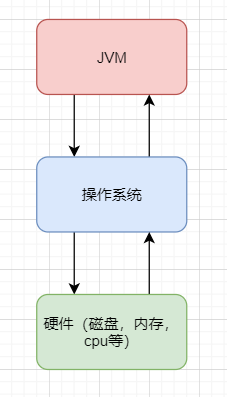
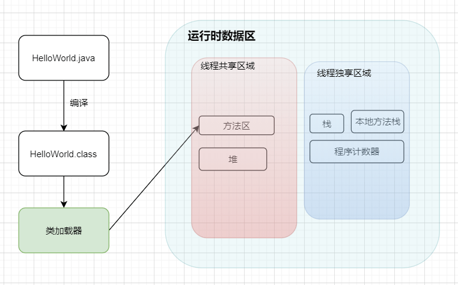
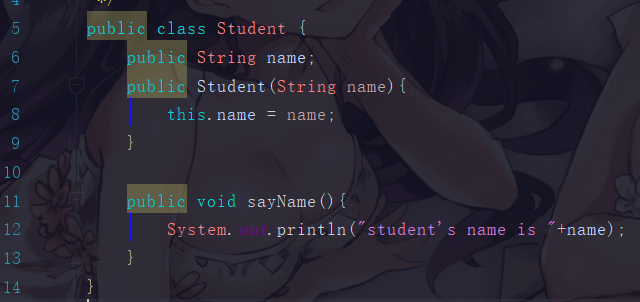
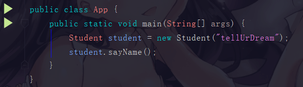

## 一、JVM的基本介绍

JVM 是 Java Virtual Machine 的缩写，它是一个虚构出来的计算机，一种规范。通过在实际的计算机上仿真模拟各类计算机功能实现···

好，其实抛开这么专业的句子不说，就知道JVM其实就类似于一台小电脑运行在windows或者linux这些操作系统环境下即可。它直接和操作系统进行交互，与硬件不直接交互，而操作系统可以帮我们完成和硬件进行交互的工作。




### 1.1 Java文件是如何被运行的

比如我们现在写了一个 HelloWorld.java 好了，那这个 HelloWorld.java 抛开所有东西不谈，那是不是就类似于一个文本文件，只是这个文本文件它写的都是英文，而且有一定的缩进而已。

那我们的 JVM 是不认识文本文件的，所以它需要一个 编译 ，让其成为一个它会读二进制文件的 HelloWorld.class

#### ① 类加载器

如果 JVM 想要执行这个 .class 文件，我们需要将其装进一个 类加载器 中，它就像一个搬运工一样，会把所有的 .class 文件全部搬进JVM里面来。


#### ② 方法区

方法区 是用于存放类似于元数据信息方面的数据的，比如类信息，常量，静态变量，编译后代码···等

类加载器将 .class 文件搬过来就是先丢到这一块上

#### ③ 堆

堆 主要放了一些存储的数据，比如对象实例，数组···等，它和方法区都同属于 **线程共享区域** 。也就是说它们都是 **线程不安全** 的

#### ④ 栈

栈 这是我们的代码运行空间。我们编写的每一个方法都会放到 栈 里面运行。

#### ⑤ 程序计数器

主要就是完成一个加载工作，类似于一个指针一样的，指向下一行我们需要执行的代码。和栈一样，都是 **线程独享** 的，就是说每一个线程都会有自己对应的一块区域而不会存在并发和多线程的问题。




**小总结**
* Java文件经过编译后变成 .class 字节码文件
* 字节码文件通过类加载器被搬运到 JVM 虚拟机中
* 虚拟机主要的5大块：方法区，堆都为线程共享区域，有线程安全问题，栈和本地方法栈和计数器都是独享区域，不存在线程安全问题，而 JVM 的调优主要就是围绕堆，栈两大块进行


### 1.2 简单的代码例子





执行main方法的步骤如下:

* 编译好 App.java 后得到 App.class 后，执行 App.class，系统会启动一个 JVM 进程，从 classpath 路径中找到一个名为 App.class 的二进制文件，将 App 的类信息加载到运行时数据区的方法区内，这个过程叫做 App 类的加载
* JVM 找到 App 的主程序入口，执行main方法
* 这个main中的第一条语句为 Student student = new Student("tellUrDream") ，就是让 JVM 创建一个Student对象，但是这个时候方法区中是没有 Student 类的信息的，所以 JVM 马上加载 Student 类，把 Student 类的信息放到方法区中
* 加载完 Student 类后，JVM 在堆中为一个新的 Student 实例分配内存，然后调用构造函数初始化 Student 实例，这个 Student 实例持有 指向方法区中的 Student 类的类型信息 的引用
* 执行student.sayName();时，JVM 根据 student 的引用找到 student 对象，然后根据 student 对象持有的引用定位到方法区中 student 类的类型信息的方法表，获得 sayName() 的字节码地址。
* 执行sayName()

其实也不用管太多，只需要知道对象实例初始化时会去方法区中找类信息，完成后再到栈那里去运行方法。找方法就在方法表中找。

## 二、类加载器的介绍


之前也提到了它是负责加载.class文件的，它们在文件开头会有特定的文件标示，将class文件字节码内容加载到内存中，并将这些内容转换成方法区中的运行时数据结构，并且ClassLoader只负责class文件的加载，而是否能够运行则由 Execution Engine 来决定

### 2.1 类加载器的流程

从类被加载到虚拟机内存中开始，到释放内存总共有7个步骤：加载，验证，准备，解析，初始化，使用，卸载。其中**验证，准备，解析**三个部分统称为连接

#### 2.1.1 加载

* 将class文件加载到内存
* 将静态数据结构转化成方法区中运行时的数据结构
* 在堆中生成一个代表这个类的 java.lang.Class对象作为数据访问的入口

#### 2.1.2 连接

* 验证：确保加载的类符合 JVM 规范和安全，保证被校验类的方法在运行时不会做出危害虚拟机的事件，其实就是一个安全检查
* 准备：为static变量在方法区中分配内存空间，设置变量的初始值，例如 static int a = 3 （注意：准备阶段只设置类中的静态变量（方法区中），不包括实例变量（堆内存中），实例变量是对象初始化时赋值的）
* 解析：虚拟机将常量池内的符号引用替换为直接引用的过程（符号引用比如我现在import java.util.ArrayList这就算符号引用，直接引用就是指针或者对象地址，注意引用对象一定是在内存进行）


#### 2.1.3 初始化

初始化其实就是执行类构造器方法的<clinit>()的过程，而且要保证执行前父类的<clinit>()方法执行完毕。这个方法由编译器收集，顺序执行所有类变量（static修饰的成员变量）显式初始化和静态代码块中语句。此时准备阶段时的那个 static int a 由默认初始化的0变成了显式初始化的3。 由于执行顺序缘故，初始化阶段类变量如果在静态代码块中又进行了更改，会覆盖类变量的显式初始化，最终值会为静态代码块中的赋值。

> 注意：字节码文件中初始化方法有两种，非静态资源初始化的<init>和静态资源初始化的<clinit>，类构造器方法<clinit>()不同于类的构造器，这些方法都是字节码文件中只能给JVM识别的特殊方法。

#### 2.1.4 卸载

GC将无用对象从内存中卸载

### 2.2 类加载器的加载顺序

加载一个Class类的顺序也是有优先级的，类加载器从最底层开始往上的顺序是这样的

* BootStrap ClassLoader：rt.jar
* Extension ClassLoader: 加载扩展的jar包
* App ClassLoader：指定的classpath下面的jar包
* Custom ClassLoader：自定义的类加载器

### 2.3 双亲委派机制

当一个类收到了加载请求时，它是不会先自己去尝试加载的，而是委派给父类去完成，比如我现在要 new 一个 Person，这个 Person 是我们自定义的类，如果我们要加载它，就会先委派 App ClassLoader ，只有当父类加载器都反馈自己无法完成这个请求（也就是父类加载器都没有找到加载所需的 Class）时，子类加载器才会自行尝试加载。

这样做的好处是，加载位于 rt.jar 包中的类时不管是哪个加载器加载，最终都会委托到 BootStrap ClassLoader 进行加载，这样保证了使用不同的类加载器得到的都是同一个结果。

其实这个也是一个隔离的作用，避免了我们的代码影响了 JDK 的代码，比如我现在自己定义一个 `java.lang.String` ：

```java
package java.lang;
public class String {
    public static void main(String[] args) {
        System.out.println();
    }
}
```

尝试运行当前类的 main 函数的时候，我们的代码肯定会报错。这是因为在加载的时候其实是找到了 rt.jar 中的java.lang.String，然而发现这个里面并没有 main 方法。

