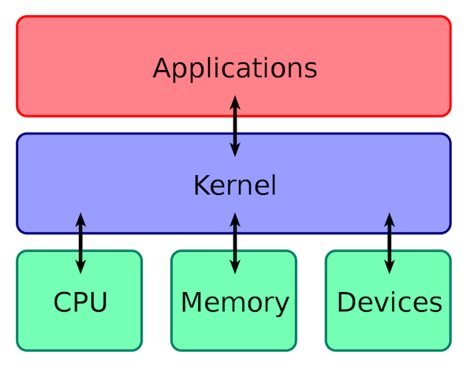
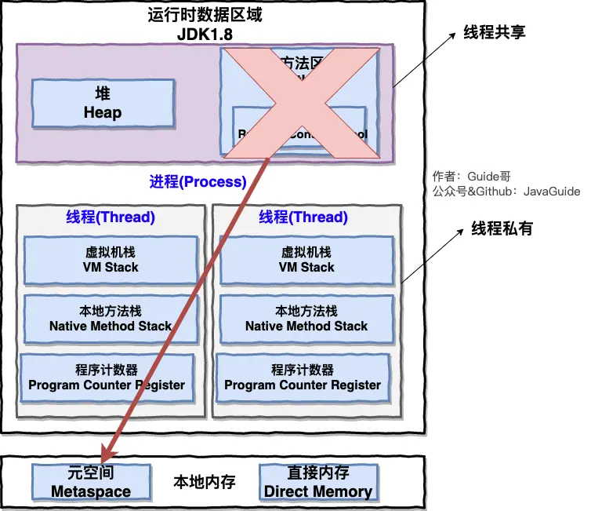
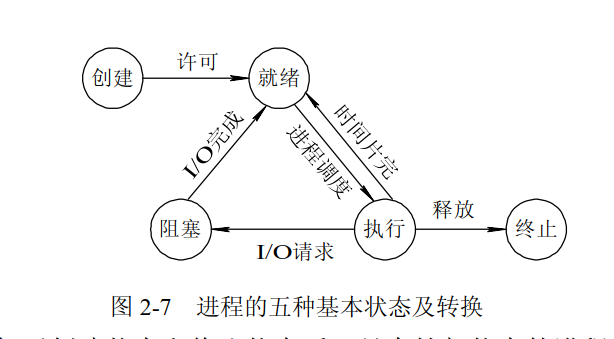
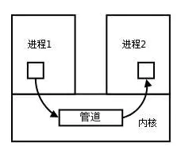
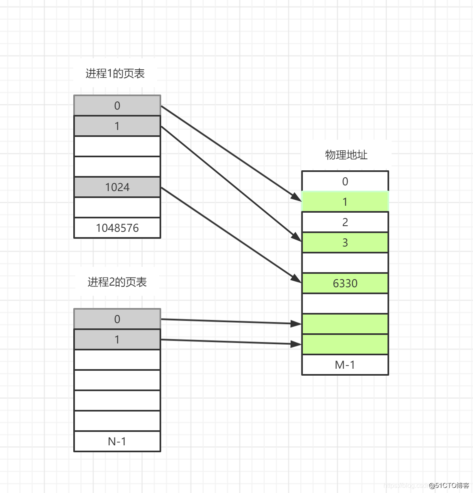
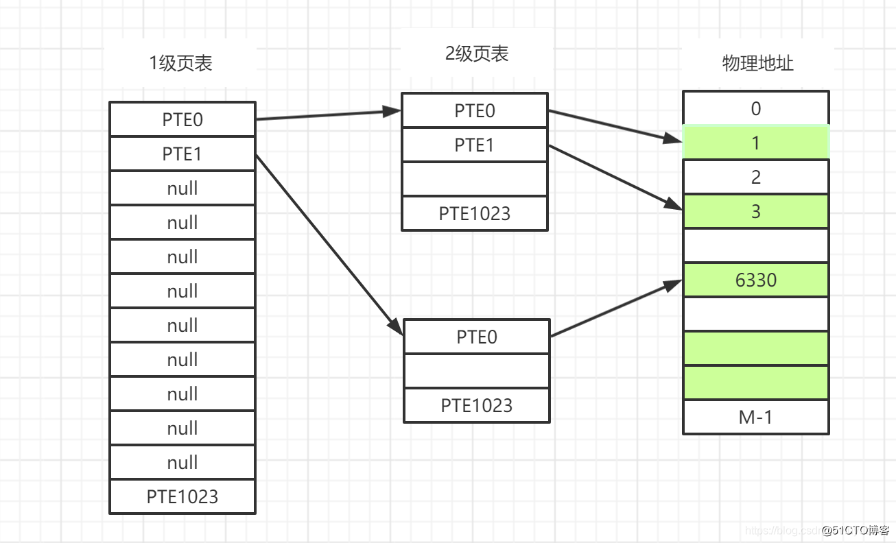
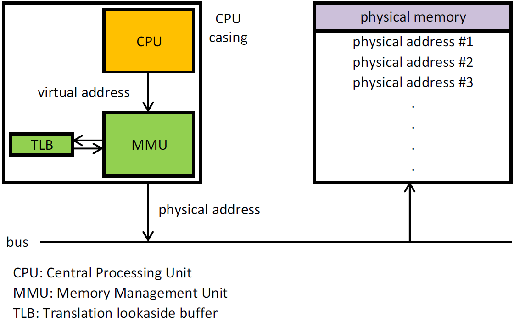

## 一、 操作系统基础

### 1.1 什么是操作系统？

* **操作系统是管理计算机硬件与软件资源的程序，是计算机的基石。**
* **操作系统的存在屏蔽了硬件层的复杂性**。操作系统就像是硬件使用的负责人，统筹着各种相关事项。
* **操作系统的内核（Kernel）是操作系统的核心部分，它负责系统的内存管理，硬件设备的管理，文件系统的管理以及应用程序的管理。**  内核是连接应用程序和硬件的桥梁，决定着系统的性能和稳定性。

### 1.2 系统调用

介绍系统调用之前，我们先来了解一下用户态和系统态。

根据进程访问资源的特点，我们可以把进程在系统上的运行分为两个级别：

* **用户态(user mode) :** 当进程执行用户自己的代码时，则该进程处于用户态。用户态运行的进程可以直接读取用户程序的数据，但是，**这时cpu访问资源受限**
* **系统态(kernel mode):** 当进程执行系统内核代码时，则该进程处于内核态。系统态运行的进程或程序几乎可以访问计算机的任何资源，不受限制，**这时cpu可以访问计算机的所有资源**

说了用户态和系统态之后，那么什么是系统调用呢？

我们运行的程序基本都是运行在用户态，如果我们调用操作系统提供的系统态级别的子功能咋办呢？那就需要系统调用了！

用户程序与外部世界的每个交流都要在内核的帮助下通过**系统调用**才能完成。一个应用程序要想保存一个文件、写到终端、或者打开一个 TCP 连接，内核都要参与。

**系统调用(system call)指的是调用由内核提供的特定功能**

也就是说在我们运行的用户程序中，凡是与系统态级别的资源有关的操作，都必须通过系统调用方式向操作系统提出服务请求，并由操作系统代为完成。

这些系统调用按功能大致可分为如下几类：

* 设备管理。完成设备的请求或释放，以及设备启动等功能。
* 文件管理。完成文件的读、写、创建及删除等功能。
* 进程控制。完成进程的创建、撤销、阻塞及唤醒等功能。
* 进程通信。完成进程之间的消息传递或信号传递等功能。
* 内存管理。完成内存的分配、回收以及获取作业占用内存区大小及地址等功能。

## 二、 进程和线程

### 2.1 进程和线程的区别

下图是 Java 内存区域，我们从 JVM 的角度来说一下线程和进程之间的关系吧！

从上图可以看出：一个进程中可以有多个线程，多个线程共享进程的**堆**和**方法区 (JDK1.8 之后的元空间)资源**，但是每个线程有自己的**程序计数器、虚拟机栈 和 本地方法栈**。

**总结：** 
* 线程是进程划分成的更小的运行单位,一个进程在其执行的过程中可以产生多个线程。
* 线程和进程最大的不同在于基本上各进程是独立的，而各线程则不一定，因为同一进程中的线程极有可能会相互影响。
* 线程执行开销小，但不利于资源的管理和保护；而进程正相反。

### 2.2 进程有哪几种状态?

* **创建状态(new) ：** 进程正在被创建，尚未到就绪状态。
* **就绪状态(ready) ：** 进程已处于准备运行状态，即进程获得了除了处理器之外的一切所需资源，一旦得到处理器资源(处理器分配的时间片)即可运行。
* **运行状态(running) ：** 进程正在处理器上上运行(单核 CPU 下任意时刻只有一个进程处于运行状态)。
* **阻塞状态(waiting) ：** 又称为等待状态，进程正在等待某一事件而暂停运行如等待某资源为可用或等待 IO 操作完成。即使处理器空闲，该进程也不能运行。
* **结束状态(terminated) ：** 进程正在从系统中消失。可能是进程正常结束或其他原因中断退出运行。

### 2.3 进程间的通信方式

大概有 7 种常见的进程间的通信方式:

**1.管道/匿名管道(pipe)**

* 管道是半双工的，数据只能向一个方向流动；需要双方通信时，需要建立起两个管道。
* 只能用于父子进程或者兄弟进程之间(具有亲缘关系的进程);
* 单独构成一种独立的文件系统：管道对于管道两端的进程而言，就是一个文件，但它不是普通的文件，它不属于某种文件系统，而是自立门户，单独构成一种文件系统，并且只存在与内存中。
* 数据的读出和写入：一个进程向管道中写的内容被管道另一端的进程读出。写入的内容每次都添加在管道缓冲区的末尾，并且每次都是从缓冲区的头部读出数据。

**管道的实质：**
* **管道的实质是一个内核缓冲区**，进程以先进先出的方式从缓冲区存取数据，管道一端的进程顺序的将数据写入缓冲区，另一端的进程则顺序的读出数据。
* 该缓冲区可以看做是一个循环队列，读和写的位置都是自动增长的，不能随意改变，一个数据只能被读一次，读出来以后在缓冲区就不复存在了。
* 当缓冲区读空或者写满时，有一定的规则控制相应的读进程或者写进程进入等待队列，当空的缓冲区有新数据写入或者满的缓冲区有数据读出来时，就唤醒等待队列中的进程继续读写。

**管道的局限：**
* 只支持单向数据流
* 只能用于具有亲缘关系的进程之间
* 没有名字
* 管道的缓冲区是有限的（管道制存在于内存中，在管道创建时，为缓冲区分配一个页面大小）
* 管道所传送的是无格式字节流，这就要求管道的读出方和写入方必须事先约定好数据的格式，比如多少字节算作一个消息（或命令、或记录）等等；

**2.有名管道(Names Pipes) :** 匿名管道由于没有名字，只能用于亲缘关系的进程间通信。为了克服这个缺点，提出了有名管道。有名管道严格遵循**先进先出(first in first out)**。有名管道以磁盘文件的方式存在，可以实现本机任意两个进程通信。

**3.信号(Signal) ：** 信号是一种比较复杂的通信方式，用于通知接收进程某个事件已经发生

**4.消息队列(Message Queuing) ：** 消息队列是消息的链表,具有特定的格式,存放在内存中并由消息队列标识符标识。管道和消息队列的通信数据都是先进先出的原则。与管道（无名管道：只存在于内存中的文件；命名管道：存在于实际的磁盘介质或者文件系统）不同的是**消息队列存放在内核**中，只有在内核重启(即，操作系统重启)或者显式地删除一个消息队列时，该消息队列才会被真正的删除。消息队列可以实现消息的随机查询,消息不一定要以先进先出的次序读取,也可以按消息的类型读取.比 FIFO 更有优势。**消息队列克服了信号承载信息量少，管道只能承载无格式字 节流以及缓冲区大小受限等缺点。**

**5.信号量(Semaphores) ：** 信号量是一个计数器，用于多进程对共享数据的访问，信号量的意图在于进程间同步。这种通信方式主要用于解决与同步相关的问题并避免竞争条件

**6.共享内存(Shared memory) ：** 使得多个进程可以访问同一块内存空间，不同进程可以及时看到对方进程中对共享内存中数据的更新。这种方式需要依靠某种同步操作，如互斥锁和信号量等。**可以说这是最有用的进程间通信方式**

**7.套接字(Sockets) :** 此方法主要用于在客户端和服务器之间通过网络进行通信。套接字是支持 TCP/IP 的网络通信的基本操作单元，可以看做是不同主机之间的进程进行双向通信的端点，简单的说就是通信的两方的一种约定，用套接字中的相关函数来完成通信过程

### 2.4 线程间的同步的方式

线程的同步就是保证多个线程的共同资源在同一时刻只有一个线程在使用和修改，保证数据是唯一的和准确的
1.**临界区（CCriticalSection）：** 当多个线程访问一个独占性共享资源时，可以使用临界区对象。拥有临界区的线程可以访问被保护起来的资源或代码段，其他线程若想访问，则被挂起，直到拥有临界区的线程放弃临界区为止。
2.**互斥量(Mutex)：** 采用互斥对象机制，只有拥有互斥对象的线程才有访问公共资源的权限。因为互斥对象只有一个，所以可以保证公共资源不会被多个线程同时访问。比如 Java 中的 synchronized 关键词和各种 Lock 都是这种机制。每个线程在对资源操作前都尝试先加锁，成功加锁才能操作，操作结束后解锁。**互斥对象和临界区对象非常相似，只是其允许在进程间使用，而临界区只限制与同一进程的各个线程之间使用，但是更节省资源，更有效率。**
3.**信号量(Semphares) ：** 它允许同一时刻多个线程访问同一资源，但是需要控制同一时刻访问此资源的最大线程数量。 6个进程需要同时使用打印机，而电脑上只有四台打印机，则打印机是被保护的资源，信号量为4。则需要用semaphore来同步。
4.**事件(Event) :** Wait/Notify：通过通知操作的方式来保持多线程同步，还可以方便的实现多线程优先级的比较操作。事件机制，则允许一个线程在处理完一个任务后，主动唤醒另外一个线程执行任务。如线程A完成之后要告诉线程B，B在接着做。

### 2.5 进程的调度算法

* **先到先服务(FCFS)调度算法 :** 从就绪队列中选择一个最先进入该队列的进程为之分配资源，使它立即执行并一直执行到完成或发生某事件而被阻塞放弃占用 CPU 时再重新调度
  * FCFS调度算法的特点是算法简单，但效率低；对长作业比较有利，但对短作业不利
* **短作业优先(SJF)的调度算法 :** 从就绪队列中选出一个估计运行时间最短的进程为之分配资源，使它立即执行并一直执行到完成或发生某事件而被阻塞放弃占用 CPU 时再重新调度
  * 该算法对长作业不利，SJF调度算法中长作业的周转时间会增加。更严重的是，如果有一长作业进入系统的后备队列，由于调度程序总是优先调度那些 (即使是后进来的）短作业，将导致长作业长期不被调度("饥饿现象")
  * 该算法完全未考虑作业的紧迫程度，因而不能保证紧迫性作业会被及时处理
  * **SJF调度算法的平均等待时间、平均周转时间最少。**
* **最短剩余时间优先:** ​	最短剩余时间是针对最短进程优先增加了抢占机制的版本。在这种情况下，进程调度总是选择预期剩余时间最短的进程。当一个进程加入到就绪队列时，他可能比当前运行的进程具有更短的剩余时间，因此只要新进程就绪，调度程序就能可能抢占当前正在运行的进程。像最短进程优先一样，调度程序正在执行选择函数是必须有关于处理时间的估计，**并且存在长进程饥饿的危险**。
* **时间片轮转调度算法 :**  时间片轮转调度是一种最古老，最简单，最公平且使用最广的算法，又称 RR(Round robin)调度。每个进程被分配一个时间段，称作它的时间片，即该进程允许运行的时间。**时间片轮转调度算法主要适用于分时系统。** 在这种算法中，系统将所有就绪进程按到达时间的先后次序排成一个队列，进程调度程序总是选择就绪队列中第一个进程执行，即先来先服务的原则，但仅能运行一个时间片，如100ms。在使用完一个时间片后，即使进程并未完成其运行，它也必须释放出（被剥夺）处理机给下一个就绪的进程，而被剥夺的进程返回到就绪队列的末尾重新排队，等候再次运行。
* **多级反馈队列算法:** 不必事先知道各种进程所需要执行的时间，他是当前被公认的一种较好的进程调度算法。
  * 应设置多个就绪队列，并为各个队列赋予不同的优先级，第1级队列的优先级最高，第2级队列次之，其余队列的优先级逐次降低
  * 赋予各个队列中进程执行时间片的大小也各不相同，在优先级越高的队列中，每个进程的运行时间片就越小。例如，第2级队列的时间片要比第1级队列的时间片长一倍， ……第i+1级队列的时间片要比第i级队列的时间片长一倍。
  * 当一个新进程进入内存后，首先将它放入第1级队列的末尾，按FCFS原则排队等待调度。当轮到该进程执行时，如它能在该时间片内完成，便可准备撤离系统；如果它在一个时间片结束时尚未完成，调度程序便将该进程转入第2级队列的末尾，再同样地按FCFS 原则等待调度执行；如果它在第2级队列中运行一个时间片后仍未完成，再以同样的方法放入第3级队列……如此下去，当一个长进程从第1级队列依次降到第 n 级队列后，在第 n 级队列中便釆用时间片轮转的方式运行。
  * 仅当第1级队列为空时，调度程序才调度第2级队列中的进程运行；仅当第1 ~ (i-1)级队列均为空时，才会调度第i级队列中的进程运行。如果处理机正在执行第i级队列中的某进程时，又有新进程进入优先级较高的队列（第 1 ~ (i-1)中的任何一个队列），则此时新进程将抢占正在运行进程的处理机，即由调度程序把正在运行的进程放回到第i级队列的末尾，把处理机分配给新到的更高优先级的进程。
* **优先级调度 ：** 为每个流程分配优先级，首先执行具有最高优先级的进程，依此类推。具有相同优先级的进程以 FCFS 方式执行。可以根据内存要求，时间要求或任何其他资源要求来确定优先级。

### 2.6 死锁

多个进程可以竞争有限数量的资源。当一个进程申请资源时，如果这时没有可用资源，那么这个进程进入等待状态。有时，如果所申请的资源被其他等待进程占有，那么该等待进程有可能再也无法改变状态。这种情况称为 死锁。**由于两个或者多个进程互相持有对方所需要的资源，导致这些进程处于等待状态，无法前往执行。**

### 2.7 死锁的四个条件

如果系统中以下四个条件同时成立，那么就能引起死锁：
* **互斥：** 资源必须处于非共享模式，即一次只有一个进程可以使用。如果另一进程申请该资源，那么必须等待直到该资源被释放为止
* **占有并等待：** 一个进程至少应该占有一个资源，并等待另一资源，而该资源被其他进程所占有
* **非抢占：** 资源不能被抢占。只能在持有资源的进程完成任务后，该资源才会被释放
* **循环等待：** 有一组等待进程 `{P0, P1,..., Pn}`， `P0` 等待的资源被 `P1` 占有，`P1` 等待的资源被 `P2` 占有，......，`Pn-1` 等待的资源被 `Pn` 占有，`Pn` 等待的资源被 `P0` 占有

注意，只有四个条件同时成立时，死锁才会出现。

## 三、 操作系统内存管理基础

### 3.1 内存管理介绍

操作系统的内存管理主要负责内存的分配与回收（malloc 函数：申请内存，free 函数：释放内存），另外地址转换也就是将逻辑地址转换成相应的物理地址等功能也是操作系统内存管理做的事情

### 3.2 常见的几种内存管理机制

简单分为**连续分配管理方式**和**非连续分配管理方式**这两种。连续分配管理方式是指为一个用户程序分配一个连续的内存空间，常见的如 **块式管理** 。同样地，非连续分配管理方式允许一个程序使用的内存分布在离散或者说不相邻的内存中，常见的如**页式管理** 和 **段式管理**

1. **块式管理：**  远古时代的计算机操系统的内存管理方式。将内存分为几个固定大小的块，每个块中只包含一个进程。如果程序运行需要内存的话，操作系统就分配给它一块，如果程序运行只需要很小的空间的话，分配的这块内存很大一部分几乎被浪费了。这些在每个块中未被利用的空间，我们称之为碎片

2. **页式管理 ：** 把主存分为大小相等且固定的一页一页的形式，页较小，相对相比于块式管理的划分力度更大，提高了内存利用率，减少了碎片。页式管理通过页表对应逻辑地址和物理地址。

3. **段式管理 ：** 页式管理虽然提高了内存利用率，但是页式管理其中的页实际并无任何实际意义。 段式管理把主存分为一段段的，段是有实际意义的，每个段定义了一组逻辑信息，例如,有主程序段 MAIN、子程序段 X、数据段 D 及栈段 S 等。 段式管理通过段表对应逻辑地址和物理地址。

4. **段页式管理机制：** 段页式管理机制结合了段式管理和页式管理的优点。简单来说段页式管理机制就是把主存先分成若干段，每个段又分成若干页，也就是说 段页式管理机制 中段与段之间以及段的内部的都是离散的。
  
简单来说：页是物理单位，段是逻辑单位。分页可以有效提高内存利用率，分段可以更好满足用户需求。

### 3.3 快表和多级页表

在分页内存管理中，很重要的两点是：
* 虚拟地址到物理地址的转换要快
* 解决虚拟地址空间大，页表也会很大的问题

快表

为了解决虚拟地址到物理地址的转换速度，操作系统在 **页表方案** 基础之上引入了 **快表** 来加速虚拟地址到物理地址的转换。我们可以把快表理解为一种特殊的高速缓冲存储器（Cache），其中的内容是页表的一部分或者全部内容。作为页表的 Cache，它的作用与页表相似，但是提高了访问速率。由于采用页表做地址转换，读写内存数据时 CPU 要访问两次主存。有了快表，有时只要访问一次高速缓冲存储器，一次主存，这样可加速查找并提高指令执行速度。

使用快表之后的地址转换流程是这样的：

* 根据虚拟地址中的页号查快表；
* 如果该页在快表中，直接从快表中读取相应的物理地址；
* 如果该页不在快表中，就访问内存中的页表，再从页表中得到物理地址，同时将页表中的该映射表项添加到快表中；
* 当快表填满后，又要登记新页时，就按照一定的淘汰策略淘汰掉快表中的一个页。

多级页表

引入多级页表的主要目的是为了避免把全部页表一直放在内存中占用过多空间，特别是那些根本就不需要的页表就不需要保留在内存中，多级页表属于时间换空间的典型场景。

关于为什么多级页表能节省空间，看下面两张图就一目了然了。

把进程1的1048576个页表分成了图二中的两级页表1024*1024个，但如果这连续的1024个都没内容，就不分二级页表出来，就节省了许多空间。

为了提高内存的空间性能，提出了多级页表的概念；但是提到空间性能是以浪费时间性能为基础的，因此为了补充损失的时间性能，提出了快表（即 TLB）的概念。 不论是快表还是多级页表实际上都利用到了程序的局部性原理。

### 3.4 分页机制和分段机制的共同点和区别

**共同点 ：**
* 分页机制和分段机制都是为了提高内存利用率，减少内存碎片。
* 页和段都是离散存储的，所以两者都是离散分配内存的方式。但是，每个页和段中的内存是连续的。

**区别：**
* 页的大小是固定的，由操作系统决定；而段的大小不固定，取决于我们当前运行的程序。
* 分页仅仅是为了满足操作系统内存管理的需求，而段是逻辑信息的单位，在程序中可以体现为代码段，数据段，能够更好满足用户的需要。

### 3.5 逻辑(虚拟)地址和物理地址

**逻辑地址(虚拟地址)是操作系统建立，方便程序访问变量的**，比如在 C 语言中，指针里面存储的数值就可以理解成为内存里的一个地址，这个地址也就是我们说的逻辑地址。**物理地址指的是真实物理内存中地址**，更具体一点来说就是**内存地址寄存器**中的地址。物理地址是内存单元真正的地址。

### 3.6 CPU 寻址了解吗?为什么需要虚拟地址空间?

现代处理器使用的是一种称为 **虚拟寻址(Virtual Addressing)** 的寻址方式。**使用虚拟寻址，CPU 需要将虚拟地址翻译成物理地址，这样才能访问到真实的物理内存**。 实际上完成虚拟地址转换为物理地址转换的硬件是 CPU 中含有一个被称为 **内存管理单元（Memory Management Unit, MMU）** 的硬件。如下图所示：

**为什么要有虚拟地址空间呢？**

先从没有虚拟地址空间的时候说起吧！没有虚拟地址空间的时候，**程序都是直接访问和操作的都是物理内存 。** 但是这样有什么问题呢？

* 用户程序可以访问任意内存，寻址内存的每个字节，这样就很容易（有意或者无意）破坏操作系统，造成操作系统崩溃。
* **想要同时运行多个程序特别困难**，比如你想同时运行一个微信和一个 QQ 音乐都不行。为什么呢？举个简单的例子：微信在运行的时候给内存地址 1xxx 赋值后，QQ 音乐也同样给内存地址 1xxx 赋值，那么 QQ 音乐对内存的赋值就会覆盖微信之前所赋的值，这就造成了微信这个程序就会崩溃。

**总结来说：如果直接把物理地址暴露出来的话会带来严重问题，比如可能对操作系统造成伤害以及给同时运行多个程序造成困难。**

通过虚拟地址访问内存有以下优势：

* 程序可以使用一系列相邻的虚拟地址来访问物理内存中不相邻的大内存缓冲区。
* 程序可以使用一系列虚拟地址来访问大于可用物理内存的内存缓冲区。当物理内存的供应量变小时，内存管理器会将物理内存页（通常大小为 4 KB）保存到磁盘文件。数据或代码页会根据需要在物理内存与磁盘之间移动。
* 不同进程使用的虚拟地址彼此隔离。一个进程中的代码无法更改正在由另一进程或操作系统使用的物理内存。

## 四、 虚拟内存

### 4.1 什么是虚拟内存(Virtual Memory)?

很多时候我们使用点开了很多占内存的软件，这些软件占用的内存可能已经远远超出了我们电脑本身具有的物理内存。为什么可以这样呢？ 正是因为 虚拟内存 的存在，通过 虚拟内存 可以让程序可以拥有超过系统物理内存大小的可用内存空间。另外，虚拟内存为每个进程提供了一个**一致的、私有的**地址空间，**它让每个进程产生了一种自己在独享主存的错觉（每个进程拥有一片连续完整的内存空间）**。这样会更加有效地管理内存并减少出错。

虚拟内存是计算机系统内存管理的一种技术，我们可以手动设置自己电脑的虚拟内存。不要单纯认为虚拟内存只是“使用硬盘空间来扩展内存“的技术。虚拟内存的重要意义是**它定义了一个连续的虚拟地址空间，并且 把内存扩展到硬盘空间。**

> **虚拟内存** 使得应用程序认为它拥有连续的可用的内存（一个连续完整的地址空间），而实际上，它通常是被分隔成多个物理内存碎片，还有部分暂时存储在外部磁盘存储器上，在需要时进行数据交换。与没有使用虚拟内存技术的系统相比，使用这种技术的系统使得大型程序的编写变得更容易，对真正的物理内存（例如 RAM）的使用也更有效率。

### 4.2 局部性原理

早在 1968 年的时候，就有人指出我们的程序在执行的时候往往呈现局部性规律，也就是说在某个较短的时间段内，程序执行局限于某一小部分，程序访问的存储空间也局限于某个区域。

局部性原理表现在以下两个方面：

* **时间局部性 ：** 如果程序中的某条指令一旦执行，不久以后该指令可能再次执行；如果某数据被访问过，不久以后该数据可能再次被访问。**产生时间局部性的典型原因，是由于在程序中存在着大量的循环操作。**
* **空间局部性 ：** 一旦程序访问了某个存储单元，在不久之后，其附近的存储单元也将被访问，即程序在一段时间内所访问的地址，可能集中在一定的范围之内，**这是因为指令通常是顺序存放、顺序执行的**，**数据也一般是以向量、数组、表等形式簇聚存储的。** 

### 4.3 虚拟存储器

基于局部性原理，在程序装入时，可以将程序的一部分装入内存，而将其他部分留在外存，就可以启动程序执行。由于外存往往比内存大很多，所以我们运行的软件的内存大小实际上是可以比计算机系统实际的内存大小大的。在程序执行过程中，当所访问的信息不在内存时，由操作系统将所需要的部分调入内存，然后继续执行程序。另一方面，操作系统将内存中暂时不使用的内容换到外存上，从而腾出空间存放将要调入内存的信息。这样，计算机好像为用户提供了一个比实际内存大的多的存储器——**虚拟存储器**。

实际上，我觉得虚拟内存同样是一种时间换空间的策略，你用 CPU 的计算时间，页的调入调出花费的时间，换来了一个虚拟的更大的空间来支持程序的运行。

