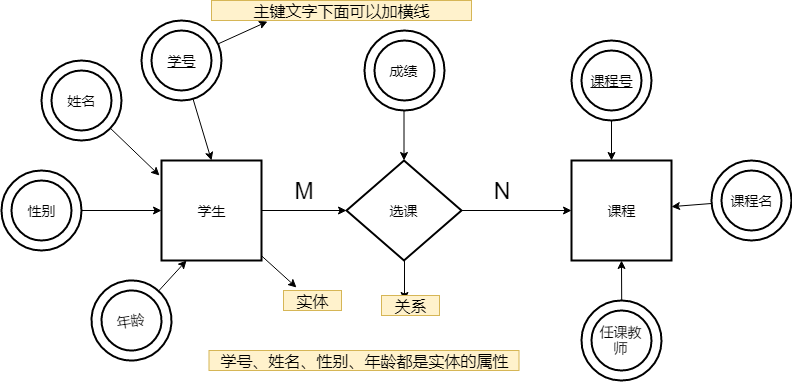
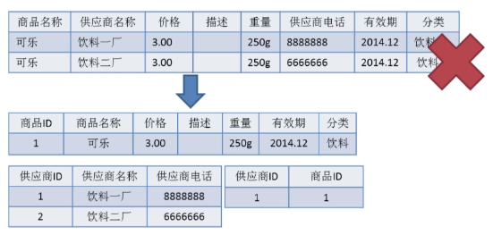

## 什么是元组, 码, 候选码, 主码, 外码, 主属性, 非主属性？

* **元组 ：** 元组（tuple）是**关系数据库中**的基本概念，关系是一张表，表中的每行（即数据库中的每条记录）就是一个元组，每列就是一个属性。 在二维表里，元组也称为行。
* **码 ：** 码就是能唯一标识实体的属性，对应表中的列。
* **候选码 ：** 若关系中的**某一属性或属性组的值能唯一的标识一个元组**，而其任何、子集都不能再标识，则称该属性组为候选码。例如：在学生实体中，“学号”是能唯一的区分学生实体的，同时又假设“姓名”、“班级”的属性组合足以区分学生实体，那么{学号}和{姓名，班级}都是候选码。
* **主码 :** **主码也叫主键。** 主码是从候选码中选出来的。 一个实体集中**只能有一个主码**，但可以有多个候选码。
* **外码 :** 外码也叫外键。如果一个关系中的一个属性是另外一个关系中的主码则这个属性为外码。
* **主属性 ：** **候选码中出现过的属性称为主属性。** 比如关系 工人（工号，身份证号，姓名，性别，部门）. 显然工号和身份证号都能够唯一标示这个关系，所以都是候选码。工号、身份证号这两个属性就是主属性。如果主码是一个属性组，那么属性组中的属性都是主属性。
* **非主属性：** **不包含在任何一个候选码中的属性称为非主属性。** 比如在关系——学生（学号，姓名，年龄，性别，班级）中，主码是“学号”，那么其他的“姓名”、“年龄”、“性别”、“班级”就都可以称为非主属性。

## 主键和外键有什么区别?

* **主键(主码) ：** 主键用于唯一标识一个元组，值不能有重复，不允许为空。一个表只能有一个主键。
* **外键(外码) ：** 外键用来和其他表建立联系用，外键是另一表的主键，外键是可以有重复的，可以是空值。一个表可以有多个外键。

## 为什么不推荐使用外键与级联？

对于外键和级联，阿里巴巴开发手册这样说到：

> 【强制】不得使用外键与级联，一切外键概念必须在应用层解决。
> 说明: 以学生和成绩的关系为例，学生表中的 student_id 是主键，那么成绩表中的 student_id 则为外键。如果更新学生表中的 student_id，同时触发成绩表中的 student_id 更新，即为级联更新。外键与级联更新适用于单机低并发，不适合分布式、高并发集群; 级联更新是强阻塞，存在数据库更新风暴的风 险; **外键影响数据库的插入速度**

为什么不要用外键呢？

> 1.**增加了复杂性：** a. 每次做DELETE 或者UPDATE都必须考虑外键约束，会导致开发的时候很痛苦, 测试数据极为不方便; b. 外键的主从关系是定的，假如那天需求有变化，数据库中的这个字段根本不需要和其他表有关联的话就会增加很多麻烦。
> 2.**对分库分表不友好 ：** 因为分库分表下外键是无法生效的。

实际上，我们知道外键也是有很多好处的，比如：

* 保证了数据库数据的一致性和完整性；
* 级联操作方便，减轻了程序代码量；

所以说，不要一股脑的就抛弃了外键这个概念，既然它存在就有它存在的道理，如果系统不涉及分库分表，并发量不是很高的情况还是可以考虑使用外键的。

## ER 图

**E-R 图** 也称实体-联系图(Entity Relationship Diagram)，提供了表示实体类型、属性和联系的方法，用来描述现实世界的概念模型。 它是描述现实世界关系概念模型的有效方法。 是表示概念关系模型的一种方式。

下图是一个学生选课的 ER 图，每个学生可以选若干门课程，同一门课程也可以被若干人选择，所以它们之间的关系是多对多（M: N）。另外，还有其他两种关系是：1 对 1（1:1）、1 对多（1: N）。

我们试着将上面的 ER 图转换成数据库实际的关系模型(实际设计中，我们通常会将任课教师也作为一个实体来处理)：

## 数据库范式

**1NF(第一范式)**

属性（对应于表中的字段）不能再被分割，也就是这个字段只能是一个值，不能再分为多个其他的字段了。**1NF 是所有关系型数据库的最基本要求** ，也就是说关系型数据库中创建的表一定满足第一范式。

**2NF(第二范式)**

2NF 在 1NF 的基础之上，消除了非主属性对于码的部分函数依赖。如下图所示，展示了第一范式到第二范式的过渡。第二范式在第一范式的基础上增加了一个列，这个列称为主键，非主属性都依赖于主键。

**3NF(第三范式)**

3NF 在 2NF 的基础之上，消除了非主属性对于码的传递函数依赖 。符合 3NF 要求的数据库设计，基本上解决了数据冗余过大，插入异常，修改异常，删除异常的问题。比如在关系 R(学号 , 姓名, 系名，系主任)中，学号 → 系名，系名 → 系主任，所以存在非主属性系主任对于学号的传递函数依赖，所以该表的设计，不符合 3NF 的要求。 

* **函数依赖（functional dependency） ：** 若在一张表中，在属性（或属性组）X 的值确定的情况下，必定能确定属性 Y 的值，那么就可以说 Y 函数依赖于 X，写作 X → Y。
* **部分函数依赖（partial functional dependency） ：** 如果 X→Y，并且存在 X 的一个真子集 X0，使得 X0→Y，则称 Y 对 X 部分函数依赖。比如学生基本信息表 R 中（学号，身份证号，姓名）当然学号属性取值是唯一的，在 R 关系中，（学号，身份证号）->（姓名），（学号）->（姓名），（身份证号）->（姓名）；所以姓名部分函数依赖与（学号，身份证号）
* **完全函数依赖(Full functional dependency) ：** 在一个关系中，若某个非主属性数据项依赖于全部关键字称之为完全函数依赖。比如学生基本信息表 R（学号，班级，姓名）假设不同的班级学号有相同的，班级内学号不能相同，在 R 关系中，（学号，班级）->（姓名），但是（学号）->(姓名)不成立，（班级）->(姓名)不成立，所以姓名完全函数依赖与（学号，班级）；
* **传递函数依赖 ：** 在关系模式 R(U)中，设 X，Y，Z 是 U 的不同的属性子集，如果 X 确定 Y、Y 确定 Z，且有 X 不包含 Y，Y 不确定 X，（X∪Y）∩Z=空集合，则称 Z 传递函数依赖(transitive functional dependency) 于 X。传递函数依赖会导致数据冗余和异常。传递函数依赖的 Y 和 Z 子集往往同属于某一个事物，因此可将其合并放到一个表中。比如在关系 R(学号 , 姓名, 系名，系主任)中，学号 → 系名，系名 → 系主任，所以存在非主属性系主任对于学号的传递函数依赖。

**总结：**

* 1NF： 属性不可再分。
* 2NF：1NF 的基础之上，消除了非主属性对于码的部分函数依赖。
* 3NF：3NF 在 2NF 的基础之上，消除了非主属性对于码的传递函数依赖 。

## 存储过程

我们可以把存储过程看成是一些 SQL 语句的集合，中间加了点逻辑控制语句。存储过程在业务比较复杂的时候是非常实用的，比如很多时候我们完成一个操作可能需要写一大串 SQL 语句，这时候我们就可以写有一个存储过程，这样也方便了我们下一次的调用。存储过程一旦调试完成通过后就能稳定运行，另外，使用存储过程比单纯 SQL 语句执行要快，因为存储过程是预编译过的。 

存储过程在互联网公司应用不多，因为存储过程**难以调试和扩展，而且没有移植性，还会消耗数据库资源**。

