## 应用层有哪些常见的协议？

### HTTP:超文本传输协议

**超文本传输协议（HTTP，HyperText Transfer Protocol)** 主要是为 Web 浏览器与 Web 服务器之间的通信而设计的。当我们使用浏览器浏览网页的时候，我们网页就是通过 HTTP 请求进行加载的，整个过程如下图所示。 

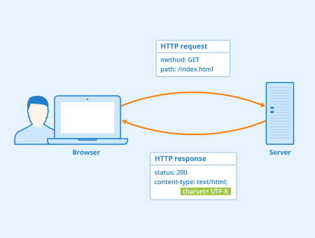

HTTP 协是基于 TCP协议，发送 HTTP 请求之前首先要建立 TCP 连接也就是要经历 3 次握手。目前使用的 HTTP 协议大部分都是 1.1。在 1.1 的协议里面，默认是开启了 Keep-Alive 的，这样的话建立的连接就可以在多次请求中被复用了。 

另外， HTTP 协议是”无状态”的协议，它无法记录客户端用户的状态，一般我们都是通过 Session 来记录客户端用户的状态。

### SMTP:简单邮件传输(发送)协议

简单邮件传输(发送)协议（SMTP，Simple Mail Transfer Protocol） 基于 TCP 协议，用来发送电子邮件。

**接受邮件的协议不是 SMTP 而是 POP3 协议**

SMTP 协议这块涉及的内容比较多，下面这两个问题比较重要：

* 电子邮件的发送过程
* 如何判断邮箱是真正存在的？

**电子邮件的发送过程？**

比如我的邮箱是“dabai@cszhinan.com”，我要向“xiaoma@qq.com”发送邮件，整个过程可以简单分为下面几步：
* 通过 SMTP 协议，我将我写好的邮件交给163邮箱服务器（邮局）。
* 163邮箱服务器发现我发送的邮箱是qq邮箱，然后它使用 SMTP协议将我的邮件转发到 qq邮箱服务器。
* qq邮箱服务器接收邮件之后就通知邮箱为“xiaoma@qq.com”的用户来收邮件，然后用户就通过 **POP3/IMAP** 协议将邮件取出。

**如何判断邮箱是真正存在的？**

很多场景(比如邮件营销)下面我们需要判断我们要发送的邮箱地址是否真的存在，这个时候我们可以利用 SMTP 协议来检测：

* 查找邮箱域名对应的 SMTP 服务器地址
* 尝试与服务器建立连接
* 连接成功后尝试向需要验证的邮箱发送邮件
* 根据返回结果判定邮箱地址的真实性

### POP3/IMAP:邮件接收的协议

这两个协议没必要多做阐述，只需要了解 POP3 和 IMAP 两者都是负责邮件接收的协议即可。另外，需要注意不要将这两者和 SMTP 协议搞混淆了。**SMTP 协议只负责邮件的发送，真正负责接收的协议是POP3/IMAP。**

IMAP 协议相比于POP3更新一点，为用户提供的可选功能也更多一点,几乎所有现代电子邮件客户端和服务器都支持IMAP。大部分网络邮件服务提供商都支持POP3和IMAP。

### FTP:文件传输协议

**FTP 协议** 主要提供文件传输服务，基于 TCP 实现可靠的传输。使用 FTP 传输文件的好处是可以屏蔽操作系统和文件存储方式。

FTP 是基于客户—服务器（C/S）模型而设计的，在客户端与 FTP 服务器之间建立两个连接。

> FTP 的独特的优势同时也是与其它客户服务器程序最大的不同点就在于它在两台通信的主机之间使用了两条 TCP 连接（其它客户服务器应用程序一般只有一条 TCP 连接）： 
    1.控制连接：用于传送控制信息（命令和响应） 
    2.数据连接：用于数据传送； 
这种将命令和数据分开传送的思想大大提高了 FTP 的效率。

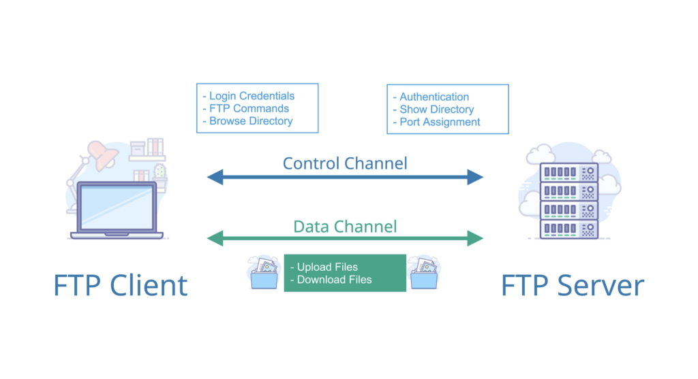

### Telnet:远程登陆协议

Telnet 协议 通过一个终端登陆到其他服务器，建立在可靠的传输协议 TCP 之上。Telnet 协议的最大缺点之一是所有数据（包括用户名和密码）均以明文形式发送，这有潜在的安全风险。这就是为什么如今很少使用Telnet并被一种称为SSH的非常安全的协议所取代的主要原因。

### SSH:安全的网络传输协议

SSH（ Secure Shell） 是目前较可靠，专为远程登录会话和其他网络服务提供安全性的协议。利用 SSH 协议可以有效防止远程管理过程中的信息泄露问题。SSH  建立在可靠的传输协议 TCP 之上。

**Telnet 和 SSH 之间的主要区别在于 SSH 协议会对传输的数据进行加密保证数据安全性。**

## TCP 三次握手

为了准确无误地把数据送达目标处，TCP 协议采用了三次握手策略。

### TCP 三次握手漫画图解

如下图所示，下面的两个机器人通过 3 次握手确定了对方能正确接收和发送消息(图片来源：《图解 HTTP》)。

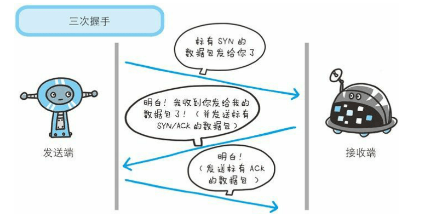

**简单示意图：**

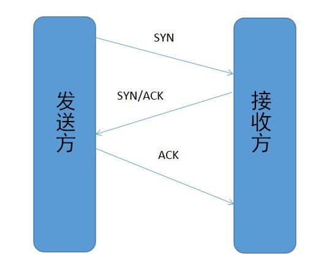

* 客户端–发送带有 SYN 标志的数据包–一次握手–服务端
* 服务端–发送带有 SYN/ACK 标志的数据包–二次握手–客户端
* 客户端–发送带有带有 ACK 标志的数据包–三次握手–服务端

### 三次握手详细流程

>最开始的时候客户端和服务器都是处于CLOSED状态。主动打开连接的为客户端，被动打开连接的是服务器。

* TCP服务器进程先创建传输控制块TCB，时刻准备接受客户进程的连接请求，此时**服务器就进入了LISTEN（监听**）状态；
* TCP客户进程也是先创建传输控制块TCB，然后向服务器发出连接请求报文，这是报文首部中的同部位SYN=1，同时选择一个初始序列号 seq=x ，此时，**TCP客户端进程进入了 SYN-SENT（同步已发送状态）** 状态。**TCP规定，SYN报文段（SYN=1的报文段）不能携带数据，但需要消耗掉一个序号**
* TCP服务器收到请求报文后，如果同意连接，则发出确认报文。确认报文中应该 ACK=1，SYN=1，确认号是ack=x+1，同时也要为自己初始化一个序列号 seq=y，此时，**TCP服务器进程进入了SYN-RCVD（同步收到**状态。**这个报文也不能携带数据，但是同样要消耗一个序号。**
* TCP客户进程收到确认后，还要向服务器给出确认。确认报文的ACK=1，ack=y+1，自己的序列号seq=x+1，**此时，TCP连接建立，客户端进入ESTABLISHED（已建立连接）状态。TCP规定，ACK报文段可以携带数据，但是如果不携带数据则不消耗序号。**
* **当服务器收到客户端的确认后也进入ESTABLISHED状态，此后双方就可以开始通信了。**

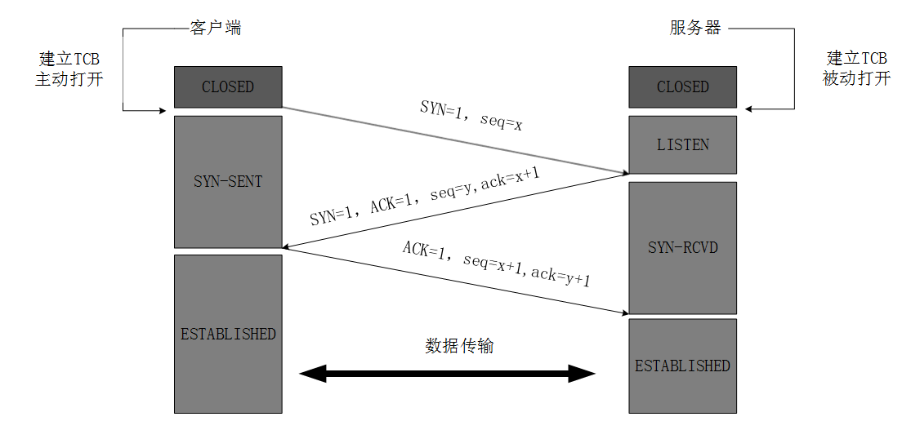

### 为什么要三次握手

**三次握手的目的是建立可靠的通信信道，说到通讯，简单来说就是数据的发送与接收，而三次握手最主要的目的就是双方确认自己与对方的发送与接收是正常的。**

第一次握手：Client 什么都不能确认；Server 确认了对方发送正常，自己接收正常

第二次握手：Client 确认了：自己发送、接收正常，对方发送、接收正常；Server 确认了：对方发送正常，自己接收正常

第三次握手：Client 确认了：自己发送、接收正常，对方发送、接收正常；Server 确认了：自己发送、接收正常，对方发送、接收正常

所以三次握手就能确认双发收发功能都正常，缺一不可。

### 为什么TCP客户端最后还要发送一次确认呢？

**一句话，主要防止已经失效的连接请求报文突然又传送到了服务器，从而产生错误。**

如果使用的是两次握手建立连接，假设有这样一种场景，客户端发送了第一个请求连接并且没有丢失，只是因为在网络结点中滞留的时间太长了，由于TCP的客户端迟迟没有收到确认报文，以为服务器没有收到，此时重新向服务器发送这条报文，此后客户端和服务器经过两次握手完成连接，传输数据，然后关闭连接。此时此前滞留的那一次请求连接，网络通畅了到达了服务器，这个报文本该是失效的，但是，两次握手的机制将会让客户端和服务器再次建立连接，这将导致不必要的错误和资源的浪费。

如果采用的是三次握手，就算是那一次失效的报文传送过来了，服务端接受到了那条失效报文并且回复了确认报文，但是客户端不会再次发出确认。由于服务器收不到确认，就知道客户端并没有请求连接。

### 第 2 次握手传回了 ACK，为什么还要传回 SYN？

接收端传回发送端所发送的 ACK 是为了告诉客户端，我接收到的信息确实就是你所发送的信号了，这表明从客户端到服务端的通信是正常的。而回传 SYN 则是为了建立并确认从服务端到客户端的通信。”

> SYN 同步序列编号(Synchronize Sequence Numbers) 是 TCP/IP 建立连接时使用的握手信号。在客户机和服务器之间建立正常的 TCP 网络连接时，客户机首先发出一个 SYN 消息，服务器使用 SYN-ACK 应答表示接收到了这个消息，最后客户机再以 ACK确认字符(Acknowledgement）消息响应。这样在客户机和服务器之间才能建立起可靠的 TCP 连接，数据才可以在客户机和服务器之间传递。 

### TCP 三次握手期间的异常

#### 第一次握手丢失了，会发生什么？

当客户端想和服务端建立 TCP 连接的时候，首先第一个发的就是 SYN 报文，然后进入到 `SYN_SENT` 状态。

在这之后，如果客户端迟迟收不到服务端的 `SYN-ACK` 报文（第二次握手），就会触发超时重传机制。

不同版本的操作系统可能超时时间不同，有的 1 秒的，也有 3 秒的，这个超时时间是写死在内核里的，如果想要更改则需要重新编译内核，比较麻烦。

当客户端在 1 秒后没收到服务端的 SYN-ACK 报文后，客户端就会重发 SYN 报文，那到底重发几次呢？

在 Linux 里，客户端的 SYN 报文最大重传次数由 `tcp_syn_retries`内核参数控制，这个参数是可以自定义的，默认值一般是 5。

通常，第一次超时重传是在 1 秒后，第二次超时重传是在 2 秒，第三次超时重传是在 4 秒后，第四次超时重传是在 8 秒后，第五次是在超时重传 16 秒后。**没错，每次超时的时间是上一次的 2 倍。**

当第五次超时重传后，会继续等待 32 秒，如果服务端仍然没有回应 ACK，客户端就不再发送 SYN 包，然后断开 TCP 连接。

所以，总耗时是 1+2+4+8+16+32=63 秒，大约 1 分钟左右。

#### 第二次握手丢失了，会发生什么？

因为第二次握手报文里是包含对客户端的第一次握手的 ACK 确认报文，所以，如果客户端迟迟没有收到第二次握手，那么客户端就觉得可能自己的 SYN 报文（第一次握手）丢失了，**于是客户端就会触发超时重传机制，重传 SYN 报文。**

然后，因为第二次握手中包含服务端的 SYN 报文，所以当客户端收到后，需要给服务端发送 ACK 确认报文（第三次握手），服务端才会认为该 SYN 报文被客户端收到了。

那么，如果第二次握手丢失了，服务端就收不到第三次握手，**于是服务端这边会触发超时重传机制，重传 SYN-ACK 报文。**

在 Linux 下，SYN-ACK 报文的最大重传次数由 `tcp_synack_retries`内核参数决定，默认值是 5。

因此，当第二次握手丢失了，客户端和服务端都会重传：

* 客户端会重传 SYN 报文，也就是第一次握手，最大重传次数由 `tcp_syn_retries`内核参数决定。
* 服务端会重传 SYN-ACK 报文，也就是第二次握手，最大重传次数由 `tcp_synack_retries` 内核参数决定。

#### 第三次握手丢失了，会发生什么？

因为这个第三次握手的 ACK 是对第二次握手的 SYN 的确认报文，所以当第三次握手丢失了，如果服务端那一方迟迟收不到这个确认报文，就会触发超时重传机制，重传 SYN-ACK 报文，直到收到第三次握手，或者达到最大重传次数。

**注意，ACK 报文是不会有重传的，当 ACK 丢失了，就由对方重传对应的报文。**

## TCP 四次挥手

### 为什么要四次挥手

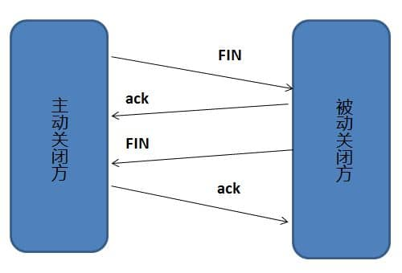

断开一个 TCP 连接则需要“四次挥手”：

* 客户端-发送一个 FIN，用来关闭客户端到服务器的数据传送
* 服务器-收到这个 FIN，它发回一 个 ACK，确认序号为收到的序号加 1 。和 SYN 一样，一个 FIN 将占用一个序号
* 服务器-关闭与客户端的连接，发送一个 FIN 给客户端
* 客户端-发回 ACK 报文确认，并将确认序号设置为收到序号加 1

任何一方都可以在数据传送结束后发出连接释放的通知，待对方确认后进入半关闭状态。当另一方也没有数据再发送的时候，则发出连接释放通知，对方确认后就完全关闭了 TCP 连接。

举个例子：A 和 B 打电话，通话即将结束后，A 说“我没啥要说的了”，B 回答“我知道了”，但是 B 可能还会有要说的话，A 不能要求 B 跟着自己的节奏结束通话，于是 B 可能又巴拉巴拉说了一通，最后 B 说“我说完了”，A 回答“知道了”，这样通话才算结束。

### 四次挥手详细流程

> 数据传输完毕后，双方都可释放连接。最开始的时候，客户端和服务器都是处于ESTABLISHED状态，然后客户端主动关闭，服务器被动关闭。

1. 客户端进程发出连接释放报文，并且停止发送数据。释放数据报文首部，FIN=1，其序列号为seq=u（等于前面已经传送过来的数据的最后一个字节的序号加1），此时，**客户端进入FIN-WAIT-1（终止等待1**状态。 **TCP规定，FIN报文段即使不携带数据，也要消耗一个序号。**
   
2. 服务器收到连接释放报文，发出确认报文，ACK=1，ack=u+1，并且带上自己的序列号seq=v，**此时，服务端就进入了CLOSE-WAIT（关闭等待)** 状态。TCP服务器通知高层的应用进程，客户端向服务器的方向就释放了，这时候处于半关闭状态，即客户端已经没有数据要发送了，但是服务器若发送数据，客户端依然要接受。这个状态还要持续一段时间，也就是整个CLOSE-WAIT状态持续的时间。

3. 客户端收到服务器的确认请求后，此时，客户端就进入**FIN-WAIT-2（终止等待2)** 状态，等待服务器发送连接释放报文（**在这之前还需要接受服务器发送的最后的数据**）。

4. 服务器将最后的数据发送完毕后，就向客户端发送连接释放报文，FIN=1，ack=u+1，由于在半关闭状态，服务器很可能又发送了一些数据，假定此时的序列号为seq=w，此时，服务器就进入了**LAST-ACK（最后确认）** 状态，等待客户端的确认。

5. 客户端收到服务器的连接释放报文后，必须发出确认，ACK=1，ack=w+1，而自己的序列号是seq=u+1，此时，**客户端就进入了TIME-WAIT（时间等待）** 状态。**注意此时TCP连接还没有释放，必须经过2∗ MSL（最长报文段寿命）的时间后，当客户端撤销相应的TCB后，才进入CLOSED状态。**

6. 服务器只要收到了客户端发出的确认，**立即进入CLOSED状态** 。同样，撤销TCB后，就结束了这次的TCP连接。可以看到，服务器结束TCP连接的时间要比客户端早一些。

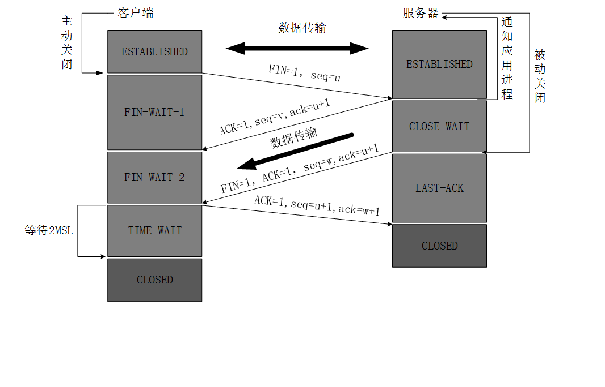

### 为什么客户端最后还要等待2MSL？

MSL（Maximum Segment Lifetime），TCP允许不同的实现可以设置不同的MSL值。

* **第一，保证客户端发送的最后一个ACK报文能够到达服务器**，因为这个ACK报文可能丢失，站在服务器的角度看来，我已经发送了FIN+ACK报文请求断开了，客户端还没有给我回应，应该是我发送的请求断开报文它没有收到，于是服务器又会重新发送一次，而客户端就能在这个2MSL时间段内收到这个重传的报文，接着给出回应报文，并且会重启2MSL计时器。
* **第二，防止类似与“三次握手”中提到了的“已经失效的连接请求报文段”出现在本连接中**。客户端发送完最后一个确认报文后，在这个2MSL时间中，就可以使本连接持续的时间内所产生的所有报文段都从网络中消失。这样新的连接中不会出现旧连接的请求报文

### 为什么建立连接是三次握手，关闭连接确是四次挥手呢？

建立连接的时候， 服务器在LISTEN状态下，收到建立连接请求的SYN报文后，把ACK和SYN放在一个报文里发送给客户端。
而关闭连接时，服务器收到对方的FIN报文时，仅仅表示对方不再发送数据了但是还能接收数据，而自己也未必全部数据都发送给对方了，所以己方可以立即关闭，也可以发送一些数据给对方后，再发送FIN报文给对方来表示同意现在关闭连接，因此，己方ACK和FIN一般都会分开发送，从而导致多了一次。

### 如果已经建立了连接，但是客户端突然出现故障了怎么办？

TCP还设有一个保活计时器，显然，客户端如果出现故障，服务器不能一直等下去，白白浪费资源。服务器每收到一次客户端的请求后都会重新复位这个计时器，时间通常是设置为2小时，若两小时还没有收到客户端的任何数据，服务器就会发送一个探测报文段，以后每隔75秒发送一次。若一连发送10个探测报文仍然没反应，服务器就认为客户端出了故障，接着就关闭连接。

### TCP 四次挥手期间的异常

#### 第一次挥手丢失了，会发生什么？

如果第一次挥手丢失了，那么客户端迟迟收不到被动方的 ACK 的话，也就会触发超时重传机制，重传 FIN 报文，重发次数由 `tcp_orphan_retries` 参数控制。

当客户端重传 FIN 报文的次数超过 `tcp_orphan_retries` 后，就不再发送 FIN 报文，直接进入到 `close` 状态。

#### 第二次挥手丢失了，会发生什么？

在前面我们也提了，ACK 报文是不会重传的，所以如果服务端的第二次挥手丢失了，客户端就会触发超时重传机制，重传 FIN 报文，直到收到服务端的第二次挥手，或者达到最大的重传次数。

对于 close 函数关闭的连接，由于无法再发送和接收数据，所以`FIN_WAIT2` 状态不可以持续太久，而 `tcp_fin_timeout` 控制了这个状态下连接的持续时长，默认值是 60 秒。

这意味着对于调用 close 关闭的连接，如果在 60 秒后还没有收到 FIN 报文，客户端（主动关闭方）的连接就会直接关闭。

#### 第三次挥手丢失了，会发生什么？

当服务端（被动关闭方）收到客户端（主动关闭方）的 FIN 报文后，内核会自动回复 ACK，同时连接处于 CLOSE_WAIT 状态，顾名思义，它表示等待应用进程调用 close 函数关闭连接

此时，内核是没有权利替代进程关闭连接，必须由进程主动调用 close 函数来触发服务端发送 FIN 报文。

服务端处于 CLOSE_WAIT 状态时，调用了 close 函数，内核就会发出 FIN 报文，同时连接进入 LAST_ACK 状态，等待客户端返回 ACK 来确认连接关闭。

如果迟迟收不到这个 ACK，服务端就会重发 FIN 报文，重发次数仍然由 `tcp_orphan_retries` 参数控制，这与客户端重发 FIN 报文的重传次数控制方式是一样的。

#### 第四次挥手丢失了，会发生什么？

当客户端收到服务端的第三次挥手的 FIN 报文后，就会回 ACK 报文，也就是第四次挥手，此时客户端连接进入 `TIME_WAIT` 状态。

在 Linux 系统，`TIME_WAIT` 状态会持续 60 秒后才会进入关闭状态。

然后，服务端（被动关闭方）没有收到 ACK 报文前，还是处于 `LAST_ACK` 状态。

如果第四次挥手的 ACK 报文没有到达服务端，服务端就会重发 FIN 报文，重发次数仍然由前面介绍过的 `tcp_orphan_retries` 参数控制。

## TCP, UDP 协议的区别

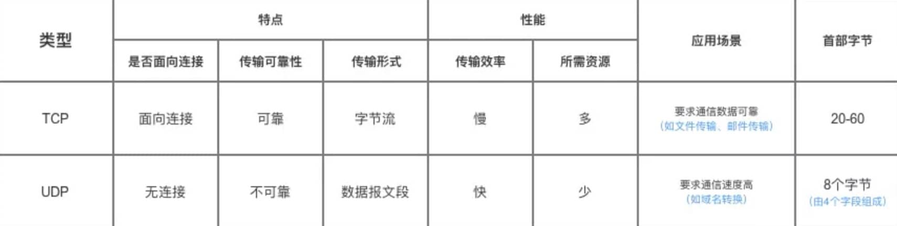

UDP 在传送数据之前不需要先建立连接，远地主机在收到 UDP 报文后，不需要给出任何确认。虽然 UDP 不提供可靠交付，但在某些情况下 UDP 却是一种最有效的工作方式（一般用于即时通信），比如： QQ 语音、 QQ 视频 、直播等等 

TCP 提供面向连接的服务。在传送数据之前必须先建立连接，数据传送结束后要释放连接。 TCP 不提供广播或多播服务。由于 TCP 要提供可靠的，面向连接的传输服务（TCP 的可靠体现在 TCP 在传递数据之前，会有三次握手来建立连接，而且在数据传递时，有确认、窗口、重传、拥塞控制机制，在数据传完后，还会断开连接用来节约系统资源），这难以避免增加了许多开销，如确认，流量控制，计时器以及连接管理等。这不仅使协议数据单元的首部增大很多，还要占用许多处理机资源。TCP 一般用于文件传输、发送和接收邮件、远程登录等场景。 

## TCP 协议如何保证可靠传输

1. 应用数据被分割成 TCP 认为最适合发送的数据块。

2. TCP 给发送的每一个包进行编号，接收方对数据包进行排序，把有序数据传送给应用层。

3. **校验和：** TCP 将保持它首部和数据的检验和。这是一个端到端的检验和，目的是检测数据在传输过程中的任何变化。如果收到段的检验和有差错，TCP 将丢弃这个报文段和不确认收到此报文段

4. TCP 的接收端会丢弃重复的数据

5. **流量控制：** TCP 连接的每一方都有固定大小的缓冲空间，TCP 的接收端只允许发送端发送接收端缓冲区能接纳的数据。当接收方来不及处理发送方的数据，能提示发送方降低发送的速率，防止包丢失。TCP 使用的流量控制协议是可变大小的滑动窗口协议。 （TCP 利用滑动窗口实现流量控制）

6. **拥塞控制：** 当网络拥塞时，减少数据的发送

7. **ARQ 协议：**  也是为了实现可靠传输的，它的基本原理就是每发完一个分组就停止发送，等待对方确认。在收到确认后再发下一个分组

8. **超时重传：**  当 TCP 发出一个段后，它启动一个定时器，等待目的端确认收到这个报文段。如果不能及时收到一个确认，将重发这个报文段

### ARQ 协议

**自动重传请求**（Automatic Repeat-reQuest，ARQ）是 OSI 模型中数据链路层和传输层的错误纠正协议之一。它通过使用确认和超时这两个机制，在不可靠服务的基础上实现可靠的信息传输。如果发送方在发送后一段时间之内没有收到确认帧，它通常会重新发送。**ARQ 包括停止等待 ARQ 协议和连续 ARQ 协议**。 

#### 停止等待 ARQ 协议

停止等待协议是为了实现可靠传输的，它的基本原理就是每发完一个分组就停止发送，等待对方确认（回复 ACK）。如果过了一段时间（超时时间后），还是没有收到 ACK 确认，说明没有发送成功，需要重新发送，直到收到确认后再发下一个分组。 

在停止等待协议中，若接收方收到重复分组，就丢弃该分组，但同时还要发送确认。

**优缺点：**
* **优点：** 简单
* **缺点：** 信道利用率低，等待时间长

**1) 无差错情况:**

发送方发送分组, 接收方在规定时间内收到, 并且回复确认. 发送方再次发送。

**2) 出现差错情况（超时重传）:**

停止等待协议中超时重传是指只要超过一段时间仍然没有收到确认，就重传前面发送过的分组（认为刚才发送过的分组丢失了）。因此每发送完一个分组需要设置一个超时计时器，其重传时间应比数据在分组传输的平均往返时间更长一些。这种自动重传方式常称为 自动重传请求 ARQ 。另外在停止等待协议中若收到重复分组，就丢弃该分组，但同时还要发送确认。**连续 ARQ 协议 可提高信道利用率。** 发送维持一个发送窗口，凡位于发送窗口内的分组可连续发送出去，而不需要等待对方确认。**接收方一般采用累积确认，对按序到达的最后一个分组发送确认，表明到这个分组位置的所有分组都已经正确收到了**

**3) 确认丢失和确认迟到**

* **确认丢失 ：** 确认消息在传输过程丢失。当 A 发送 M1 消息，B 收到后，B 向 A 发送了一个 M1 确认消息，但却在传输过程中丢失。而 A 并不知道，在超时计时过后，A 重传 M1 消息，B 再次收到该消息后采取以下两点措施：**1. 丢弃这个重复的 M1 消息，不向上层交付。** **2. 向 A 发送确认消息。**（不会认为已经发送过了，就不再发送。A 能重传，就证明 B 的确认消息丢失）。
* **确认迟到 ：** 确认消息在传输过程中迟到。A 发送 M1 消息，B 收到并发送确认。在超时时间内没有收到确认消息，A 重传 M1 消息，B 仍然收到并继续发送确认消息（B 收到了 2 份 M1）。此时 A 收到了 B 第二次发送的确认消息。接着发送其他数据。过了一会，A 收到了 B 第一次发送的对 M1 的确认消息（A 也收到了 2 份确认消息）。处理如下：1. A 收到重复的确认后，直接丢弃。2. B 收到重复的 M1 后，也直接丢弃重复的 M1。

#### 连续 ARQ 协议

连续 ARQ 协议可提高信道利用率。发送方维持一个发送窗口，凡位于发送窗口内的分组可以连续发送出去，而不需要等待对方确认。接收方一般采用累积确认，对按序到达的最后一个分组发送确认，表明到这个分组为止的所有分组都已经正确收到了。

**优缺点：**

* **优点：** 信道利用率高，容易实现，即使确认丢失，也不必重传。
* **缺点：** 不能向发送方反映出接收方已经正确收到的所有分组的信息。 比如：发送方发送了 5 条 消息，中间第三条丢失（3 号），这时接收方只能对前两个发送确认。发送方无法知道后三个分组的下落，而只好把后三个全部重传一次。这也叫 Go-Back-N（回退 N），表示需要退回来重传已经发送过的 N 个消息

### 滑动窗口和流量控制

**TCP 利用滑动窗口实现流量控制。流量控制是为了控制发送方发送速率，保证接收方来得及接收。** 接收方发送的确认报文中的窗口字段可以用来控制发送方窗口大小，从而影响发送方的发送速率。将窗口字段设置为 0，则发送方不能发送数据。

### 拥塞控制

**在某段时间，若对网络中某一资源的需求超过了该资源所能提供的可用部分，网络的性能就要变坏。这种情况就叫拥塞。拥塞控制就是为了防止过多的数据注入到网络中，这样就可以使网络中的路由器或链路不致过载。** 拥塞控制所要做的都有一个前提，就是网络能够承受现有的网络负荷。拥塞控制是一个全局性的过程，涉及到所有的主机，所有的路由器，以及与降低网络传输性能有关的所有因素。相反，流量控制往往是点对点通信量的控制，是个端到端的问题。流量控制所要做到的就是抑制发送端发送数据的速率，以便使接收端来得及接收

为了进行拥塞控制，TCP 发送方要维持一个 **拥塞窗口(cwnd)** 的状态变量。拥塞控制窗口的大小取决于网络的拥塞程度，并且动态变化。发送方让自己的发送窗口取为拥塞窗口和接收方的接受窗口中较小的一个。 

TCP 的拥塞控制采用了四种算法，即 **慢开始 、 拥塞避免 、快重传 和 快恢复**。在网络层也可以使路由器采用适当的分组丢弃策略（如主动队列管理 AQM），以减少网络拥塞的发生。

* **慢开始：** 慢开始算法的思路是当主机开始发送数据时，如果立即把大量数据字节注入到网络，那么可能会引起网络阻塞，因为现在还不知道网络的符合情况。经验表明，较好的方法是先探测一下，即由小到大逐渐增大发送窗口，也就是由小到大逐渐增大拥塞窗口数值。cwnd 初始值为 1，每经过一个传播轮次，cwnd 加倍
* **拥塞避免：** 拥塞避免算法的思路是让拥塞窗口 cwnd 缓慢增大，即每经过一个往返时间 RTT 就把发送放的 cwnd 加 1.
* **快重传与快恢复：** 在 TCP/IP 中，快速重传和恢复（fast retransmit and recovery，FRR）是一种拥塞控制算法，它能快速恢复丢失的数据包。没有 FRR，如果数据包丢失了，TCP 将会使用定时器来要求传输暂停。在暂停的这段时间内，没有新的或复制的数据包被发送。有了 FRR，如果接收机接收到一个不按顺序的数据段，它会立即给发送机发送一个重复确认。如果发送机接收到三个重复确认，它会假定确认件指出的数据段丢失了，并立即重传这些丢失的数据段。有了 FRR，就不会因为重传时要求的暂停被耽误。 　**当有单独的数据包丢失时，快速重传和恢复（FRR）能最有效地工作。当有多个数据信息包在某一段很短的时间内丢失时，它则不能很有效地工作**

## 在浏览器输入 url 网址 → 显示主页的过程

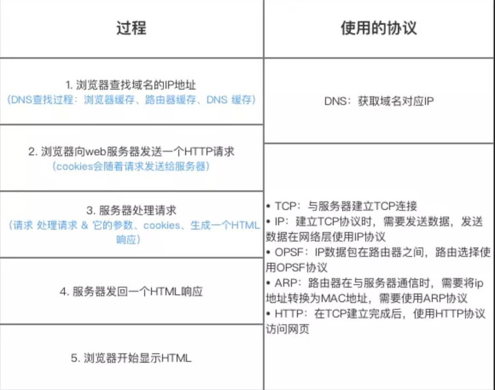

总体来说分为以下几个过程:
* DNS解析
* 建立TCP连接
* 发送HTTP请求
* 服务器处理请求并返回HTTP报文
* 浏览器解析渲染页面
* 连接结束

### DNS解析

**DNS解析的过程就是寻找哪台机器上有你需要资源的过程。** 互联网上每一台计算机的唯一标识是它的IP地址，但是IP地址并不方便记忆。用户更喜欢用方便记忆的网址去寻找互联网上的其它计算机，所以互联网设计者需要在用户的方便性与可用性方面做一个权衡，这个权衡就是一个网址到IP地址的转换，这个过程就是DNS解析。

#### 解析过程

DNS解析是一个递归查询的过程。

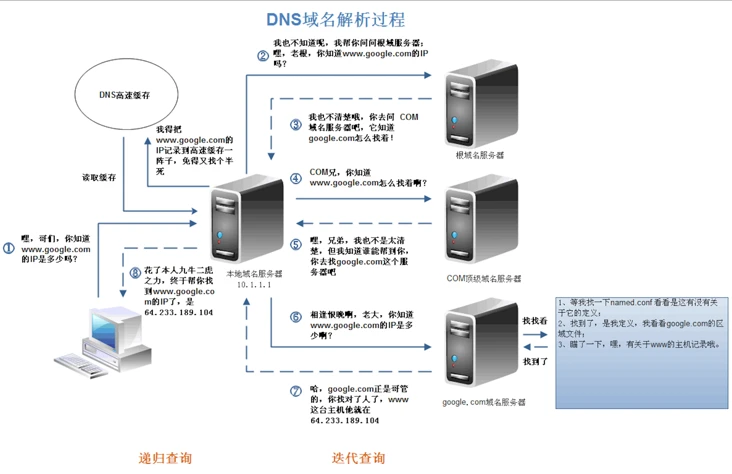

上述图片是查找www.google.com的IP地址过程。首先在本地域名服务器中查询IP地址，如果没有找到的情况下，本地域名服务器会向根域名服务器发送一个请求，如果根域名服务器也不存在该域名时，本地域名会向com顶级域名服务器发送一个请求，依次类推下去。直到最后本地域名服务器得到google的IP地址并把它缓存到本地，供下次查询使用。从上述过程中，可以看出网址的解析是一个**从右向左**的过程: com -> google.com -> www.google.com。但是你是否发现少了点什么，根域名服务器的解析过程呢？事实上，真正的网址是www.google.com.，并不是我多打了一个.，这个.对应的就是根域名服务器，默认情况下所有的网址的最后一位都是.，既然是默认情况下，为了方便用户，通常都会省略，浏览器在请求DNS的时候会自动加上，所有网址真正的解析过程为: . -> .com -> google.com. -> www.google.com.。

### TCP 连接

TCP连接通过三次握手来建立

### HTTP请求

发送HTTP请求的过程就是构建HTTP请求报文并通过TCP协议中发送到服务器指定端口(HTTP协议80/8080, HTTPS协议443)。HTTP请求报文是由三部分组成: **请求行, 请求报头和请求正文**。

**请求行**

格式如下:

Method Request-URL HTTP-Version CRLF

`eg: GET index.html HTTP/1.1`

常用的方法有: GET, POST, PUT, DELETE, OPTIONS, HEAD。

**请求报头**

请求报头允许客户端向服务器传递请求的附加信息和客户端自身的信息。
PS: 客户端不一定特指浏览器，有时候也可使用Linux下的CURL命令以及HTTP客户端测试工具等。
常见的请求报头有: Accept, Accept-Charset, Accept-Encoding, Accept-Language, Content-Type, Authorization, Cookie, User-Agent等。
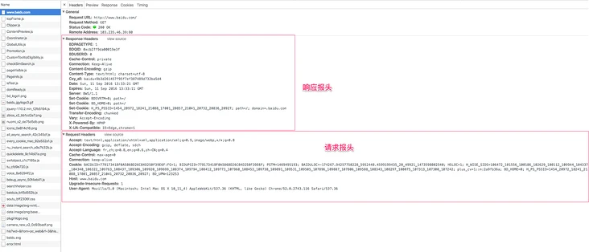

上图是使用Chrome开发者工具截取的对百度的HTTP请求以及响应报文，从图中可以看出，请求报头中使用了Accept, Accept-Encoding, Accept-Language, Cache-Control, Connection, Cookie等字段。Accept用于指定客户端用于接受哪些类型的信息，Accept-Encoding与Accept类似，它用于指定接受的编码方式。Connection设置为Keep-alive用于告诉客户端本次HTTP请求结束之后并不需要关闭TCP连接，这样可以使下次HTTP请求使用相同的TCP通道，节省TCP连接建立的时间

**请求正文**

当使用POST, PUT等方法时，通常需要客户端向服务器传递数据。这些数据就储存在请求正文中。在请求包头中有一些与请求正文相关的信息，例如: 现在的Web应用通常采用Rest架构，请求的数据格式一般为json。这时就需要设置Content-Type: application/json。

### 服务器处理请求并返回HTTP报文

后端从在固定的端口接收到TCP报文开始，这一部分对应于编程语言中的socket。它会对TCP连接进行处理，对HTTP协议进行解析，并按照报文格式进一步封装成HTTP Request对象，供上层使用。

HTTP响应报文也是由三部分组成: **状态码**, **响应报头和响应报文**。

**状态码**

状态码是由3位数组成，第一个数字定义了响应的类别，且有五种可能取值:

* 1xx：指示信息–表示请求已接收，继续处理。
* 2xx：成功–表示请求已被成功接收、理解、接受。
* 3xx：重定向–要完成请求必须进行更进一步的操作。
* 4xx：客户端错误–请求有语法错误或请求无法实现。
* 5xx：服务器端错误–服务器未能实现合法的请求。

平时遇到比较常见的状态码有:200, 204, 301, 302, 304, 400, 401, 403, 404, 422, 500

**响应报头** 

常见的响应报头字段有: Server, Connection...。

**响应报文**

服务器返回给浏览器的文本信息，通常HTML, CSS, JS, 图片等文件就放在这一部分。

### 浏览器解析渲染页面

浏览器在收到HTML,CSS,JS文件后，它是如何把页面呈现到屏幕上的？下图对应的就是WebKit渲染的过程。

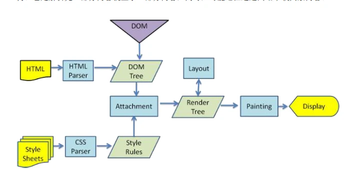

浏览器是一个边解析边渲染的过程。首先浏览器解析HTML文件构建DOM树，然后解析CSS文件构建渲染树，等到渲染树构建完成后，浏览器开始布局渲染树并将其绘制到屏幕上。这个过程比较复杂，涉及到两个概念: reflow(回流)和repaint(重绘)。DOM节点中的各个元素都是以盒模型的形式存在，这些都需要浏览器去计算其位置和大小等，这个过程称为relow;当盒模型的位置,大小以及其他属性，如颜色,字体,等确定下来之后，浏览器便开始绘制内容，这个过程称为repaint。页面在首次加载时必然会经历reflow和repaint。reflow和repaint过程是非常消耗性能的，尤其是在移动设备上，它会破坏用户体验，有时会造成页面卡顿。所以我们应该尽可能少的减少reflow和repaint。

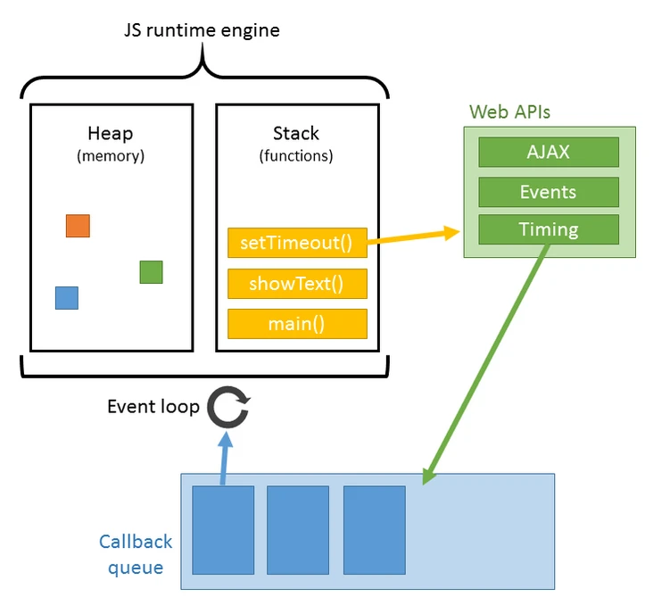

JS的解析是由浏览器中的JS解析引擎完成的。JS是单线程运行，也就是说，在同一个时间内只能做一件事，所有的任务都需要排队，前一个任务结束，后一个任务才能开始。但是又存在某些任务比较耗时，如IO读写等，所以需要一种机制可以先执行排在后面的任务，这就是：同步任务(synchronous)和异步任务(asynchronous)。JS的执行机制就可以看做是一个主线程加上一个任务队列(task queue)。同步任务就是放在主线程上执行的任务，异步任务是放在任务队列中的任务。所有的同步任务在主线程上执行，形成一个执行栈;异步任务有了运行结果就会在任务队列中放置一个事件；脚本运行时先依次运行执行栈，然后会从任务队列里提取事件，运行任务队列中的任务，这个过程是不断重复的，所以又叫做事件循环(Event loop)。

浏览器在解析过程中，如果遇到请求外部资源时，如图像,iconfont,JS等。浏览器将重复1-6过程下载该资源。请求过程是异步的，并不会影响HTML文档进行加载，但是当文档加载过程中遇到JS文件，HTML文档会挂起渲染过程，不仅要等到文档中JS文件加载完毕还要等待解析执行完毕，才会继续HTML的渲染过程。原因是因为JS有可能修改DOM结构，这就意味着JS执行完成前，后续所有资源的下载是没有必要的，这就是JS阻塞后续资源下载的根本原因。CSS文件的加载不影响JS文件的加载，但是却影响JS文件的执行。JS代码执行前浏览器必须保证CSS文件已经下载并加载完毕。

### 连接结束

## 状态码

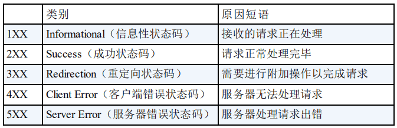

