## 1. 计算机网络概述

### 1.1. 基本术语

**1. 结点 （node）:** 网络中的结点可以是计算机，集线器，交换机或路由器等。

**2. 链路（link ） :** 从一个结点到另一个结点的一段物理线路。中间没有任何其他交点。

**3. 主机（host） ：** 连接在因特网上的计算机。

**4. ISP（Internet Service Provider） ：** 因特网服务提供者（提供商）。

**5. IXP（Internet eXchange Point） ：** 互联网交换点 IXP 的主要作用就是允许两个网络直接相连并交换分组，而不需要再通过第三个网络来转发分组。

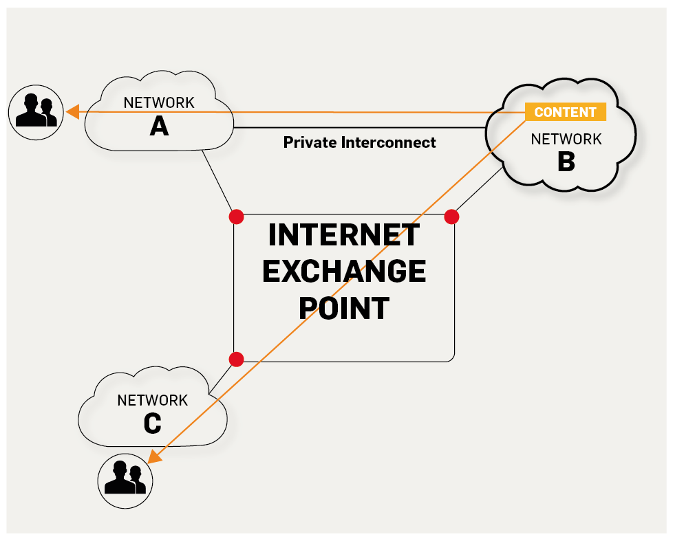

**6. RFC(Request For Comments) ：** 意思是“请求评议”，包含了关于 Internet 几乎所有的重要的文字资料。

**7. 广域网 WAN（Wide Area Network） ：** 任务是通过长距离运送主机发送的数据。

**8. 城域网 MAN（Metropolitan Area Network）：** 用来将多个局域网进行互连。

**9. 局域网 LAN（Local Area Network） ：** 学校或企业大多拥有多个互连的局域网。

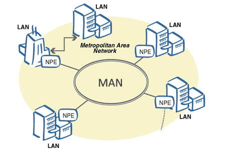

**10. 个人区域网 PAN（Personal Area Network） ：** 在个人工作的地方把属于个人使用的电子设备用无线技术连接起来的网络 。

**11. 分组（packet ） ：** 因特网中传送的数据单元。由首部 header 和数据段组成。分组又称为包，首部可称为包头。

**12. 存储转发（store and forward ） ：** 路由器收到一个分组，先检查分组是否正确，并过滤掉冲突包错误。确定包正确后，取出目的地址，通过查找表找到想要发送的输出端口地址，然后将该包发送出去。

**13. 带宽（bandwidth） ：** 在计算机网络中，表示在单位时间内从网络中的某一点到另一点所能通过的“最高数据率”。常用来表示网络的通信线路所能传送数据的能力。单位是“比特每秒”，记为 b/s。

**14. 吞吐量（throughput ） ：** 表示在单位时间内通过某个网络（或信道、接口）的数据量。吞吐量更经常地用于对现实世界中的网络的一种测量，以便知道实际上到底有多少数据量能够通过网络。吞吐量受网络的带宽或网络的额定速率的限制。

### 1.2. 重要知识点总结

1. **计算机网络（简称网络）把许多计算机连接在一起，而互联网把许多网络连接在一起，是网络的网络。**
2. 小写字母 i 开头的 internet（互联网）是通用名词，它泛指由多个计算机网络相互连接而成的网络。在这些网络之间的通信协议（即通信规则）可以是任意的。大写字母 I 开头的 Internet（互联网）是专用名词，它指全球最大的，开放的，由众多网络相互连接而成的特定的互联网，并采用 TCP/IP 协议作为通信规则，其前身为 ARPANET。Internet 的推荐译名为因特网，现在一般流行称为互联网。
3. 路由器是实现分组交换的关键构件，其任务是转发收到的分组，这是网络核心部分最重要的功能。分组交换采用存储转发技术，表示把一个报文（要发送的整块数据）分为几个分组后再进行传送。在发送报文之前，先把较长的报文划分成为一个个更小的等长数据段。在每个数据端的前面加上一些由必要的控制信息组成的首部后，就构成了一个分组。分组又称为包。分组是在互联网中传送的数据单元，正是由于分组的头部包含了诸如目的地址和源地址等重要控制信息，每一个分组才能在互联网中独立的选择传输路径，并正确地交付到分组传输的终点。
4. 互联网按工作方式可划分为边缘部分和核心部分。主机在网络的边缘部分，其作用是进行信息处理。由大量网络和连接这些网络的路由器组成核心部分，其作用是提供连通性和交换。
5. 计算机通信是计算机中进程（即运行着的程序）之间的通信。计算机网络采用的通信方式是客户-服务器方式（C/S 方式）和对等连接方式（P2P 方式）。
6. 客户和服务器都是指通信中所涉及的应用进程。客户是服务请求方，服务器是服务提供方。
7. 按照作用范围的不同，计算机网络分为广域网 WAN，城域网 MAN，局域网 LAN，个人区域网 PAN。
8. 计算机网络最常用的性能指标是：**速率，带宽，吞吐量，时延（发送时延，处理时延，排队时延），时延带宽积，往返时间和信道利用率。**
9. 网络协议即协议，是为进行网络中的数据交换而建立的规则。计算机网络的各层以及其协议集合，称为网络的体系结构。
10. 五层体系结构由应用层，运输层，网络层（网际层），数据链路层，物理层组成。**运输层最主要的协议是 TCP 和 UDP 协议，网络层最重要的协议是 IP 协议。**

## 2. 物理层（Physical Layer）

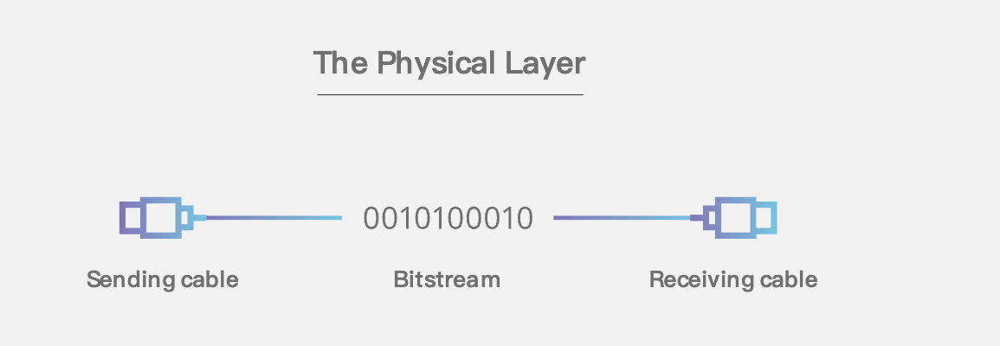

### 2.1. 基本术语

1. **数据（data） :** 运送消息的实体

2. **信号（signal） ：** 数据的电气的或电磁的表现。或者说信号是适合在传输介质上传输的对象

3. **码元（ code） ：** 在使用时间域（或简称为时域）的波形来表示数字信号时，代表不同离散数值的基本波形

4. **单工（simplex ） :** 只能有一个方向的通信而没有反方向的交互

5. **半双工（half duplex ） ：** 通信的双方都可以发送信息，但不能双方同时发送(当然也就不能同时接收)

6. **全双工（full duplex） :** 通信的双方可以同时发送和接收信息

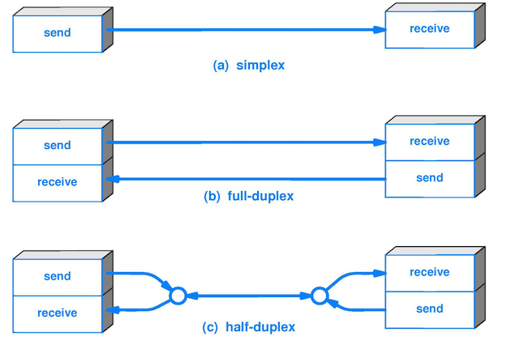

7. **失真 :** 失去真实性，主要是指接受到的信号和发送的信号不同，有磨损和衰减。影响失真程度的因素：1.码元传输速率 2.信号传输距离 3.噪声干扰 4.传输媒体质量

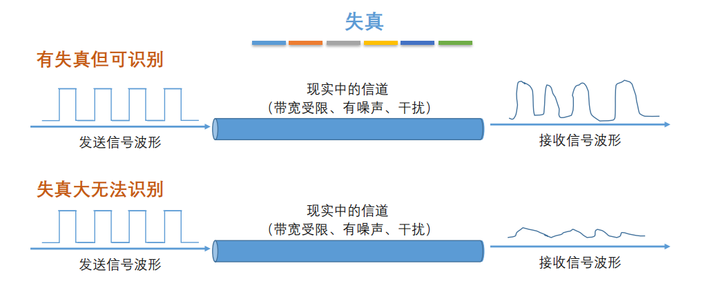

8. **奈氏准则 :** 在任何信道中，码元的传输的效率是有上限的，传输速率超过此上限，就会出现严重的码间串扰问题，使接收端对码元的判决（即识别）成为不可能。

9. **香农定理 ：** 在带宽受限且有噪声的信道中，为了不产生误差，信息的数据传输速率有上限值

10. **基带信号（baseband signal） :** 来自信源的信号。指没有经过调制的数字信号或模拟信号

11. **带通（频带）信号（bandpass signal） ：** 把基带信号经过载波调制后，把信号的频率范围搬移到较高的频段以便在信道中传输（即仅在一段频率范围内能够通过信道），这里调制过后的信号就是带通信号

12. **调制（modulation ） :** 对信号源的信息进行处理后加到载波信号上，使其变为适合在信道传输的形式的过程

13. **信噪比（signal-to-noise ratio ） :** 指信号的平均功率和噪声的平均功率之比，记为 S/N。信噪比（dB）=10*log10（S/N）

14. **信道复用（channel multiplexing ） ：** 指多个用户共享同一个信道。（并不一定是同时）。

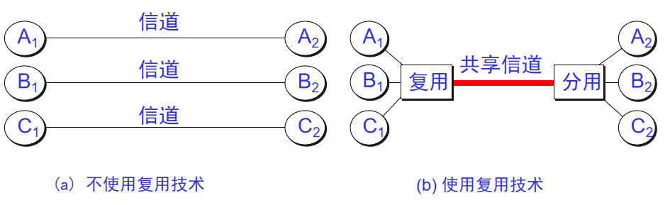

15. **比特率（bit rate ） ：** 单位时间（每秒）内传送的比特数

16. **波特率（baud rate） ：** 单位时间载波调制状态改变的次数。针对数据信号对载波的调制速率。

17. **复用（multiplexing） ：** 共享信道的方法

18. **ADSL（Asymmetric Digital Subscriber Line ） ：** 非对称数字用户线

19. **光纤同轴混合网（HFC 网） :** 在目前覆盖范围很广的有线电视网的基础上开发的一种居民宽带接入网

### 2.2. 重要知识点总结

1. **物理层的主要任务就是确定与传输媒体接口有关的一些特性，如机械特性，电气特性，功能特性，过程特性**

2. 一个数据通信系统可划分为三大部分，即源系统，传输系统，目的系统。源系统包括源点（或源站，信源）和发送器，目的系统包括接收器和终点。

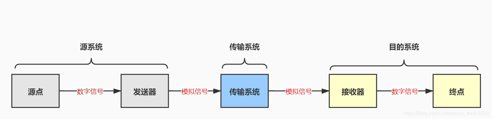

3. **通信的目的是传送消息。如话音，文字，图像等都是消息，数据是运送消息的实体。信号则是数据的电气或电磁的表现。**

4. 根据信号中代表消息的参数的取值方式不同，信号可分为模拟信号（或连续信号）和数字信号（或离散信号）。在使用时间域（简称时域）的波形表示数字信号时，代表不同离散数值的基本波形称为码元。

5. 根据双方信息交互的方式，通信可划分为单向通信（或单工通信），双向交替通信（或半双工通信），双向同时通信（全双工通信）。

6. 来自信源的信号称为基带信号。信号要在信道上传输就要经过调制。调制有基带调制和带通调制之分。最基本的带通调制方法有调幅，调频和调相。还有更复杂的调制方法，如正交振幅调制。

7. 要提高数据在信道上的传递速率，可以使用更好的传输媒体，或使用先进的调制技术。但数据传输速率不可能任意被提高。

8. 传输媒体可分为两大类，即导引型传输媒体（双绞线，同轴电缆，光纤）和非导引型传输媒体（无线，红外，大气激光）。

9.  为了有效利用光纤资源，在光纤干线和用户之间广泛使用无源光网络 PON。无源光网络无需配备电源，其长期运营成本和管理成本都很低。最流行的无源光网络是以太网无源光网络 EPON 和吉比特无源光网络 GPON。

### 2.3. 补充

2.3.1. 物理层主要做啥？

物理层主要做的事情就是 透明地传送比特流。也可以将物理层的主要任务描述为确定与传输媒体的接口的一些特性，即：机械特性（接口所用接线器的一些物理属性如形状和尺寸），电气特性（接口电缆的各条线上出现的电压的范围），功能特性（某条线上出现的某一电平的电压的意义），过程特性（对于不同功能的各种可能事件的出现顺序）。

**物理层考虑的是怎样才能在连接各种计算机的传输媒体上传输数据比特流，而不是指具体的传输媒体。** 现有的计算机网络中的硬件设备和传输媒体的种类非常繁多，而且通信手段也有许多不同的方式。物理层的作用正是尽可能地屏蔽掉这些传输媒体和通信手段的差异，使物理层上面的数据链路层感觉不到这些差异，这样就可以使数据链路层只考虑完成本层的协议和服务，而不必考虑网络的具体传输媒体和通信手段是什么。

2.3.2. 几种常用的信道复用技术

1. **频分复用(FDM) ：** 所有用户在同样的时间占用不同的带宽资源。

>频分复用的基本思想是：要传送的信号带宽是有限的，而线路可使用的带宽则远远大于要传送的信号带宽，通过对多路信号采用不同频率进行调制的方法，使调制后的各路信号在频率位置上错开，以达到多路信号同时在一个信道内传输的目的。因此，频分复用的各路信号是在时间上重叠而在频谱上不重叠的信号。

2. **时分复用（TDM） ：** 所有用户在不同的时间占用同样的频带宽度（分时不分频）。

3. **统计时分复用 (Statistic TDM) ：** 也叫异步时分复用, 是一种根据用户实际需要动态分配线路资源的时分复用方法。

4. **码分复用(CDM) ：** 用户使用经过特殊挑选的不同码型，因此各用户之间不会造成干扰。这种系统发送的信号有很强的抗干扰能力，其频谱类似于白噪声，不易被敌人发现。

5. **波分复用( WDM) ：** 波分复用就是光的频分复用。

2.3.3. 几种常用的宽带接入技术，主要是 ADSL 和 FTTx

用户到互联网的宽带接入方法有非对称数字用户线 ADSL（用数字技术对现有的模拟电话线进行改造，而不需要重新布线。ADSL 的快速版本是甚高速数字用户线 VDSL。），光纤同轴混合网 HFC（是在目前覆盖范围很广的有线电视网的基础上开发的一种居民宽带接入网）和 FTTx（即光纤到x, 为各种光纤通讯网络的总称）

## 3. 数据链路层（Data Link Layer）

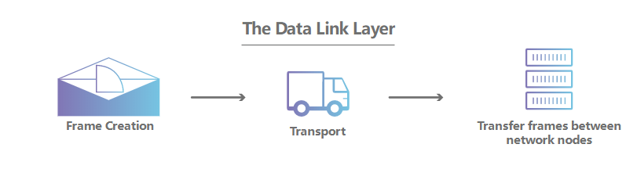

### 3.1. 基本术语

1. **链路（link） ：** 一个结点到相邻结点的一段物理链路

2. **数据链路（data link） ：** 把实现控制数据运输的协议的硬件和软件加到链路上就构成了数据链路

3. **循环冗余检验 CRC（Cyclic Redundancy Check） ：** 为了保证数据传输的可靠性，CRC 是数据链路层广泛使用的一种检错技术

4. **帧（frame） ：** 一个数据链路层的传输单元，由一个数据链路层首部和其携带的封包所组成协议数据单元

5. **MTU（Maximum Transfer Uint ） ：** 最大传送单元。帧的数据部分的的长度上限

6. **误码率 BER（Bit Error Rate ） ：** 在一段时间内，传输错误的比特占所传输比特总数的比率

7. **PPP（Point-to-Point Protocol ） ：** 点对点协议。即用户计算机和 ISP 进行通信时所使用的数据链路层协议。以下是 PPP 帧的示意图：

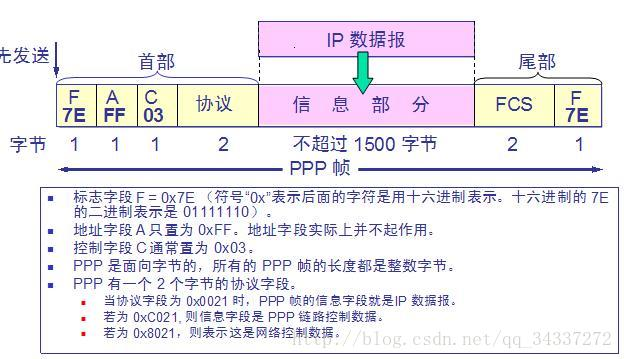

帧校验域（FCS）也为两个字节，它用于对信息域的校验
**若信息域中出现7EH，则转换为（7DH，5EH）两个字符。当信息域出现7DH时，则转换为（7DH，5DH）。** 当信息流中出现ASCII码的控制字符（即小于20H），即在该字符前加入一个7DH字符。

8. **MAC 地址（Media Access Control 或者 Medium Access Control） ：** 意译为媒体访问控制，或称为物理地址、硬件地址，**用来定义网络设备的位置**。在 OSI 模型中，第三层网络层负责 IP 地址，第二层数据链路层则负责 MAC 地址。因此一个主机会有一个 MAC 地址，而每个网络位置会有一个专属于它的 IP 地址 。地址是识别某个系统的重要标识符，“名字指出我们所要寻找的资源，地址指出资源所在的地方，路由告诉我们如何到达该处。”

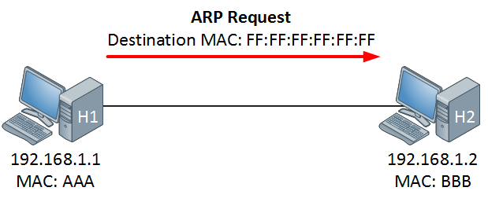

9. **网桥（bridge） ：** 一种用于数据链路层实现中继，连接两个或多个局域网的网络互连设备

10. **交换机（switch ） ：** 广义的来说，交换机指的是一种通信系统中完成信息交换的设备。这里工作在数据链路层的交换机指的是交换式集线器，其实质是一个多接口的网桥

### 3.2. 重要知识点总结

1. 链路是从一个结点到相邻结点的一段物理链路，数据链路则在链路的基础上增加了一些必要的硬件（如网络适配器）和软件（如协议的实现）

2. 数据链路层使用的主要是**点对点信道**和**广播信道**两种。

3. 数据链路层传输的协议数据单元是帧。数据链路层的三个基本问题是：**封装成帧，透明传输和差错检测**

4. **循环冗余检验 CRC** 是一种检错方法，而帧检验序列 FCS 是添加在数据后面的冗余码

5. **点对点协议 PPP** 是数据链路层使用最多的一种协议，它的特点是：简单，只检测差错而不去纠正差错，不使用序号，也不进行流量控制，可同时支持多种网络层协议

6. PPPoE 是为宽带上网的主机使用的链路层协议

7. **局域网的优点是：** 具有广播功能，从一个站点可方便地访问全网；便于系统的扩展和逐渐演变；提高了系统的可靠性，可用性和生存性。

8. 计算机与外接局域网通信需要通过通信适配器（或网络适配器），它又称为网络接口卡或网卡。**计算器的硬件地址就在适配器的 ROM 中。**

9. 以太网采用的无连接的工作方式，对发送的数据帧不进行编号，也不要求对方发回确认。目的站收到有差错帧就把它丢掉，其他什么也不做

10. 以太网采用的协议是具有冲突检测的载波监听多路访问 CSMA/CD。协议的特点是：发送前先监听，边发送边监听，一旦发现总线上出现了碰撞，就立即停止发送。然后按照退避算法等待一段随机时间后再次发送。 因此，每一个站点在自己发送数据之后的一小段时间内，存在着遭遇碰撞的可能性。以太网上的各站点平等地争用以太网信道

11. 以太网的适配器具有过滤功能，它只接收单播帧，广播帧和多播帧。

12. 使用集线器可以在物理层扩展以太网（扩展后的以太网仍然是一个网络）

### 3.3. 补充

1. 数据链路层的点对点信道和广播信道的特点，以及这两种信道所使用的协议（PPP 协议以及 CSMA/CD 协议）的特点

* 点对点信道：使用一对一的点对点通信方式。
* 广播信道：使用一对多的广播通信方式。由于连接的主机很多，因此必须使用专用的共享信道协议来协调这些主机的数据发送。
* PPP 协议: 简单，只检测差错而不去纠正差错，不使用序号，也不进行流量控制，可同时支持多种网络层协议
* CSMA/CD 协议: 发送前先监听，边发送边监听，一旦发现总线上出现了碰撞，就立即停止发送。然后按照退避算法等待一段随机时间后再次发送。 因此，每一个站点在自己发送数据之后的一小段时间内，存在着遭遇碰撞的可能性。以太网上的各站点平等地争用以太网信道

2. 数据链路层的三个基本问题：封装成帧，透明传输，差错检测

* 封装成帧就是在一段数据前后分别添加首部和尾部。接收端以便从收到的比特流中识别帧的开始与结束，帧定界是分组交换的必然要求
* 透明传输则是则是防止数据中也出现开始和结束的字符，使得解析时错误的解析，那么就必须插入转义字符。也就是消息符号和帧定界符号的相互混淆
* 差错检验是为了防止无效的数据帧在后续路由网络上的传输, 造成了网络的浪费

3. 以太网的 MAC 层硬件地址

**48 位的 MAC 地址**

> IEEE 的注册管理机构 RA 负责向厂家分配地址字段 6 个字节中的前三个字节 (即高位 24 位)，称为**组织唯一标识符。**

> 所以就只有 3 个字节能支配了，这 3 个字节由厂家支配，称为**扩展唯一标识符**，必须保证生产出的适配器没有重复地址。

生产适配器时，6 字节的 MAC 地址已被固化在适配器的 ROM，因此，MAC 地址也叫做硬件地址 (hardware address) 或物理地址。

所以无论你把它带到哪里去，或者把它砸了，烧了，它的硬件地址还是不会变。

**下面介绍一下 IEEE 组织的一些规定：**

* IEEE 规定地址字段的 **第一字节的最低位** 为 $ I / G $ 位。$I / G$ 表示 $I n d i v i d u a l / G r o u p $
* 当 $I / G $ 位 $= 0$ 时，地址字段表示一个单站地址。
* 当 $I / G $ 位 $= 1$时，表示组地址，用来进行多播。

所以对于前三个字节，既然第一个字节的最后一位被占用了，就只能支配其余的 $23$位了。

> ❗所有 48 位都为 1 时，为广播地址。只能作为目的地址使用。

**IEEE 又规定了:**

* IEEE 把地址字段第一字节的倒数第 $2$ 位规定为 $G / L$, 表示 $Global / Local$
* 当$G / L$ 位 $= 0$ 时， 是全球管理。
* 当$G / L$ 位 $= 1$ 时， 是本地管理。

> 全球管理需要购买，本地管理用户自定义，不过以太网几乎不会去理会这个用户自定义的。

**适配器检查 MAC 地址**

适配器从网络上每收到一个 MAC 帧就首先用硬件检查 MAC 帧中的 MAC 地址，然后检查这个帧是否是下面的其中一种，如果不是就丢弃，如果是就收下然后转发

* 单播 (unicast) 帧（一对一）
* 广播 (broadcast) 帧（一对全体）
* 多播 (multicast) 帧（一对多）

**MAC 帧的格式**

常用的以太网 MAC 帧格式有两种标准 ：

* DIX Ethernet V2 标准
* IEEE的802.3 标准

最常用的$ M A C $帧是以太网 $V 2$的格式。

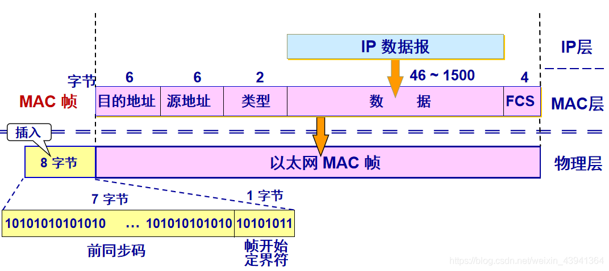

我们来放大看一下：

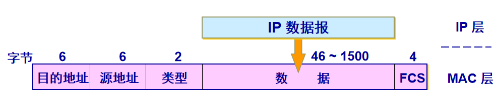

* 首先是目的地址字段，占 6 个字节
* 然后是源地址字段，也是 6 字节
* 类型字段用来标志上一层使用的是什么协议，以便把收到的 $M A C$ 帧的数据上交给上一层的这个协议
* 数据字段的正式名称是 MAC 客户数据字段。 最小长度 $64 字 节 − 18 字 节$的首部和尾部 $=$ 数据字段的最小长度（ $46$字节
* FSC 用于差错检测

其实你会发现从 $M A C $层到物理层还会多出 $8$个字节，那么这 $8$个字节是啥呢

> 在帧的前面插入（硬件生成）的 8 字节中，第一个字段共 7 个字节，是前同步码，用来迅速实现 MAC帧的比特同步。第二个字段 1 个字节是帧开始定界符，表示后面的信息就是 MAC 帧。

最后提一下与 $I E E E   802.3   M A C 帧$的区别：

* IEEE 802.3 规定的 MAC 帧的第三个字段是“长度 / 类型”。
* 当 长度 / 类型 字段值小于$ 0 x 0600$时，数据字段必须装入上面的逻辑链路控制 LLC 子层的 LLC 帧。

> 帧间最小间隔为 $9.6 μ s$，相当于 $96 b i t$的发送时间。（10M以太网）
一个站在检测到总线开始空闲后，还要等待 $9.6 μ s$才能再次发送数据。
这样做是为了使刚刚收到数据帧的站的接收缓存来得及清理，做好接收下一帧的准备。

**为什么MAC帧最短长度为512bit(64字节)**

CSMA/CD协议的一个要点就是当发送站正在发送时，若检测到冲突则立即终止发送，然后推后一段时间再发送。如果所发送的帧太短，还没来得及检测到最远到来的冲突就已经发送完了，那么就无法进行冲突检测了。结果是：发送失败，但未察觉而不重发。

**无效的 MAC 帧**
* 帧的长度不是整数个字节
* 用收到的帧检验序列 FCS 查出有差错
* 数据字段的长度不在 46 ~ 1500 字节之间
* 有效的 MAC 帧长度为 64 ~ 1518 字节之间
* 对于检查出的无效 MAC 帧就简单地丢弃。以太网不负责重传丢弃的帧

4. 适配器，转发器，集线器，网桥，以太网交换机的作用以及适用场合

* 适配器：计算机与外界局域网的连接是通过通信适配器进行的。适配器本来即网卡。适配器和局域网之间的通信是通过电缆或双绞线以串行传输方式进行的，而适配器和计算机之间的通信则是通过计算机主板上的IO总线以并行传输方式进行的。适配器的一个重要功能就是**数据串行传输和并行传输的转换**。
  
网桥与转发器不同：

* 网桥工作在数据链路层，而转发器工作在物理层；

* 网桥不像转发器转发所有的帧，而是只转发未出现差错，且目的站属于另一网络的帧或广播帧；

* 转发器转发一帧时不用检测传输媒体，而网桥在转发一帧前必须执行CSMA/CD算法；

* 网桥和转发器都有扩展局域网的作用，但网桥还能提高局域网的效率并连接不同MAC子层和不同速率局域网的作用。

网桥与以太网交换机：
* 以太网交换机通常有十几个端口，而网桥一般只有2-4个端口，它们都工作在数据链路层。
* 网桥的端口一般连接到局域网，而以太网的每个接口都直接与主机相连，交换机允许多对计算机间能同时通信，而网桥允许每个网段上的计算机同时通信。所以实质上以太网交换机是一个多端口的网桥，连到交换机上的每台计算机就像连到网桥的一个局域网段上。
* 网桥采用存储转发方式进行转发，而以太网交换机还可采用直通方式转发。
* 以太网交换机采用了专用的交换机构芯片，转发速度比网桥快。

