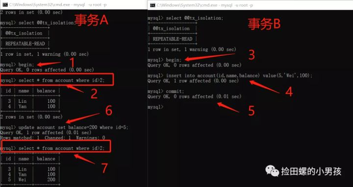

## Java基础

### Java语言有哪些特点

* 面向对象（封装，继承，多态）
* 平台无关性，平台无关性的具体表现在于，Java 是“一次编写，到处运行（Write Once，Run any Where）”的语言，因此采用 Java 语言编写的程序具有很好的可移植性，而保证这一点的正是 Java 的虚拟机机制。在引入虚拟机之后，Java 语言在不同的平台上运行不需要重新编译。
* 可靠性、安全性；
* 支持多线程。C++ 语言没有内置的多线程机制，因此必须调用操作系统的多线程功能来进行多线程程序设计，而 Java 语言却提供了多线程支持
* 支持网络编程并且很方便。Java 语言诞生本身就是为简化网络编程设计的，因此 Java 语言不仅支持网络编程而且很方便；
* 编译与解释并存；

### Java和C++有什么关系，它们有什么区别

* C++ 支持指针，而 Java 没有指针的概念
* C++ 支持多继承，而 Java 不支持多重继承，但允许一个类实现多个接口；
* Java 自动进行无用内存回收操作，不再需要程序员进行手动删除，而 C++ 中必须由程序释放内存资源，这就增加了程序员的负担。
* Java 不支持操作符重载，操作符重载则被认为是 C++ 的突出特征；

### JVM、JRE和JDK的关系是什么

**JVM:** Java 虚拟机（JVM）是运行 Java 字节码的虚拟机。JVM 有针对不同系统的特定实现（Windows，Linux，macOS），目的是使用相同的字节码，它们都会给出相同的结果。字节码和不同系统的 JVM 实现是 Java 语言“一次编译，随处可以运行”的关键所在。

**JDK:** Java开发工具，JDK 是 Java Development Kit 缩写，它是功能齐全的 Java SDK。它拥有 JRE 所拥有的一切，还有编译器（javac）和工具（如 javadoc 和 jdb）。它能够创建和编译程序。

**JRE:** JRE 是 Java 运行时环境。它是运行已编译 Java 程序所需的所有内容的集合，包括 Java 虚拟机（JVM），Java 类库，java 命令和其他的一些基础构件。但是，它不能用于创建新程序。

### switch 是否能作用在 byte 上，是否能作用在 long 上，是否能作用在 String 上？

Java5 以前 switch(expr)中，expr 只能是 byte、short、char、int。

从 Java 5 开始，Java 中引入了枚举类型， expr 也可以是 enum 类型。

从 Java 7 开始，expr还可以是字符串(String)，但是长整型(long)在目前所有的版本中都是不可以的。


### 什么是字节码?采用字节码的好处是什么?

在 Java 中，JVM 可以理解的代码就叫做字节码（即扩展名为 .class 的文件），它不面向任何特定的处理器，只面向虚拟机。
Java 语言通过字节码的方式，在一定程度上解决了传统解释型语言执行效率低的问题，同时又保留了解释型语言可移植的特点。所以， Java 程序运行时相对来说还是高效的（不过，和 C++，Rust，Go 等语言还是有一定差距的），而且，由于字节码并不针对一种特定的机器，因此，Java 程序无须重新编译便可在多种不同操作系统的计算机上运行。


### Comparable和Comparator区别是什么？

* Comparable 位于 `java.lang`包下，Comparable可作为一个类的内部排序实现，需要在目标类中实现Comparable接口，并编写比较规则。Comparable的比较方法compareTo(A)只有1个参数
* Comparator 位于 `java.util`包下，Comparator是外部排序接口，可通过实现Compartor制定多个比较排序策略，供该类采用。可用于Collections.sort()、Arrays.sort()等方法，Comparator接口的比较方法compare(A,B)有两个参数。


### Java语言的三大特性是什么

Java语言的三大特性分别是封装、继承和多态。

* 封装是指将对象的属性私有化，提供一些可以访问属性的方法，我们通过访问这些方法得到对象的属性
* 继承是指某新类继承已经存在的类，该新类拥有被继承的类的所有属性和方法，并且新类可以根据自己的情况拓展属性或方法。其中新类称为子类，原存在的类被称为父类
  * 子类拥有父类对象所有的属性和方法（包括私有属性和私有方法），但是父类中的私有属性和方法子类是无法访问，只是拥有
  * 子类可以拥有自己属性和方法，即子类可以对父类进行扩展
  * 子类可以用自己的方式实现父类的方法（重写）
* 多态基于对象所属类的不同，外部对同⼀个⽅法的调⽤，实际执⾏的逻辑不同


### 重载与重写的区别

* 重载是发生在同一个类中，具有相同的方法名，但是有不同的参数，参数的个数不一样、参数的位置不一样，这就叫重载
* 重写是发生在当子类继承父类时，对父类中的一些方法根据自己的需求进行重写操作

### 接口和抽象类的区别是什么

* 接口只有定义，不能有方法的实现，但java 1.8中可以定义default方法体，而抽象类可以有定义与实现，方法可在抽象类中实现
* 实现接口的关键字为implements，继承抽象类的关键字为extends。一个类可以实现多个接口，但一个类只能继承一个抽象类。所以，使用接口可以间接地实现多重继承
* 接口强调特定功能的实现，而抽象类强调所属关系
* 抽象类中的成员变量可以是各种类型的，⽽接⼝中的成员变量只能是public static final类型的

### 抽象类能使用 final 修饰吗

不能，定义抽象类就是让其他类继承的，如果定义为 final 该类就不能被继承，这样彼此就会产生矛盾，所以 final 不能修饰抽象类

###  java 创建对象有哪几种方式

* new创建新对象
* 通过反射机制
* 采用clone机制
* 通过序列化机制

前两者都需要显式地调用构造方法。对于clone机制,需要注意浅拷贝和深拷贝的区别，对于序列化机制需要明确其实现原理，在java中序列化可以通过实现Externalizable或者Serializable来实现。

### 什么是不可变对象?好处是什么?

不可变对象指对象一旦被创建,状态就不能再改变,任何修改都会**创建一个新的对象**,如 String、Integer及其它包装类.不可变对象最大的好处是**线程安全**.

### 介绍下hashCode()

hashCode() 的作用是获取哈希码，也称为散列码；它实际上是返回一个int整数。这个哈希码的作用是确定该对象在哈希表中的索引位置。hashCode() 定义在JDK的Object.java中，这就意味着Java中的任何类都包含有hashCode()函数。
散列表存储的是键值对(key-value)，它的特点是：能根据“键”快速的检索出对应的“值”。这其中就利用到了散列码！（可以快速找到所需要的对象）

### 为什么要有 hashCode?

**以“HashSet 如何检查重复”为例子来说明为什么要有 hashCode：**

当你把对象加入 HashSet 时，HashSet 会先计算对象的 hashcode 值来判断对象加入的位置，同时也会与其他已经加入的对象的 hashcode 值作比较，如果没有相符的hashcode，HashSet会假设对象没有重复出现。
但是如果发现有相同 hashcode 值的对象，这时会调用 equals()方法来检查 hashcode 相等的对象是否真的相同。如果两者相同，HashSet 就不会让其加入操作成功。如果不同的话，就会重新散列到其他位置。这样我们就大大减少了 equals 的次数，相应就大大提高了执行速度。

### 为什么重写 equals 方法必须重写 hashcode 方法？

判断的时候先根据hashcode进行的判断，相同的情况下再根据equals()方法进行判断。如果只重写了equals方法，而不重写hashcode的方法，会造成hashcode的值不同，而equals()方法判断出来的结果为true。

### String有哪些特性

* 不变性：String 是只读字符串，是一个典型的 immutable 对象，对它进行任何操作，其实都是创建一个新的对象，再把引用指向该对象。不变模式的主要作用在于当一个对象需要被多线程共享并频繁访问时，可以保证数据的一致性；
* 常量池优化：String 对象创建之后，会在字符串常量池中进行缓存，如果下次创建同样的对象时，会直接返回缓存的引用；
* final：使用 final 来定义 String 类，表示 String 类不能被继承，提高了系统的安全性。

###  在使用 HashMap 的时候，用 String 做 key 有什么好处？

HashMap 内部实现是通过 key 的 hashcode 来确定 value 的存储位置，因为字符串是不可变的，所以当创建字符串时，它的 hashcode 被缓存下来，不需要再次计算，所以相比于其他对象更快。

### 包装类型是什么？基本类型和包装类型有什么区别

Java 为每一个基本数据类型都引入了对应的包装类型（wrapper class），int 的包装类就是 Integer，从 Java 5 开始引入了自动装箱/拆箱机制，把基本类型转换成包装类型的过程叫做装箱（boxing）；反之，把包装类型转换成基本类型的过程叫做拆箱（unboxing），使得二者可以相互转换。

**基本类型和包装类型的区别主要有以下几点：**
* **包装类型可以为 null，而基本类型不可以。** 它使得包装类型可以应用于 POJO 中，而基本类型则不行。那为什么 POJO 的属性必须要用包装类型呢？《阿里巴巴 Java 开发手册》上有详细的说明， 数据库的查询结果可能是 null，如果使用基本类型的话，因为要自动拆箱（将包装类型转为基本类型，比如说把 Integer 对象转换成 int 值），就会抛出 NullPointerException 的异常。
* **包装类型可用于泛型，而基本类型不可以。** 泛型不能使用基本类型，因为使用基本类型时会编译出错。
* **基本类型比包装类型更高效。** 基本类型在栈中直接存储的具体数值，而包装类型则存储的是堆中的引用。 很显然，相比较于基本类型而言，包装类型需要占用更多的内存空间。

###  int 和 Integer 有什么区别

* Integer是int的包装类；int是基本数据类型；
* Integer的默认值是null；int的默认值是0。
* Integer实际是对象的引用，指向此new的Integer对象；int是直接存储数据值 ；
* Integer变量必须实例化后才能使用；int变量不需要；

### 两个new生成的Integer变量的对比

由于Integer变量实际上是对一个Integer对象的引用，所以两个通过new生成的Integer变量永远是不相等的（因为new生成的是两个对象，其内存地址不同）。

```java
Integer i = new Integer(10000);
Integer j = new Integer(10000);
System.out.print(i == j); //false
```

### Integer变量和int变量的对比

Integer变量和int变量比较时，只要两个变量的值是相等的，则结果为true（因为包装类Integer和基本数据类型int比较时，**java会自动拆包装为int**，然后进行比较，实际上就变为两个int变量的比较）

```java
int a = 10000;
Integer b = new Integer(10000);
Integer c=10000;
System.out.println(a == b); // true
System.out.println(a == c); // true
```

### 非new生成的Integer变量和new Integer()生成变量的对比

非new生成的Integer变量和new Integer()生成的变量比较时，结果为false。（因为非new生成的Integer变量指向的是java常量池中的对象，而new Integer()生成的变量指向堆中新建的对象，两者在内存中的地址不同）

```java
Integer b = new Integer(10000);
Integer c=10000;
System.out.println(b == c); // false
```

### 两个非new生成的Integer对象的对比

对于两个非new生成的Integer对象，进行比较时，**如果两个变量的值在区间-128到127之间，则比较结果为true，如果两个变量的值不在此区间，则比较结果为false**

```java
Integer i = 100;
Integer j = 100;
System.out.print(i == j); //true

Integer i = 128;
Integer j = 128;
System.out.print(i == j); //false
```

### 什么是反射？

反射是在运行状态中，对于任意一个类，都能够知道这个类的所有属性和方法；对于任意一个对象，都能够调用它的任意一个方法和属性；这种动态获取的信息以及动态调用对象的方法的功能称为 Java 语言的反射机制。

### 反射机制的优缺点有哪些

* 优点：能够运行时动态获取类的实例，提高灵活性
* 缺点：使用反射性能较低，需要解析字节码，将内存中的对象进行解析。通过setAccessible(true)关闭JDK的安全检查来提升反射速度

### 如何获取反射中的Class对象

* Class.forName(“类的路径”)；当你知道该类的全路径名时，你可以使用该方法获取 Class 类对象。
* 类名.class。这种方法只适合在编译前就知道操作的 Class
* 对象名.getClass()

### Java反射API有几类

* Class 类：反射的核心类，可以获取类的属性，方法等信息。
* Field 类：Java.lang.reflec 包中的类，表示类的成员变量，可以用来获取和设置类之中的属性值。
* Method 类：Java.lang.reflec 包中的类，表示类的方法，它可以用来获取类中的方法信息或者执行方法。
* Constructor 类：Java.lang.reflec 包中的类，表示类的构造方法。

### 反射使用的步骤

一般情况下我们使用反射获取一个对象的步骤：
* 获取类的 Class 对象实例
```java
Class clz = Class.forName("com.zhenai.api.Apple");
```
* 根据 Class 对象实例获取 Constructor 对象
```java
Constructor appleConstructor = clz.getConstructor();
```
* 使用 Constructor 对象的 newInstance 方法获取反射类对象
```java
Object appleObj = appleConstructor.newInstance();
```

而如果要调用某一个方法，则需要经过下面的步骤：
* 获取方法的 Method 对象
```java
Method setPriceMethod = clz.getMethod("setPrice", int.class);
```
* 利用 invoke 方法调用方法
```java
setPriceMethod.invoke(appleObj, 14);
```


### Java中的内部类说一下

内部类有四种，分别是静态内部类、局部内部类、匿名内部和成员内部类

* 静态内部类：常见的main函数就是静态内部类，调用静态内部类通过“外部类.静态内部类”
* 局部内部类：定义在方法中的类叫做局部内部类。
* 匿名内部类：是指继承一个父类或者实现一个接口的方式直接定义并使用的类，匿名内部类没有class关键字，因为匿名内部类直接使用new生成一个对象
* 成员内部类：成员内部类是最普通的内部类，它的定义为位于另一个类的内部

### 说一下final关键字的作用

* 当final修饰类的时候，表明这个类不能被继承。final 类中的所有成员方法都会被隐式地指定为 final 方法
* 当final修饰方法的时候，表明这个方法不能被重写。
* 当final修饰属性的时候，如果是基本数据类型的变量，则其数值一旦在初始化之后便不能 更改；如果是引用类型的变量，则在对其初始化之后便不能再让其指向另一个对象

### 为什么要用static关键字

通常来说，用new创建类的对象时，数据存储空间才被分配，方法才供外界调用。但有时我们只想为特定域分配单一存储空间，不考虑要创建多少对象或者说根本就不创建任何对象，再就是我们想在**没有创建对象的情况下也想调用方法**。在这两种情况下，static关键字，满足了我们的需求

### ”static”关键字是什么意思？Java中是否可以覆盖(override)一个private或者是static的方法

“static”关键字表明一个成员变量或者是成员方法可以在没有所属的类的实例变量的情况下被访问。

Java中static方法不能被覆盖，因为方法覆盖是基于运行时动态绑定的，而static方法是编译时静态绑定的。static方法跟类的任何实例都不相关，所以概念上不适用。

### 面向对象和面向过程的区别

**面向过程：** 
* 优点：性能比面向对象高，因为类调用时需要实例化，开销比较大，比较消耗资源;比如单片机、嵌入式开发、Linux/Unix等一般采用面向过程开发，性能是最重要的因素。
* 缺点：没有面向对象易维护、易复用、易扩展。

**面向对象：**
* 优点：易维护、易复用、易扩展，由于面向对象有封装、继承、多态性的特性，可以设计出低耦合的系统，使系统更加灵活、更加易于维护。
* 缺点：性能比面向过程低。

⽐如洗⾐机洗⾐服：
* ⾯向过程：会将任务拆解成⼀系列的步骤：打开洗⾐机----->放⾐服----->放洗⾐粉----->清 洗----->烘⼲
*  ⾯向对象：会拆出⼈和洗⾐机两个对象：
   * ⼈：打开洗⾐机 放⾐服 放洗⾐粉
   * 洗⾐机：清洗 烘⼲


### 构造器（constructor）是否可被重写（override）

构造器不能被继承，因此不能被重写，但可以被重载。每一个类必须有自己的构造函数，负责构造自己这部分的构造。子类不会覆盖父类的构造函数，相反必须一开始调用父类的构造函数。


### 说一下String，StringBuilder和StringBuffer的区别

String 真正不可变有下面几点原因：
* 保存字符串的数组被 final 修饰且为私有的，并且String 类没有提供/暴露修改这个字符串的方法
* String 类被 final 修饰导致其不能被继承，进而避免了子类破坏 String 不可变

StringBuilder 与 StringBuffer 都继承自 AbstractStringBuilder 类，在AbstractStringBuilder中也是使用字符数组保存字符串char[]value但是没有用 final`关键字修饰，所以这两种对象都是可变的。StringBuffer 对方法加了同步锁或者对调用的方法加了同步锁，所以是线程安全。StringBuilder 并没有对方法进行加同步锁，所以是非线程安全的

* 操作少量的数据: 适用 String
* 单线程操作字符串缓冲区下操作大量数据: 适用 StringBuilder
* 多线程操作字符串缓冲区下操作大量数据: 适用 StringBuffer

### 说一下Java中的==与eaquels的区别

`==` :判断两个对象是不是同一个对象(基本数据类型`==`比较的是值，引用数据类型`==`比较的是内存地址)。

`eaquels`：
* 类没有重写 `equals()` 方法。则通过 `equals()` 比较该类的两个对象时，等价于通过`==`比较这两个对象
* 类重写了 `equals()` 方法。一般，我们都重写 `equals()` 方法来比较两个对象的内容是否相等；若它们的内容相等，则返回 `true` (即，认为这两个对象相等)

### Java访问修饰符有哪些？都有什么区别？

* public：public表明该数据成员、成员函数是对所有用户开放的，所有用户都可以直接进行调用
* protected：protected对于子女、朋友来说，就是public的，可以自由使用，没有任何限制，而对于其他的外部class，protected就变成private
* private：private表示私有，私有的意思就是除了class自己之外，任何人都不可以直接使用，私有财产神圣不可侵犯嘛，即便是子女，朋友，都不可以使用

### Java中的异常体系说一下

Java中的异常主要分为Error和Exception


Error 指Java程序运行错误，如果程序在启动时出现Error，则启动失败；如果程序运行过程中出现Error，则系统将退出程序。**出现Error是系统的内部错误或资源耗尽**，Error不能在程序运行过程中被动态处理，一旦出现Error，**系统能做的只有记录错误的原因和安全终止**

Exception 指 Java程序运行异常，在运行中的程序发生了程序员不期望发生的事情，**可以被Java异常处理机制处理**。Exception也是程序开发中异常处理的核心，可分为**RuntimeException（运行时异常）** 和**CheckedException（检查异常）**，如下图所示


* RuntimeException（运行时异常）：指在Java虚拟机正常运行期间抛出的异常， RuntimeException可以被捕获并处理，如果出现此情况，我们需要抛出异常或者捕获并处理异常。常见的有NullPointerException、ClassCastException、 ArrayIndexOutOfBoundsException等
* CheckedException（检查异常）：指在编译阶段Java编译器检查 CheckedException异常，并强制程序捕获和处理此类异常，要求程序在可能出现异常的地方通过try catch语句块捕获异常并处理异常。常见的有由于I/O错误导致的IOException、SQLException、ClassNotFoundException等。该类异常通常由于打开错误的文件、SQL语法错误、类不存等引起

### 追问1：异常的处理方式？

异常处理方式有抛出异常和使用try catch语句块捕获异常两种方式。

* 抛出异常：遇到异常时不进行具体的处理，直接将异常抛给调用者，让调用者自己根据情况处理。抛出异常的三种形式：throws、throw和系统自动抛出异常。其中throws作用在方法上，用于定义方法可能抛出的异常；throw作用在方法内，表示明确抛出一个异常
* 使用try catch捕获并处理异常：使用费try catch 捕获异常能够有针对性的处理每种可能出现的异常，并在捕获到异常后根据不同的情况做不同的处理。其使用过程比较简单：用try catch语句块将可能出现异常的代码包起来即可

### Java中的深拷贝和浅拷贝说一下

深拷贝和浅拷贝都是对象拷贝

* **浅拷贝：** 浅拷贝会在堆上创建一个新的对象（区别于引用拷贝的一点），不过，如果原对象内部的属性是引用类型的话，浅拷贝会直接复制内部对象的引用地址，也就是说拷贝对象和原对象共用同一个内部对象。
* **深拷贝 ：** 深拷贝会完全复制整个对象，包括这个对象所包含的内部对象。
* **引用拷贝：** 简单来说，引用拷贝就是两个不同的引用指向同一个对象。


### 追问1：浅拷贝与深拷贝的特点是什么

浅拷贝特点
* 对于基本数据类型的成员对象，因为基础数据类型是值传递的，所以是直接将属性值赋值给新的对象。基础类型的拷贝，其中一个对象修改该值，不会影响另外一个。
* 对于引用类型，比如数组或者类对象，因为引用类型是引用传递，所以浅拷贝只是把内存地址赋值给了成员变量，它们指向了同一内存空间。改变其中一个，会对另外一个也产生影响

深拷贝特点
* 对于基本数据类型的成员对象，因为基础数据类型是值传递的，所以是直接将属性值赋值给新的对象。基础类型的拷贝，其中一个对象修改该值，不会影响另外一个（和浅拷贝一样）
* 对于引用类型，比如数组或者类对象，深拷贝会新建一个对象空间，然后拷贝里面的内容，所以它们指向了不同的内存空间。改变其中一个，不会对另外一个也产生影响
* 深拷贝相比于浅拷贝速度较慢并且花销较大

## Java集合

### Java中的集合框架有哪些

Java 集合框架主要包括两种类型的容器，一种是集合（Collection），存储一个元素集合，另一种是图（Map），存储键/值对映射

Collection 接口又有 3 种子类型，List、Set 和 Queue


### ArrayList和LinkedList的底层实现和区别

ArrayList底层使用的是 Object数组；LinkedList底层使用的是 双向链表 数据结构

ArrayList:增删慢、查询快，线程不安全，对元素必须连续存储
LinkedList:增删快，查询慢，线程不安全

### 追问1：说说ArrayList的扩容机制

通过阅读ArrayList的源码我们可以发现当以无参数构造方法创建 ArrayList 时，实际上初始化赋值的是一个空数组。当真正对数组进行添加元素操作时，才真正分配容量。即向数组中添加第一个元素时，数组容量扩为 10。当插入的元素个数大于当前容量时，就需要进行扩容了， ArrayList 每次扩容之后容量都会变为原来的 1.5 倍左右

### HashMap的底层实现？扩容？是否线程安全

在jdk1.7之前HashMap是基于数组和链表实现的，而且采用头插法

而jdk1.8 之后在解决哈希冲突时有了较大的变化，当链表长度大于阈值（默认为 8）（将链表转换成红黑树前会判断，如果当前数组的长度小于 64，那么会选择先进行数组扩容，而不是转换为红黑树）时，将链表转化为红黑树，以减少搜索时间。采用尾插法

HashMap默认的初始化大小为 16。当HashMap中的元素个数之和大于负载因子*当前容量的时候就要进行扩充，容量变为原来的 2 倍。（这里注意不是数组中的个数，而且数组中和链/树中的所有元素个数之和！）

HashMap是线程不安全的，其主要体现:

* 在jdk1.7中，在多线程环境下，扩容时会造成环形链或数据丢失
* 在jdk1.8中，在多线程环境下，会发生数据覆盖的情况

### 追问1：HashMap扩容的时候为什么是2的n次幂

数组下标的计算方法是(n - 1) & hash，取余(%)操作中如果除数是2的幂次则等价 于与其除数减一的与(&)操作（也就是说 hash%length==hash&(length-1)的前提是 length 是2的 n 次方；）。” 并且 采用二进制位操作 &，相对于%能够提高运算效率， 这就解释了 HashMap 的长度为什么是2的幂次方

### 追问2：HashMap的put方法说一下

* 根据key通过哈希算法与与运算得出数组下标
* 如果数组下标元素为空，则将key和value封装为Entry对象（JDK1.7是Entry对象，JDK1.8 是Node对象）并放入该位置
* 如果数组下标位置元素不为空，则要分情况
  * 如果是在JDK1.7，则首先会判断是否需要扩容，如果要扩容就进行扩容，如果不需要扩容就生成Entry对象，并使用头插法添加到当前链表中
  * 如果是在JDK1.8中，则会先判断当前位置上的TreeNode类型，看是红黑树还是链表Node
    * 如果是红黑树TreeNode，则将key和value封装为一个红黑树节点并添加到红黑树中去，在这个过程中会判断红黑树中是否存在当前key，如果存在则更新value
    * 如果此位置上的Node对象是链表节点，则将key和value封装为一个Node并通过尾插法插入到链表的最后位置去，因为是尾插法，所以需要遍历链表，在遍历过程中会判断是否存在当前key，如果存在则更新其value，当遍历完链表后，将新的Node插入到链表中，插入到链表后，会看当前链表的节点个数，如果大于8，则会将链表转为红黑树
    * 将key和value封装为Node插入到链表或红黑树后，在判断是否需要扩容

### HashMap源码中在计算hash值的时候为什么要右移16位

尽量打乱hashcode真正参与运算的低16位，让元素在HashMap中更加均匀的分布。


### Java中线程安全的集合有哪些

* Vector：就比Arraylist多了个同步化机制（线程安全）
* Hashtable：就比Hashmap多了个线程安全
* ConcurrentHashMap:是一种高效但是线程安全的集合
* Stack：栈，也是线程安全的，继承于Vector

### 追问1：说一下ConcurrentHashMap的底层实现，它为什么是线程安全的

在jdk1.7是 分段的数组+链表 ，jdk1.8的时候跟HashMap1.8的时候一样都是基于数组+链表/红黑树

ConcurrentHashMap是线程安全的
* 在jdk1.7的时候是使用分段锁segment，每一把锁只锁容器其中一部分数据，多线程访问容器里不同数据段的数据，就不会存在锁竞争，提高并发访问率
* 在jdk1.8的时候摒弃了 Segment的概念，而是直接用 Node 数组+链表+红黑树的数据结构来实现，并发控制使用 synchronized 和 CAS 来操作。synchronized只锁定当前链表或红黑二叉树的首节点

### HashMap和Hashtable的区别

* 线程是否安全： HashMap 是非线程安全的，HashTable 是线程安全的,因为HashTable 内部的方法基本都经过synchronized修饰
* 对 Null key 和 Null value 的支持： HashMap可以存储 null 的 key 和 value，但null 作为键只能有一个，null 作为值可以有多个；HashTable 不允许有 null 键和 null 值，否则会抛出 NullPointerException
* 初始容量大小和每次扩充容量大小的不同 ：
  * 创建时如果不指定容量初始值，Hashtable默认的初始大小为 11，之后每次扩充，容量变为原来的 2n+1。HashMap 默认的初始化大小为 16。之后每次扩充，容量变为原来的 2倍
  *  创建时如果给定了容量初始值，那么 Hashtable 会直接使用你给定的大小，而 HashMap会将其扩充为 2 的幂次方大小（HashMap 中的tableSizeFor()方法保证，下面给出了源代码）。也就是说 HashMap 总是使用 2 的幂作为哈希表的大小。
* 底层数据结构： JDK1.8 以后的 HashMap在解决哈希冲突时有了较大的变化，当链表长度大于阈值（默认为 8）（将链表转换成红黑树前会判断，如果当前数组的长度小于64，那么会选择先进行数组扩容，而不是转换为红黑树）时，将链表转化为红黑树，以减少搜索时间。Hashtable 没有这样的机制
* 效率： 因为线程安全的问题，HashMap 要比 HashTable效率高一点。另外，HashTable基本被淘汰，不要在代码中使用它

### HashMap和TreeMap的区别

相比于`HashMap`来说 `TreeMap` 主要多了对集合中的元素根据键排序的能力以及对集合内元素的搜索的能力

## Java 多线程

### 说说什么是线程安全？如何实现线程安全？

当多个线程同时访问一个对象时，如果不用考虑这些线程在运行时环境下的调度和交替执行，也不需要进行额外的同步，或者在调用方进行任何其他的协调操作，调用这个对象的行为都可以获得正确的结果，那就称这个对象是线程安全的。(当多个线程同时访问一个对象时，无论CPU如何进行调度，最终都能获得正确的结果，则称这个对象是线程安全的)

实现线程安全的方式有三大种方法，分别是互斥同步、非阻塞同步和无同步方案

互斥同步：同步是指多个线程并发访问共享数据时，保证共享数据在同一各时刻只被一条（或一些，当使用信号量的时候）线程使用。而互斥是实现同步的一种手段，临界区、互斥量和信号量都是常见的互斥实现方式。**Java中实现互斥同步的手段主要有synchronized关键字或ReentrantLock等。**

非阻塞同步类似是一种乐观并发的策略，比如**CAS**。

无同步方案，比如**使用ThreadLocal**

### 追问1：synchronized和ReentranLock的区别是什么?

#### 两者都是可重入锁

**“可重入锁”** 指的是自己可以再次获取自己的内部锁。比如一个线程获得了某个对象的锁，此时这个对象锁还没有释放，当其再次想要获取这个对象的锁的时候还是可以获取的，如果是不可重入锁的话，就会造成死锁。同一个线程每次获取锁，锁的计数器都自增 1，所以要等到锁的计数器下降为 0 时才能释放锁


* `synchronized` 是依赖于 JVM 实现的,`ReentrantLock` 是 JDK 层面实现的（也就是 API 层面，需要 lock() 和 unlock() 方法配合 try/finally 语句块来完成），所以我们可以通过查看它的源代码，来看它是如何实现的

* **等待可中断 :** `ReentrantLock`提供了一种能够中断等待锁的线程的机制，通过 `lock.lockInterruptibly()` 来实现这个机制。也就是说正在等待的线程可以选择放弃等待，改为处理其他事情
* **可实现公平锁 :** `ReentrantLock`可以指定是公平锁还是非公平锁。而`synchronized`只能是非公平锁。所谓的公平锁就是先等待的线程先获得锁。`ReentrantLock`默认情况是非公平的，可以通过 `ReentrantLock`类的`ReentrantLock(boolean fair)`构造方法来制定是否是公平的
* **可实现选择性通知（锁可以绑定多个条件）:** `synchronized`关键字与`wait()`和`notify()/notifyAll()`方法相结合可以实现等待/通知机制。`ReentrantLock`类当然也可以实现，但是需要借助于`Condition`接口与`newCondition()`方法
* **`synchronized`隐式获取锁和释放锁，`ReentrantLock`显示获取和释放锁**，在使用时避免程序异常无法释放锁，需要在`finally`控制块中进行解锁操作


> `notify()/notifyAll()`方法进行通知时，被通知的线程是由 JVM 选择的，用`ReentrantLock`类结合`Condition`实例可以实现“选择性通知”。如果执行`notifyAll()`方法的话就会通知所有处于等待状态的线程这样会造成很大的效率问题，而`Condition`实例的`signalAll()`方法 只会唤醒注册在该`Condition`实例中的所有等待线程

### 追问2：synchronized和volatile的区别

`synchronized` 关键字和 `volatile` 关键字是两个互补的存在，而不是对立的存在

* `volatile` 关键字是线程同步的轻量级实现，所以 `volatile` 性能肯定比`synchronized`关键字要好 。但是 `volatile` 关键字只能用于变量而 `synchronized` 关键字可以修饰方法以及代码块
* `volatile` 关键字能保证数据的可见性，但不能保证数据的原子性`synchronized` 关键字两者都能保证
* `volatile`关键字主要用于解决变量在多个线程之间的可见性，而 `synchronized` 关键字解决的是多个线程之间访问资源的同步性。

### 追问3：synchronize锁的作用范围

* **修饰实例方法:** 作用于当前对象实例加锁，进入同步代码前要获得 **当前对象实例的锁**
* **修饰静态方法:** 也就是给当前类加锁，会作用于类的所有对象实例 ，进入同步代码前要获得 **当前 class 的锁**
* **修饰代码块 ：** 指定加锁对象，对给定对象/类加锁。

### 追问4：synchronized锁升级的过程说一下？

**为什么要引入偏向锁？**

因为经过HotSpot的作者大量的研究发现，大多数时候是不存在锁竞争的，常常是一个线程多次获得同一个锁，因此如果每次都要竞争锁会增大很多没有必要付出的代价，为了降低获取锁的代价，才引入的偏向锁。

**如果一个线程获得了偏向锁，在此线程之后的执行过程中，如果再次进入或者退出同一段同步块代码，并不再需要去进行加锁或者解锁操作，这样可以节省很多开销。假如有两个线程来竞争该锁话，那么偏向锁就失效了，进而升级成轻量级锁了。**

**为什么要引入轻量级锁？**

轻量级锁考虑的是竞争锁对象的线程不多，而且线程持有锁的时间也不长的情景。因为阻塞线程需要CPU从用户态转到内核态，代价较大，如果刚刚阻塞不久这个锁就被释放了，那这个代价就有点得不偿失了，因此这个时候就干脆不阻塞这个线程，让它自旋这等待锁释放。所谓自旋，就是指当有另外一个线程来竞争锁时，这个线程会在原地循环等待，就相当于在执行一个啥也没有的for循环。

**轻量级锁什么时候升级为重量级锁？**

但是如果自旋的时间太长也不行，因为自旋是要消耗CPU的，因此自旋的次数是有限制的，比如10次或者100次，如果自旋次数到了线程1还没有释放锁，或者线程1还在执行，线程2 还在自旋等待，这时又有一个线程3过来竞争这个锁对象，那么这个时候轻量级锁就会 膨胀为重量级锁。重量级锁把除了拥有锁的线程都阻塞，防止CPU空转。

**重量级锁**

重量级锁是依赖对象内部的monitor锁来实现的，而monitor又依赖操作系统的MutexLock(互斥锁)来实现的，所以重量级锁也被成为互斥锁。

### 并发的三⼤特性

**原⼦性**

原⼦性是指在⼀个操作中cpu不可以在中途暂停然后再调度，即不被中断操作，要不全部执⾏完成，要 不都不执⾏。就好⽐转账，从账户A向账户B转1000元，那么必然包括2个操作：从账户A减去1000元， 往账户B加上1000元。2个操作必须全部完成。

**可⻅性**

当多个线程访问同⼀个变量时，⼀个线程修改了这个变量的值，其他线程能够⽴即看得到修改的值

**有序性**

虚拟机在进⾏代码编译时，对于那些改变顺序之后不会对最终结果造成影响的代码，虚拟机不⼀定会按 照我们写的代码的顺序来执⾏，有可能将他们重排序。实际上，对于有些代码进⾏重排序之后，虽然对 变量的值没有造成影响，但有可能会出现线程安全问题。

```java
int a = 0;
bool flag = false;
public void write() { 
  a = 2; //1 
  flag = true; //2 
}

public void multiply() { 
  if (flag) { //3 
    int ret = a * a;//4 
  } 
}
```

write⽅法⾥的1和2做了重排序，线程1先对flag赋值为true，随后执⾏到线程2，ret直接计算出结果，再 到线程1，这时候a才赋值为2,很明显迟了⼀步

synchronized关键字同时满⾜以上三种特性，但是volatile关键字不满⾜原⼦性

### Java中线程的状态有哪些？线程间的通信方式有哪些？

Java中线程生命周期分为新建（New）、运行（Runnable）、阻塞（Blocked）、无限期等待（Waiting）、限期等待（Time Waiting）和结束（Terminated）这6种状态。


Java中线程间通信方式有：

* **互斥量(Mutex)：** 采用互斥对象机制，只有拥有互斥对象的线程才有访问公共资源的权限。因为互斥对象只有一个，所以可以保证公共资源不会被多个线程同时访问。比如 Java 中的synchronized 关键词和各种 Lock 都是这种机制。
* **信号量(Semphares) ：** 它允许同一时刻多个线程访问同一资源，但是需要控制同一时刻访问此资源的最大线程数量
* **事件(Event) :** Wait/Notify：通过通知操作的方式来保持多线程同步

### 追问1：sleep后进入什么状态，wait后进入什么状态？

sleep后进入Time waiting超时等待状态，wait后进入等待waiting状态。

### 追问2：sleep和wait的区别？

* 两者最主要的区别在于：`sleep()` 方法没有释放锁，而 `wait()` 方法释放了锁 。
* `wait()` 通常被用于线程间交互/通信，`sleep()` 通常被用于暂停执行。
* `wait()` 方法被调用后，线程不会自动苏醒，需要别的线程调用同一个对象上的 `notify()` 或者 `notifyAll()` 方法。`sleep()` 方法执行完成后，线程会自动苏醒。

### 追问3：wait为什么是Object类下面的方法？

因为synchronized中的这把锁可以是任意对象，所以任意对象都可以调用wait()和notify()；所以wait和notify属于Object。

### 追问4:start方法和run方法有什么区别？

调用 start()方法，会启动一个线程并使线程进入了就绪状态，当分配到时间片后就可以开始运行了。 start() 会执行线程的相应准备工作，然后自动执行 run() 方法的内容，这是真正的多线程工作。 但是，直接执行 run() 方法，会把 run() 方法当成一个 main 线程下的普通方法去执行，并不会在某个线程中执行它，所以这并不是多线程工作。

### AQS了解吗？

AQS是一个抽象队列同步器，通过维护一个状态标志位state和一个先进先出的
（FIFO）的线程等待队列来实现一个多线程访问共享资源的同步框架

AQS的原理大概是这样的，给每个共享资源都设置一个共享锁，线程在需要访问共享资源时,首先需要获取共享资源锁，如果获取到了共享资源锁，便可以在当前线程中使用该共享资源，如果没有获取到共享锁，该线程被放入到等待队列中，等待下一次资源调度。


AQS定义了两种资源共享方式：独占式和共享式

独占式：只有一个线程能执行，具体的Java实现有ReentrantLock。

共享式：多个线程可同时执行，具体的Java实现有Semaphore和CountDownLatch。

AQS只是一个框架（模板模式），只定义了一个接口，具体资源的获取、释放都交由自定义同步器去实现。不同的自定义同步器争取用共享资源的方式也不同，自定义同步器在实现时只需实现共享资源state的获取与释放方式即可，至于具体线程等待队列的维护，如获取资源失败入队、唤醒出队等，AQS已经在顶层实现好，不需要具体的同步器在做处理

### 追问1：你使用过哪个AQS组件，有将其用于多线程编程吗？（给一个例题说 一下思路或者直接写）

```java
public class Main{

    // 计算6个文件的大小
    private static final int threadCount = 6;

    public static void main(String[] args) throws InterruptedException {
        // 创建一个具有固定线程数量的线程池对象（推荐使用构造方法创建）
        ExecutorService threadPool = Executors.newFixedThreadPool(10);
        final CountDownLatch countDownLatch = new CountDownLatch(threadCount);
        AtomicInteger totSize = new AtomicInteger();
        for (int i = 0; i < threadCount; i++) {
            final int threadnum = i;
            threadPool.execute(() -> {
                try {// 模拟文件大小
                    totSize.addAndGet((new Random().nextInt(3) + 1) * 100);
                } finally {
                    //表示一个文件已经计算
                    countDownLatch.countDown();
                }

            });
        }
        countDownLatch.await();   // 唤醒主线程
        threadPool.shutdown();    // 关闭线程池
        System.out.println("finish" + totSize);
    }

}
```

### CAS说一下

CAS指Compare and swap比较和替换是设计并发算法时用到的一种技术，CAS指令有三个操作数，分别是内存位置（在Java中可以简单的理解为变量的内存地址，用V表示），旧的预期值（用A表示）和准备设置的新值（用B表示）。CAS指令在执行的时候，当且仅当V符 合A时，处理器才会用B更新V的值，否则它就不会执行更新。

### 追问1：CAS带来的问题是什么？如何解决的？

ABA问题、循环时间长开销很大、只能保证一个共享变量的原子操作

ABA问题一般加版本号进行解决

### 追问2：什么是乐观锁，什么是悲观锁？

悲观锁和乐观锁并不是某个具体的“锁”而是一种并发编程的基本概念。乐观锁和悲观锁最早出现在数据库的设计当中，后来逐渐被 Java 的并发包所引入。

悲观锁：认为对于同一个数据的并发操作，一定是会发生修改的，哪怕没有修改，也会认为修改。因此对于同一个数据的并发操作，悲观锁采取加锁的形式。悲观地认为，不加锁的并发操作一定会出问题。

乐观锁：正好和悲观锁相反，它获取数据的时候，并不担心数据被修改，每次获取数据的时候也不会加锁，只是在更新数据的时候，通过判断现有的数据是否和原数据一致来判断数据是否被其他线程操作，如果没被其他线程修改则进行数据更新，如果被其他线程修改则不进行数据更新

### Java中创建线程的方式有哪些？

Java中创建线程的方式有4种，分别是
* 写一个类继承子Thread类，重写run方法
* 写一个类重写Runable接口，重写run方法
* 写一个类重写Callable接口，重写call方法
* 使用线程池

### 追问1：线程池的好处？说几个Java中常见的线程池？说一下其中的参数和运行流程？

**使用线程池的好处：**
* **降低资源消耗。** 通过重复利用已创建的线程降低线程创建和销毁造成的消耗。
* **提高响应速度。** 当任务到达时，任务可以不需要等到线程创建就能立即执行。
* **提高线程的可管理性。** 线程是稀缺资源，如果无限制的创建，不仅会消耗系统资源，还会降低系统的稳定性，使用线程池可以进行统一的分配，调优和监控。

Executors 实现了以下四种类型的 ThreadPoolExecutor：


**ThreadPoolExecutor 3 个最重要的参数：**
* **corePoolSize :** 核心线程数定义了最小可以同时运行的线程数量。
* **maximumPoolSize :** 当队列中存放的任务达到队列容量的时候，当前可以同时运行的线程数量变为最大线程数。
* **workQueue:** 当新任务来的时候会先判断当前运行的线程数量是否达到核心线程数，如果达到的话，新任务就会被存放在队列中

`ThreadPoolExecutor`其他常见参数:
* `keepAliveTime`:当线程池中的线程数量大于 `corePoolSize` 的时候，如果这时没有新的任务提交，核心线程外的线程不会立即销毁，而是会等待，直到等待的时间超过了 `keepAliveTime`才会被回收销毁；
* `unit` :` keepAliveTime` 参数的时间单位。
* `threadFactory` :`executor` 创建新线程的时候会用到。
* `handler` :拒绝策略。


### 追问2：拒绝策略有哪些？

* `ThreadPoolExecutor.AbortPolicy：` 抛出 `RejectedExecutionException`来拒绝新任务的处理。
* `ThreadPoolExecutor.CallerRunsPolicy：` 调用执行自己的线程运行任务，也就是直接在调用`execute`方法的线程中运行(run)被拒绝的任务，如果执行程序已关闭，则会丢弃该任务。因此这种策略会降低对于新任务提交速度，影响程序的整体性能。如果您的应用程序可以承受此延迟并且你要求任何一个任务请求都要被执行的话，你可以选择这个策略
* `ThreadPoolExecutor.DiscardPolicy：` 不处理新任务，直接丢弃掉
* `ThreadPoolExecutor.DiscardOldestPolicy`： 此策略将丢弃最早的未处理的任务请求

### 追问3：线程池的参数如何确定呢？

CPU密集型时，任务可以少配置线程数，大概和机器的cpu核数相当，这样可以使得每个线程都在执行任务。
IO密集型时，大部分线程都阻塞，故需要多配置线程数，2*cpu核数。

### 追问4：Java中常见的阻塞队列有哪些？

* ArrayBlockingQueue：是一个我们常用的典型的有界队列，其内部的实现是基于数组来实现的。
* LinkedBlockingQueue 从它的名字我们可以知道，它是一个由链表实现的队列，这个队列的长度Integer.MAX_VALUE ，这个值是非常大的，几乎无法达到，对此我们可以认为这个队列基本属于一个无界队列（也又认为是有界队列）。此队列按照先进先出的顺序进行排序。
* SynchronousQueue 是一个不存储任何元素的阻塞队列，每一个put操作必须等待take操作，否则不能添加元素。同时它也支持公平锁和非公平锁。
* PriorityBlockingQueue是一个支持优先级排序的无界阻塞队列，可以通过自定义实现compareTo() 方法来指定元素的排序规则，或者通过构造器参数 Comparator 来指定排序规则。但是需要注意插入队列的对象必须是可比较大小的，也就是 Comparable 的，否则会抛出 ClassCastException 异常。
* DelayQueue 是一个实现PriorityBlockingQueue的延迟获取的无界队列。具有“延迟”的功能

### ThreadLocal知道吗？

Java中每一个线程都有自己的专属本地变量， JDK 中提供的ThreadLocal类，
ThreadLocal类主要解决的就是让每个线程绑定自己的值，可以将 ThreadLocal类形 象的比喻成存放数据的盒子，盒子中可以存储每个线程的私有数据。

* ThreadLocal是Java中所提供的线程本地存储机制，可以利用该机制将数据存在某个线程内部，该线程可以在任意时刻、任意方法中获取缓存的数据
* ThreadLocal底层是通过ThreadLocalmap来实现的，每个Thread对象（注意不是ThreadLocal对象）中都存在一个ThreadLocalMap，Map的key为ThreadLocal对象，Map的 value为需要缓存的值。
* ThreadLocal经典的应用场景就是连接管理（一个线程持有一个链接，该连接对象可以在不同给的方法之间进行线程传递，线程之间不共享同一个连接）

### 追问1：用它可能会带来什么问题？

内存泄漏（Memory Leak）是指程序中已动态分配的堆内存由于某种原因程序未释放或无法释放，造成系统内存的浪费，导致程序运行速度减慢甚至系统崩溃等严重后果。

`ThreadLocalMap` 中使用的 key 为 `ThreadLocal` 的弱引用,而 value 是强引用。所以，如果 `ThreadLocal` 没有被外部强引用的情况下，在垃圾回收的时候，key 会被清理掉，而 value 不会被清理掉。这样一来，`ThreadLocalMap` 中就会出现 key 为 null 的 Entry。假如我们不做任何措施的话，value 永远无法被 GC 回收，这个时候就可能会产生内存泄露。`ThreadLocalMap` 实现中已经考虑了这种情况，在调用 `set()、get()、remove()` 方法的时候，会清理掉 key 为 null 的记录。使用完 `ThreadLocal`方法后 最好手动调用`remove()`方法

### 追问2：什么是强软弱虚引用？

* 强引用是使用最普遍的引用。只要某个对象有强引用与之关联，JVM必定不会回收 这个对象，即使在内存不足的情况下，JVM宁愿抛出OutOfMemory错误也不会回收这 种对象
* 软引用是用来描述一些有用但并不是必需的对象，在Java中用java.lang.ref.SoftReference类来表示。只有在内存不足的时候JVM才会回收该对象。
* 只具有弱引用的对象拥有更短暂的生命周期。在垃圾回收器线程扫描它所管辖的内存区域的过程中，一旦发现了只具有弱引用的对象，不管当前内存空间足够与否，都会回收它的内存。弱引用可以和一个引用队列（ReferenceQueue）联合使用，如果弱引用所引用的对象被垃圾回收，Java虚拟机就会把这个弱引用加入到与之关联的引用队列中。
* 如果一个对象仅持有虚引用，那么它就和没有任何引用一样，在任何时候都可能被垃圾回收器回收。

虚引用必须和引用队列 （ReferenceQueue）联合使用。当垃圾回收器准备回收一个对象时，如果发现它还有虚引用，就会在回收对象的内存之前，把这个虚引用加入到与之 关联的引用队列中。

## JVM

### 介绍一下Java运行时数据区域，并说一下每个部分都存哪些内容？

Java的运行时区主要包含堆、方法区、虚拟机栈、程序计数器和本地方法栈，其中堆和方法区是所有线程所共有的。而且虚拟机栈、程序计数器和本地方法栈是线程所私有的。

* 堆：存放对象实例
* 方法区：用来存储已经被虚拟机加载的类型信息、常量、静态变量、即时编译器编译后的代码缓存等数据
* 虚拟机栈：（生命周期与线程相同）Java中每个方法执行的时候，Java虚拟机都会同步创建一个栈帧，用于存储局部变量表、操作数栈、动态链接、方法出口等信息
* 程序计数器：保存下一条需要执行的字节码指令，是程序控制流的指示器，分支、循环、跳转、异常处理、线程恢复等基础功能都是依赖程序计数器
* 本地方法栈：与虚拟机栈类似

### 追问1：程序计数器可以为空吗？

可以为空，当执行的是本地方法时

### 追问2：堆中又怎么细分的

堆中可以细分为新生代和老年代，其中新生代又分为Eden区，From Survivor和To Survivor区，比例是8:1:1

### 追问3：哪些区域会造成OOM

除了程序计数器不会产生OOM，其余的均可以产生OOM

### Java中对象的创建过程是什么样的

* 当遇到new关键字的时候，首先检查这个指令的参数是否可以在常量池中定位到一个类的符号引用，并检查这个符号引用代表的类是否已被加载、解析和初始化
* 在类加载检查后，接下来需要为新对象分配内存
* 需要将分配到的内存空间都初始化为零
* 需要对对象进行相关的设置，比如这个对象是哪个类的实例、如何才能找到类的元数据信息、对象的GC分代年龄等信息，这些信息都存放在对象的对象头中
* 把对象按照程序员的意愿进行初始化

### 追问1：内存分配的策略有哪些

* 指针碰撞：假设Java堆中的内存都是规整的，所有被使用过的放在一边，未使用过的放在一边，中间有一个指针作为分界，分配内存仅仅需要把这个指针向空闲空间方向移动一段即可
* 空闲列表：如果Java堆中的内存不是规整的，已使用过的和空闲的交错，虚拟机就需要维护一个列表，记录哪些内存是可用的，在分配的时候找到足够大的一块内存进行分配

### 追问2：对象头包含哪些？

虚拟机中对象头包含两类信息，第一类是用于存储对象自身运动时数据、如哈希码、GC分代年龄、线程持有的锁、偏向线程ID、偏向时间戳。对象的另外一部分是类型指针，即对象指向它的类型元数据的指针，虚拟机通过这个指针来确定这个对象是哪个类的实例

### 追问3：对象的访问定位方法有几种，各有什么优缺点？

*  句柄： 如果使用句柄的话，那么Java堆中将会划分出一块内存来作为句柄池，reference 中存储的就是对象的句柄地址，而句柄中包含了对象实例数据与类型数据各自的具体地址信息；
*  直接指针： 如果使用直接指针访问，那么 Java 堆对象的布局中就必须考虑如何放置访问类型数据的相关信息，而reference 中存储的直接就是对象的地址

使用句柄最大的好处就是reference中存储的是稳定句柄地址，在对象移动时只会改变句柄中的实例数据指针，而reference本身不需要被修改。使用直接指针访问方式最大的好处就是速度快，它节省了一次指针定位的时间开销。

### 如何判断对象已死？

* 引用计数法：对象中添加一个引用计数器，每当有一个地方引用它，计数器就加1；当引用失效，计数器就减1；任何时候计数器为0的对象就是不可能再被使用的
* 可达性分析：通过一系列的GC Roots的根对象作为 起始节点，从这些节点开始，根据引用关系向下搜索，如果某个对象到GC Roots间没有任何引用链相连，则不可达

>引⽤计数法，可能会出现A 引⽤了 B，B ⼜引⽤了 A，这时候就算他们都不再使⽤了，但因为相互引 ⽤ 计数器=1 永远⽆法被回收。

### 追问1：GCroot可以是哪些？

* 在虚拟机栈中引用的对象，比如各个线程被调用的方法堆栈中使用到的参数、局部变量、临时变量等
* 在方法区中类静态属性引用的对象，比如Java类的引用类型静态变量
* 在方法区中常量引用的对象，比如字符串常量池里的引用
* 在本地方法栈中JNI引用的对象
* Java虚拟机内部的引用，如基本数据类型对应的Class对象，一些常驻的异常对象
* 所有被同步锁持有的对象

### 追问2：被标志为GC的对象一定会被GC掉吗？

不一定，还有逃脱的可能。真正宣告一个对象死亡至少经历两次标记的过程。如果对象进行可达性分析后没有与GC Roots相连，那么这是第一次标记，之后会在进行一次筛选，筛选的条件是是否有必要执行finalize()方法

### ⼀个对象从加载到JVM，再到被GC清除，都经历了什么过程

* ⽤户创建⼀个对象，JVM⾸先需要到⽅法区去找对象的类型信息。然后再创建对象。
* JVM要实例化⼀个对象，⾸先要在堆当中先创建⼀个对象。-> 半初始化状态
* 对象⾸先会分配在堆内存中新⽣代的Eden。然后经过⼀次Minor GC，对象如果存活，就会进⼊S 区。在后续的每次GC中，如果对象⼀直存活，就会在S区来回拷⻉，每移动⼀次，年龄加1。-> 多 ⼤年龄才会移⼊⽼年代？ 年龄最⼤15， 超过⼀定年龄后，对象转⼊⽼年代。
* 当⽅法执⾏结束后，栈中的指针会先移除掉
* 堆中的对象，经过Full GC，就会被标记为垃圾，然后被GC线程清理掉。

### 垃圾回收算法有哪些？

###  标记清除算法

标记清除算法就是分为“标记”和“清除”两个阶段。标记出所有需要回收的对象，标记结束后统一回收。这个套路很简单，也存在不足，后续的算法都是根据这个基础来加以改进的。

其实它就是把已死亡的对象标记为空闲内存，然后记录在一个空闲列表中，当我们需要new一个对象时，内存管理模块会从空闲列表中寻找空闲的内存来分给新的对象。

不足的方面就是标记和清除的效率比较低下。且这种做法会让内存中的碎片非常多。这个导致了如果我们需要使用到较大的内存块时，无法分配到足够的连续内存。比如下图


此时可使用的内存块都是零零散散的，导致了刚刚提到的大内存对象问题


###  复制算法

为了解决效率问题，复制算法就出现了。它将可用内存按容量划分成两等分，每次只使用其中的一块。和survivor一样也是用from和to两个指针这样的玩法。fromPlace存满了，就把存活的对象copy到另一块toPlace上，然后交换指针的内容。这样就解决了碎片的问题。

这个算法的代价就是把内存缩水了，这样堆内存的使用效率就会变得十分低下了


不过它们分配的时候也不是按照1:1这样进行分配的，就类似于Eden和Survivor也不是等价分配是一个道理。

###  标记整理算法

复制算法在对象存活率高的时候会有一定的效率问题，标记过程仍然与“标记-清除”算法一样，但后续步骤不是直接对可回收对象进行清理，而是让所有存活的对象都向一端移动，然后直接清理掉边界以外的内存


###  分代收集算法

这种算法并没有什么新的思想，只是根据对象存活周期的不同将内存划分为几块。一般是把Java堆分为新生代和老年代，这样就可以根据各个年代的特点采用最适当的收集算法。在新生代中，每次垃圾收集时都发现有大批对象死去，**只有少量存活，那就选用复制算法**，只需要付出少量存活对象的复制成本就可以完成收集。**而老年代中因为对象存活率高、没有额外空间对它进行分配担保，就必须使用“标记-清理”或者“标记-整理”算法来进行回收。**

### 追问1：新生代和老年代一般使用什么算法？

新生代一般使用复制算法，老年代一般使用标记清除和标记整理算法

### 追问2：为什么新生代不使用标记清除算法？

在新生代中，每次垃圾收集时都发现有大批对象死去，只有少量存活，那就选用复制算法，只需要付出少量存活对象的复制成本就可以完成收集。而老年代中因为对象存活率高、没有额外空间对它进行分配担保，就必须使用“标记—清理”或者“标记—整理”算法来进行回收。

### 什么是STW？

Stop-The-World，是在垃圾回收算法执⾏过程当中，需要将JVM内存冻结的⼀种状态。在STW 状态下，JAVA的**所有线程都是停⽌执⾏的**-**GC线程除外**，**native⽅法可以执⾏，但是，不能与JVM交 互**。GC各种算法优化的重点，就是减少STW，同时这也是JVM调优的重点。

### 垃圾回收器有哪些？

垃圾回收器可以在新生代和老年代都有，在新生代有Serial、ParNew、Parallel Scavenge；老年代有CMS、Serial Old、Parallel Old;还有不区分年的G1算法

### 追问1：CMS垃圾回收器的过程是什么样的？会带来什么问题？

CMS回收过程可以分为4个步骤。

* 初始标记：初始标记仅仅只是标记一下GC Roots能直接关联到的对象，速度很快，但需要暂停所有其他的工作线程
* 并发标记： 这个阶段紧随初始标记阶段，在初始标记的基础上继续向下追溯标记，不需要暂停工作线程。
* 重新标记：在并发标记过程中用户线程继续运作，导致在垃圾回收过程中部分对象的状态发生了变化，未来确保这部分对象的状态的正确性，需要对其重新标记并暂停工作线程。
* 并发清除：清理删除掉标记阶段判断的已经死亡的对象，这个过程用户线程和垃圾回收线程同时发生

带来的问题：

* CMS是基于标记-清除算法，会产生大量的空间碎片。
* 无法处理浮动垃圾：在最后一步并发清理过程中，用户线程执行也会产生垃圾，但是这部分垃圾是在标记之后，所以只有等到下一次GC的时候清理掉，这部分垃圾叫浮动垃圾
* 对CPU非常敏感：在并发阶段虽然不会导致用户线程停顿，但是会因为占用了一部分线程使应用程序变慢

### 追问2：G1垃圾回收器的改进是什么？相比于CMS突出的地方是什么？

G1垃圾回收器抛弃了分代的概念，将堆内存划分为大小固定的几个独立区域，并维护一个优先级列表，在垃圾回收过程中根据系统允许的最长垃圾回收时间，优先回收垃圾最多的区域。

G1突出的地方：

* 基于标记整理算法，不产生垃圾碎片。
* 可以精确的控制停顿时间，在不牺牲吞吐量的前提下实现短停顿垃圾回收


### 追问3：现在jdk默认使用的是哪种垃圾回收器？

jdk1.7 和 1.8 默认垃圾收集器Parallel Scavenge（新生代）+Parallel Old（老年代）
jdk1.9 默认垃圾收集器G1

### 内存分配策略是什么样的？

**对象优先在Eden分配。** 如果说Eden内存空间不足，就会发生Minor GC/Young GC
**大对象直接进入老年代。** 大对象：需要大量连续内存空间的Java对象，比如很长的字符串和
大型数组
**长期存活的对象将进入老年代，默认15岁**
空间分配担保：新生代中有大量的对象存活，survivor空间不够，当出现大量对象在MinorGC后仍然存活的情况（最极端的情况就是内存回收后新生代中所有对象都存活），就需要老年代进行分配担保，把Survivor无法容纳的对象直接进入老年代.只要老年代的连续空间大于新生代对象的总大小或者历次晋升的平均大小，就进行Minor GC，否则FullGC。

### 追问1：内存溢出与内存泄漏的区别？

内存溢出：实实在在的内存空间不足导致

内存泄漏：该释放的对象没有释放，多见于自己使用容器保存元素的情况下。

### jvm调优了解过吗？常用的命令和工具有哪些？

Linux中有top、vmstat、pidstat，jdk中的jstat、jstack、jps、jmap等

### 追问1：内存持续上升，如何排查？

* 通过top找到占用率高的进程
* 通过top -Hp pid找到占用CPU高的线程ID
* 通过命令jstack 找到有问题的代码

### 追问2：jstack和jsp的区别是什么？

* jstack：（Stack Trace for Java）命令用于生成虚拟机当前时刻的线程快照

> 线程快照就是当前虚拟机内每一条线程正在执行的方法堆栈的集合，生成线程快照的主要目的是定位线程出现长时间停顿的原因

* jps ： 列出当前机器上正在运行的虚拟机进程

> -p :仅仅显示VM 标示，不显示jar,class, main参数等信息
> -m:输出主函数传入的参数.
> -l: 输出应用程序主类完整package名称或jar完整名称
> -v: 列出jvm参数, -Xms20m -Xmx50m是启动程序指定的jvm参数

### 虚拟机的加载机制是什么样的？

JVM的类加载分为7个阶段：分别是加载、验证、准备、解析、初始化、使用和卸载。

* 加载：读取Class文件，并根据Class文件描述创建对象的过程
* 验证：确保Class文件符合当前虚拟机的要求
* 准备：为static变量在方法区中分配内存空间，设置变量的初始值
* 解析：虚拟机将常量池内的符号引用替换为直接引用的过程
* 初始化：执行类构造函数为类进行初始化

### 追问1：类加载器有哪些？

JVM提供了三种类加载器，分别启动类加载器（Bootstrap Classloader）、扩展类加载器（Extention Classloader）和应用类加载器（Application Classloader）

### 追问2：什么叫双亲委派机制？

双亲委派机制是指一个类在收到类加载请求后不会尝试自己加载这个类，而且把这该类加载请求委派给其父类去完成，父类在接收到该加载请求后又会将其委派给自己的父类，以此类推，这样所有的类加载请求都被向上委派到启动类加载器中。若父类加载器在接收到类加载请求后发现自己也无法加载该类，则父类会将该请求反馈给子类向下委派子类加载器加载该类，直到被加载成功，若找不到会抛出异常

### 追问3：如何打破双亲委派机制？

双亲委派机制是在哪里实现的? 是在ClassLoader类的loadClass(...)方法实现的. 如果我们不想使用系统自带的双亲委派模式, 只需要重写一个类继承ClassLoader，并重写loadClass方法。

### 符号引用和直接引用的区别

* **符号引用：** 在编译时，java类并不知道所引用的类的实际地址，因此只能使用符号引用来代替。由类似于CONSTANT_Class_info的常量来表示的
* **直接引用：** 直接引用可以是直接指向目标的指针

## MySQL

### 请简述常用的索引有哪些种类?

* 普通索引: 即针对数据库表创建索引
* 唯一索引: 与普通索引类似，不同的就是：MySQL 数据库索引列的值必须唯一，但允许有空值
* 主键索引: 它是一种特殊的唯一索引，不允许有空值。一般是在建表的时候同时创建主键索引
* 联合索引: 将数据库表中的多个字段联合起来作为一个联合索引

### mysql 数据库中索引的工作机制是什么

数据库索引，是数据库管理系统中一个排序的数据结构，以协助快速查询、更新数据库表中数据。索引的实现通常使用 B 树及其变种 B+树

### 唯一索引和主键索引的区别，聚集索引

主键是一种特殊的唯一索引，区别在于，唯一索引列允许null值，而主键列不允许为null值。一张表最多建立一个主键，也可以不建立主键。

聚集索引：数据行的物理顺序与列值（一般是主键的那一列）的逻辑顺序相同，一个表中只能拥有一个聚集索引。

### 说一下B+树与B树的区别

* B 树的所有节点既存放键(key) 也存放 数据(data)，而 B+树只有叶子节点存放 key 和 data，其他内节点只存放 key。
* B 树的叶子节点都是独立的;B+树的叶子节点有一条引用链指向与它相邻的叶子节点。
* B 树的检索的过程相当于对范围内的每个节点的关键字做二分查找，可能还没有到达叶子节点，检索就结束了。而 B+树的检索效率就很稳定了，任何查找都是从根节点到叶子节点的过程，叶子节点的顺序检索很明显。

### 为什么MySQL数据库使用B+树不使用B树

* B树只适合**随机检索**，而B+树同时支持**随机检索**和**顺序检索**
* **B+树空间利用率更高。** 因为内部节点不存储数据，只存储索引值，因为相比较B树来说，B+树一个节点可以存储更多的索引值，从而使整颗B+树变得更矮，减少了I/O次数，磁盘读写代价更低，I/O读写次数是影响索引检索效率的最大因素

### Hash 索引和 B+ 树索引区别是什么？

* Hash 索引在等值查询上比 B+ 树效率更高。
* B+ 树可以进行范围查询，Hash 索引不能。
* B+ 树支持联合索引的最左侧原则，Hash 索引不支持。
* B+ 树支持 order by 排序，Hash 索引不支持。
* B+ 树使用 like 进行模糊查询的时候，like（如果无前置%,只有后置%，是可以用到列上的索引的）的话可以起到优化的作用，Hash 索引根本无法进行模糊查询。

### 如何选择在哪些列上建索引

* 选择性高的列，也就是重复度低的列
* 经常用于查询的列（出现在where条件中的列）
* 多表关联查询时作为关联条件的列
* 值会频繁变化的列**不适合**建索引

### 什么是最左匹配原则

可以说创建的idx_abc(a,b,c)索引，相当于创建了(a)、（a,b）（a,b,c）三个索引。

B+树会先比较a列来确定下一步应该搜索的方向，往左还是往右。如果a列相同再比较b列。但是如果查询条件没有a列，B+树就不知道第一步应该从哪个节点查起

组合索引的最左前缀匹配原则：使用组合索引查询时，mysql会一直向右匹配直至遇 到范围查询(>、<、between、like)就停止匹配

### 覆盖索引

覆盖索引并不是说是索引结构，覆盖索引是一种很常用的优化手段。

**覆盖索引即需要查询的字段正好是索引的字段，那么直接根据该索引，就可以查到数据了， 而无需回表查询**

### 什么是锁，锁的作用是什么

锁是数据库系统区别文件系统的一个关键特性，**锁机制用于管理对共享资源的并发访问，保持数据的完整性和一致性**

### 数据库有哪些锁？lock和latch的区别

数据库中有表锁和行锁等

lock锁：锁的对象是事务，用于锁定数据库中的对象，如表、页、行等，并且lock锁一般在commit或rollback后释放，有死锁机制

latch锁：一般称为轻量级锁，要求锁定的时间必须非常短，在InnoDB中又可以分为mutex(互斥量)和rwlock(读写锁)。目的是用来保证并发线程操作临界资源的正确性，并且通常没有死锁检测的机制

### InnoDB存储引擎中的锁都有哪些类型

可以分为共享锁、排他锁、意向锁、一致性非锁定读和一致性锁定读

其中共享锁和排他锁均属于行级锁

* 共享锁(S Lock)：允许事务读一行数据
* 排他锁(X Lock)：允许事务删除或更新一行数据

> 行锁的三种算法：
> Record Lock：单个行记录上的锁
> Gap Lock：间隙锁，锁定一个范围，但不包含记录本身。
> Next-Key Lock：Gap+Record Lock锁定一个范围，并且锁定记录本身

意向锁属于表级别的锁，又可以分为意向共享锁(IS Lock)和意向排他锁(IX Lock)

* 意向共享锁(IS Lock)：事务想要获得一张表中某几行的共享锁
* 意向排他锁(IX Lock)：事务想要获得一张表中某几行的排他锁
* 一致性非锁定读：指InnoDB存储引擎通过多版本控制的方式来读取当前执行时间数据库中行的数据。如果读取的行正在执行DELETE或UPDATE操作，这时读取操作不会因此等待行上锁的释放，相反的，InnoDB存储引擎会读取一个快照数据
* 一致性锁定读：InnoDB存储引擎对于SELECT语句支持两种一致性锁定读的操作: `select ... for update和select ... lock in share mode`。

### MyISAM 和 InnoDB 的区别

MySQL 5.5 之前，MyISAM 引擎是 MySQL 的默认存储引擎，可谓是风光一时。

虽然，MyISAM 的性能还行，各种特性也还不错（比如全文索引、压缩、空间函数等）。但是，MyISAM **不支持事务和行级锁，而且最大的缺陷就是崩溃后无法安全恢复**。

5.5 版本之后，MySQL 引入了 InnoDB（事务性数据库引擎），MySQL 5.5 版本后默认的存储引擎为 InnoDB。

简单对比一下两者：

**1.是否支持行级锁：**

MyISAM 只有表级锁(table-level locking)，而 InnoDB 支持行级锁(row-level locking)和表级锁,默认为行级锁。

也就说，MyISAM 一锁就是锁住了整张表，这在并发写的情况下是多么滴憨憨啊！这也是为什么 InnoDB 在并发写的时候，性能更牛皮了！

**2.是否支持事务：**

MyISAM 不提供事务支持。

InnoDB 提供事务支持，具有提交(commit)和回滚(rollback)事务的能力。

**3.是否支持外键：**

MyISAM 不支持，而 InnoDB 支持。

一般我们也是不建议在数据库层面使用外键的，应用层面可以解决。不过，这样会对数据的一致性造成威胁。具体要不要使用外键还是要根据你的项目来决定。

**4.是否支持数据库异常崩溃后的安全恢复：**

MyISAM 不支持，而 InnoDB 支持。

使用 InnoDB 的数据库在异常崩溃后，数据库重新启动的时候会保证数据库恢复到崩溃前的状态。这个恢复的过程依赖于 `redo log` 。

**5.是否支持 MVCC：**

MyISAM 不支持，而 InnoDB 支持。

MVCC 可以看作是行级锁的一个升级，可以有效减少加锁操作，提供性能。

**表级锁和行级锁对比：**

* **表级锁：** MySQL 中锁定 **粒度最大** 的一种锁，对当前操作的整张表加锁，实现简单，资源消耗也比较少，加锁快，不会出现死锁。其锁定粒度最大，触发锁冲突的概率最高，并发度最低，MyISAM 和 InnoDB 引擎都支持表级锁。
* **行级锁：** MySQL 中锁定 **粒度最小** 的一种锁，只针对当前操作的行进行加锁。 行级锁能大大减少数据库操作的冲突。其加锁粒度最小，并发度高，但加锁的开销也最大，加锁慢，会出现死锁。

### MVCC

**MVCC 用来解决什么问题？**

MVCC主要是为了提高数据库的并发性能。同一行数据平时发生读写请求时，会上锁阻塞住，但MVCC用更好的方式去处理读写请求，做到在发生读写请求冲突时不用加锁。

**MVCC 是啥？**

MVCC 的英文全称是 Multiversion Concurrency Control ，中文意思是多版本并发控制技术。原理是，通过数据行的多个版本管理来实现数据库的并发控制，简单来说就是保存数据的历史版本。可以通过比较版本号决定数据是否显示出来。读取数据的时候不需要加锁可以保证事务的隔离效果

**MVCC 可以解决什么问题？**

* 读写之间阻塞的问题，通过 MVCC 可以让读写互相不阻塞，读不相互阻塞，写不阻塞读，这样可以提升数据并发处理能力。
* 降低了死锁的概率，这个是因为 MVCC 采用了乐观锁的方式，读取数据时，不需要加锁，写操作，只需要锁定必要的行。

**什么是快照读？**

快照读，读取的是**快照数据**，不加锁的简单 Select 都属于快照读.

```sql
SELECT * FROM player WHERE ...
```

**什么是当前读？**

当前读就是读的是**最新数据**,而不是历史的数据，加锁的 SELECT，或者对数据进行增删改都会进行当前读。

```sql
SELECT * FROM player LOCK IN SHARE MODE;
SELECT FROM player FOR UPDATE;
INSERT INTO player values ...
DELETE FROM player WHERE ...
UPDATE player SET ...
```

**InnoDB 的 MVCC 是如何实现的？**

InnoDB 是如何存储记录多个版本的？这些数据是 事务版本号，行记录中的隐藏列和Undo Log。

**事务版本号**

每开启一个日志，都会从数据库中获得一个事务ID（也称为事务版本号），这个事务 ID 是自增的，通过 ID 大小，可以判断事务的时间顺序。

**行记录的隐藏列**
* row_id :隐藏的行 ID ,用来生成默认的聚集索引。如果创建数据表时没指定聚集索引，这时 InnoDB 就会用这个隐藏 ID 来创建聚集索引。采用聚集索引的方式可以提升数据的查找效率。
* trx_id: 操作这个数据事务 ID ，也就是最后一个对数据插入或者更新的事务 ID 。
* roll_ptr:回滚指针，指向这个记录的 Undo Log 信息。

**Undo Log**

InnoDB 将行记录快照保存在 Undo Log 里。

数据行通过快照记录都通过链表的结构的串联了起来，每个快照都保存了 trx_id 事务ID，如果要找到历史快照，就可以通过遍历回滚指针的方式进行查找。

**Read View 是啥？**

如果一个事务要查询行记录，需要读取哪个版本的行记录呢？ Read View 就是来解决这个问题的。Read View 可以帮助我们解决可见性问题。 **Read View 保存了当前事务开启时所有活跃的事务列表。换个角度，可以理解为: Read View 保存了不应该让这个事务看到的其他事务 ID 列表**。

* trx_ids 系统当前正在活跃的事务ID集合。
* low_limit_id ,活跃事务的最大的事务 ID。
* up_limit_id 活跃的事务中最小的事务 ID。
* creator_trx_id，创建这个 ReadView 的事务ID。

如果当前事务的 creator_trx_id 想要读取某个行记录，这个行记录ID 的trx_id ，这样会有以下的情况：

* 如果 trx_id < 活跃的最小事务ID（up_limit_id）,也就是说这个行记录在**这些活跃的事务创建前就已经提交了，那么这个行记录对当前事务是可见的**。
* 如果trx_id > 活跃的最大事务ID（low_limit_id），这个说明行记录在这些活跃的事务之后才创建，说明**这个行记录对当前事务是不可见的**。
* 如果 up_limit_id <= trx_id <= low_limit_id,说明该记录需要在 trx_ids 集合中，可能还处于活跃状态，因此我们需要在 trx_ids 集合中遍历 ，**如果trx_id 存在于 trx_ids 集合中，证明这个事务 trx_id 还处于活跃状态，不可见，否则 ，trx_id 不存在于 trx_ids 集合中，说明事务trx_id 已经提交了，这行记录是可见的**。

**如何查询一条记录**

* 获取事务自己的版本号，即 事务ID
* 获取 Read View
* 查询得到的数据，然后 Read View 中的事务版本号进行比较。
* 如果不符合 ReadView 规则， 那么就需要 UndoLog 中历史快照；
* 最后返回符合规则的数据

**总结**
* 如果事务隔离级别是 ReadCommit ，一个事务的每一次 Select 都会去查一次ReadView ，每次查询的Read View 不同，就可能会造成不可重复读或者幻读的情况。
* 如果事务的隔离级别是可重读，为了避免不可重复读，一个事务只在第一次 Select 的时候会获取一次Read View ，然后后面索引的Select 会复用这个 ReadView.

### MVCC是否解决了幻读的问题

答案是在RR级别下快照读不存在幻读问题，对于当前读会上锁控制，但某种特殊情况也会出现幻读。

**快照读**


**当前读**


可以发现事务B无法插入数据，原因是记录被加锁了

**特殊情况**

但是当先执行了**快照读**再执行**当前读**就会出现问题了。



### 并发事务带来哪些问题?

在典型的应用程序中，多个事务并发运行，经常会操作相同的数据来完成各自的任务（多个用户对同一数据进行操作）。并发虽然是必须的，但可能会导致以下的问题。

* **脏读（Dirty read）:** 当一个事务正在访问数据并且对数据进行了修改，而这种修改还没有提交到数据库中，这时另外一个事务也访问了这个数据，然后使用了这个数据。因为这个数据是还没有提交的数据，那么另外一个事务读到的这个数据是“脏数据”，依据“脏数据”所做的操作可能是不正确的。
* **丢失修改（Lost to modify）:** 指在一个事务读取一个数据时，另外一个事务也访问了该数据，那么在第一个事务中修改了这个数据后，第二个事务也修改了这个数据。这样第一个事务内的修改结果就被丢失，因此称为丢失修改。 例如：事务 1 读取某表中的数据 A=20，事务 2 也读取 A=20，事务 1 修改 A=A-1，事务 2 也修改 A=A-1，最终结果 A=19，事务 1 的修改被丢失。
* **不可重复读（Unrepeatable read）:** 指在一个事务内多次读同一数据。在这个事务还没有结束时，另一个事务也访问该数据。那么，在第一个事务中的两次读数据之间，由于第二个事务的修改导致第一个事务两次读取的数据可能不太一样。这就发生了在一个事务内两次读到的数据是不一样的情况，因此称为不可重复读。
* **幻读（Phantom read）:** 幻读与不可重复读类似。它发生在一个事务（T1）读取了几行数据，接着另一个并发事务（T2）插入了一些数据时。在随后的查询中，第一个事务（T1）就会发现多了一些原本不存在的记录，就好像发生了幻觉一样，所以称为幻读。

**不可重复读和幻读区别：**

不可重复读的重点是修改比如多次读取一条记录发现其中某些列的值被修改，幻读的重点在于新增或者删除比如多次查询同一条查询语句（DQL）时，记录发现记录增多或减少了。


### 数据库中的死锁概念你知道吗

在事务执行过程中，如果有加锁操作，这个锁需要等事务提交时释放。

事务1

```sql
start transaction;
update ordered set status = 1 where ordered_id = 1;
update ordered set status = 2 where ordered_id = 2;
commit;
```

事务2

```sql
start transaction;
update ordered set status = 1 where ordered_id = 2;
update ordered set status = 2 where ordered_id = 1;
commit;
```

如果凑巧,两个事务均执行了第一条update语句,同时锁定了该资源,当尝试执行第二条update语句的时候,去发现资源已经被锁定,两个事务都等待对方释放锁,则陷入死循环,形成死锁。

### 什么是事务？

事务是数据库区别于文件系统的重要特性之一，事务可以一条非常简单的SQL语句组成，也可以由一组复杂的SQL语句组成，事务是访问并更新数据库中各种数据项的一个程序执行单元。在事务中的操作，要么都做修改，要么都不做，这就是事务的主要目的

### 事务的特性有哪些？分别是怎么保证的？

事务的四大特性分别是原子性、一致性、隔离性和持久性

MySQL InnoDB 引擎使用 `redo log(重做日志)` 保证事务的**持久性**，使用 `undo log(回滚日志)` 来保证事务的**原子性**。

MySQL InnoDB 引擎通过 **锁机制、MVCC** 等手段来保证事务的**隔离性**（ 默认支持的隔离级别是 `REPEATABLE-READ` ）。

保证了事务的持久性、原子性、隔离性之后，一致性才能得到保障。

### binlog

binlog是用于**记录数据库表结构和表数据变更的二进制日志**，比如insert、update、delete、create、truncate等等操作，不会记录select、show操作，因为没有对数据本身发生变更。

binlog会记录下每条变更的sql语句，还有执行开始时间，结束时间，事务id等等信息。

**binlog用来干嘛的呢？**

* 用于主从复制。一般在公司中做一主二从的结构时，就需要master节点打开binlog日志，从机订阅binlog日志的信息，因为binlog日志记录了数据库数据的变更，所以当master发生数据变更时，从机也能随着master节点的数据变更而变更，做到主从复制的效果。
* 用于数据恢复。因为binlog记录了数据库的变更，所以可以用于数据恢复。我们看到上面图中有个字段叫Position，这个参数是用于记录binlog日志的指针。当我们需要恢复数据时，只要指定--start-position和--stop-position，或者指定--start-datetime和--stop-datetime，那么就可以恢复指定区间的数据。

### redo log

redo log又称重做日志文件，用于记录事务操作的变化，记录的是数据修改之后的值，**不管事务是否提交都会记录下来**。在实例和介质失败（media failure）时，redo log文件就能派上用场，如数据库掉电，InnoDB存储引擎会使用redo log恢复数据，以此来保证数据的完整性。

Redo Log 记录了此次事务**完成后**的数据状态，记录的是更新之**后**的值

### undo log

undo log的作用主要用于回滚，mysql数据库的事务的原子性就是通过undo log实现的。我们都知道原子性是指对数据库的一系列操作，要么全部成功，要么全部失败。
undo log主要存储的是数据的逻辑变化日志，比如说我们要insert一条数据，那么undo log就会生成一条对应的delete日志。简单点说，**undo log记录的是数据修改之前的数据**，因为需要支持回滚。


### binlog和redo log的区别

* redo log是在InnoDB存储引擎层产生的，而binlog是在MySQL数据库上层产生的，binlog不仅仅针对InnoDB存储引擎，任何存储引擎都会产生binlog。
* 两种日志的记录内容形式不同。binlog是一种逻辑日志，记录的是SQL语句；而InnoDB存储引擎层面的redo log是物理格式日志，记录的是对于每个页的修改
* 写入磁盘的时间不同，binlog只在事务提交完成后进行一次写入，而redo log在事务进行中不断的写入
* binlog不是循环使用，在写满或者重启之后，会生成新的binlog文件，redo log是循环使用
* redo log是恢复在内存更新后，还没来得及刷到磁盘的数据, binlog是存储所有数据变更的情况，理论上只要记录在binlog上的数据，都可以恢复。

### 事务隔离级别有哪些?

SQL 标准定义了四个隔离级别：

* **READ-UNCOMMITTED(读取未提交)：** 最低的隔离级别，允许读取尚未提交的数据变更，可能会导致**脏读、幻读或不可重复读**。
* **READ-COMMITTED(读取已提交)：** 允许读取并发事务已经提交的数据，可以**阻止脏读，但是幻读或不可重复读仍有可能发生**。
* **REPEATABLE-READ(可重复读)：** 对同一字段的多次读取结果都是一致的，除非数据是被本身事务自己所修改，**可以阻止脏读和不可重复读，但幻读仍有可能发生。**
* **SERIALIZABLE(可串行化)：** 最高的隔离级别，完全服从 ACID 的隔离级别。所有的事务依次逐个执行，这样事务之间就完全不可能产生干扰，也就是说，该级别可以**防止脏读、不可重复读以及幻读**。


至于InnoDB为什么选用可重复读，我的个人理解是：在InnoDB存储引擎中，使用可重复读可以解决脏读、不可重复读，而幻读也有可能发生，但是是可以避免的，通过加Next-Key Lock锁可以解决幻读问题。并且并非隔离级别越高越好，隔离级别越高的话，并发性能越低，所以在实际的开发中，需要根据业务场景进行选择事务的隔离级别。

## 计网

### 在浏览器输入 url 网址 → 显示主页的过程

总体来说分为以下几个过程:
* DNS解析
* 建立TCP连接
* 发送HTTP请求
* 服务器处理请求并返回HTTP报文
* 浏览器解析渲染页面
* 连接结束

### 追问：DNS解析过程

首先会在本地的hosts文件中查找是否有这个网址的映射关系，如果有则直接调用这个IP的映射进行访问。首先在本地域名服务器中查询IP地址，如果没有找到的情况下，本地域名服务器会向根域名服务器发送一个请求，如果根域名服务器也不存在该域名时，本地域名会向com顶级域名服务器发送一个请求，依次类推下去。直到最后本地域名服务器得到google的IP地址并把它缓存到本地，供下次查询使用。从上述过程中，可以看出网址的解析是一个**从右向左**的过程: com -> google.com -> www.google.com。但是你是否发现少了点什么，根域名服务器的解析过程呢？事实上，真正的网址是www.google.com.，并不是我多打了一个.，这个.对应的就是根域名服务器，默认情况下所有的网址的最后一位都是.，既然是默认情况下，为了方便用户，通常都会省略，浏览器在请求DNS的时候会自动加上，所有网址真正的解析过程为: . -> .com -> google.com. -> www.google.com.


### Ping的工作原理

ping 命令执行的时候，源主机先会构建一个 ICMP 回送请求消息数据包。在规定的时候间内，源主机如果没有接到 ICMP 的应答包，则说明目标主机不可达；如果接收到了 ICMP 回送响应消息，则说明目标主机可达。此时，源主机会检查，用当前时刻减去该数据包最初从源主机上发出的时刻，就是 ICMP 数据包的时间延迟。

### Cookie的作用是什么?和Session有什么区别？

**区别**
* session 在服务器端，cookie 在客户端，既然它是存储在客户端的，换句话说通过某些手法我就可以篡改本地存储的信息来欺骗服务端的某些策略。
* cookie不是很安全，考虑到安全应当使用session，但也可以对cookie进行加密
* session会在一定时间内保存在服务器上。当访问增多，会比较占用你服务器的性能考虑到减轻服务器性能方面，应当使用cookie
* 单个Cookie保存的数据不能超过4K，很多浏览器都限制一个站点最多保存20个Cookie
* Session 的运行依赖Session ID，而 Session ID 是存在 Cookie 中的，也就是说，如果浏览器禁用了 Cookie，Session 也会失效 **（但是可以通过其它方式实现，比如在 url 中传递 Session ID）**
* 用户验证这种场合一般会用 Session。因此，维持一个会话的核心就是客户端的唯一标识，即Session ID。

### OSI与TCP/IP各层的结构与功能,都有哪些协议?


### 追问1：HTTP属于那一层？TCP/UDP属于哪一层？IP属于哪一层？

IP： 网络层
TCP/UDP： 传输层
HTTP、RTSP、FTP： 应用层协议

### HTTP是什么？ HTTP 常见的状态码，有哪些？GET 和 POST 的区别？

HTTP是超文本传输协议(HTTP 是在计算机世界的协议。它使计算机能够理解的语言确立了一种计算机之间交流通信的规范（两个以上的参与者），以及相关的各种控制和错 误处理方式（行为约定和规范）

### HTTP常见状态码


**GET和POST的区别：**
*  get是获取数据的，而post是提交数据的
*  GET 用于获取信息，是无副作用的，是幂等的，且可缓存， 而POST 用于修改服务器上的数据，有副作用，非幂等，不可缓存


### 追问1：HTTP1.1相对于HTTP1.0的优化是什么？

* **长连接 : 在 HTTP/1.0 中，默认使用的是短连接**，也就是说每次请求都要重新建立一次连接。HTTP 是基于 TCP/IP 协议的,每一次建立或者断开连接都需要三次握手四次挥手的开销，如果每次请求都要这样的话，开销会比较大。因此最好能维持一个长连接，可以用个长连接来发多个请求。**HTTP 1.1 起，默认使用长连接** ,默认开启 Connection： keep-alive。 **HTTP/1.1 的持续连接有非流水线方式和流水线方式** 。流水线方式是客户在收到 HTTP 的响应报文之前就能接着发送新的请求报文。与之相对应的非流水线方式是客户在收到前一个响应后才能发送下一个请求。
* **错误状态响应码 :** HTTP/1.1中新加入了大量的状态码，光是错误响应状态码就新增了24种。比如说，`100 (Continue)` ——在请求大资源前的预热请求，`206 (Partial Content)` ——范围请求的标识码，`409 (Conflict)` ——请求与当前资源的规定冲突，`410 (Gone)` ——资源已被永久转移，而且没有任何已知的转发地址。
* **缓存处理 :** 在 HTTP1.0 中主要使用 header 里的 If-Modified-Since,Expires 来做为缓存判断的标准，HTTP1.1 则引入了更多的缓存控制策略例如 Entity tag，If-Unmodified-Since, If-Match, If-None-Match 等更多可供选择的缓存头来控制缓存策略
* **带宽优化及网络连接的使用 :** HTTP1.0 中，存在一些浪费带宽的现象，例如客户端只是需要某个对象的一部分，而服务器却将整个对象送过来了，并且不支持断点续传功能，HTTP1.1 则在请求头引入了 range 头域，它允许只请求资源的某个部分，即返回码是 206（Partial Content），这样就方便了开发者自由的选择以便于充分利用带宽和连接。 
* **Host头处理 :** HTTP/1.1在请求头中加入了Host字段

Host 是 HTTP 1.1 协议中新增的一个请求头，主要用来实现虚拟主机技术
虚拟主机（virtual hosting）即共享主机（shared web hosting）,可以利用虚拟技术把一台完整的服务器分成若干个主机，因此可以在单一服务器上运行多个网站或服务。
举一个简单的例子：有一台 ip 地址为 61.135.169.125 的服务器，在这台服务器桑部署着谷歌、百度、淘宝的网站。为什么我们访问 https://www.google.com 时，看到的是 Google 的首页而不是百度或者淘宝的首页？原因就是 Host 请求头决定着访问哪个虚拟主机。


### 追问2：HTTP与HTTPS的区别？

* **端口号 ：** HTTP 默认是 80，HTTPS 默认是 443。
* **URL 前缀 ：** HTTP 的 URL 前缀是 http://，HTTPS 的 URL 前缀是 https://。
* **安全性和资源消耗 ：** HTTP 协议运行在 TCP 之上，所有传输的内容都是明文，客户端和服务器端都无法验证对方的身份。HTTPS 是运行在 SSL/TLS 之上的 HTTP 协议，SSL/TLS 运行在 TCP 之上。所有传输的内容都经过加密，加密采用对称加密，但对称加密的密钥用服务器方的证书进行了非对称加密。所以说，HTTP 安全性没有 HTTPS 高，但是 HTTPS 比 HTTP 耗费更多服务器资源

### 追问3：HTTPS 解决了 HTTP 的哪些问题？

HTTP 由于是明⽂传输，所以安全上存在以下三个⻛险：

* 窃听风险，如通信链路上可以获取通信内容，号容易没
* 篡改风险，如强制植入垃圾广告，视觉污染，用户眼容易瞎
* 冒充风险，冒充淘宝网站，用户钱容易没


### HTTP1.1和HTTP2.0的区别

* **多路复用：**  HTTP2.0使用了多路复用的技术，做到同一个连接并发处理多个请求，而且并发请求的数量比HTTP1.1大了好几个数量级。
* **头部数据压缩：** 在HTTP1.1中，状态行和头部却没有经过任何压缩，直接以纯文本传输。随着Web功能越来越复杂，每个页面产生的请求数也越来越多，导致消耗在头部的流量越来越多。HTTP2.0使用HPACK算法对header的数据进行压缩，这样数据体积小了，在网络上传输就会更快
* **服务器推送：** 网页使用了许多资源：HTML、样式表、脚本、图片等等。在HTTP1.1中这些资源每一个都必须明确地请求。这是一个很慢的过程。HTTP2.0引入了server push，它允许服务端推送资源给浏览器，在浏览器明确地请求之前，免得客户端再次创建连接发送请求到服务器端获取。这样客户端可以直接从本地加载这些资源，不用再通过网络。

### TCP和UDP的区别是什么？


### TCP是如何保证可靠传输的

1. 应用数据被分割成 TCP 认为最适合发送的数据块。

2. TCP 给发送的每一个包进行编号，接收方对数据包进行排序，把有序数据传送给应用层。

3. **校验和：** TCP 将保持它首部和数据的检验和。这是一个端到端的检验和，目的是检测数据在传输过程中的任何变化。如果收到段的检验和有差错，TCP 将丢弃这个报文段和不确认收到此报文段

4. TCP 的接收端会丢弃重复的数据

5. **流量控制：** TCP 连接的每一方都有固定大小的缓冲空间，TCP 的接收端只允许发送端发送接收端缓冲区能接纳的数据。当接收方来不及处理发送方的数据，能提示发送方降低发送的速率，防止包丢失。TCP 使用的流量控制协议是可变大小的滑动窗口协议。 （TCP 利用滑动窗口实现流量控制）

6. **拥塞控制：** 当网络拥塞时，减少数据的发送

7. **ARQ 协议：**  也是为了实现可靠传输的，它的基本原理就是每发完一个分组就停止发送，等待对方确认。在收到确认后再发下一个分组

8. **超时重传：**  当 TCP 发出一个段后，它启动一个定时器，等待目的端确认收到这个报文段。如果不能及时收到一个确认，将重发这个报文段

### TCP的三次握手和四次挥手

>最开始的时候客户端和服务器都是处于CLOSED状态。主动打开连接的为客户端，被动打开连接的是服务器。

* TCP服务器进程先创建传输控制块TCB，时刻准备接受客户进程的连接请求，此时**服务器就进入了LISTEN（监听**）状态；
* TCP客户进程也是先创建传输控制块TCB，然后向服务器发出连接请求报文，这是报文首部中的同部位SYN=1，同时选择一个初始序列号 seq=x ，此时，**TCP客户端进程进入了 SYN-SENT（同步已发送状态）** 状态。**TCP规定，SYN报文段（SYN=1的报文段）不能携带数据，但需要消耗掉一个序号**
* TCP服务器收到请求报文后，如果同意连接，则发出确认报文。确认报文中应该 ACK=1，SYN=1，确认号是ack=x+1，同时也要为自己初始化一个序列号 seq=y，此时，**TCP服务器进程进入了SYN-RCVD（同步收到**状态。**这个报文也不能携带数据，但是同样要消耗一个序号。**
* TCP客户进程收到确认后，还要向服务器给出确认。确认报文的ACK=1，ack=y+1，自己的序列号seq=x+1，**此时，TCP连接建立，客户端进入ESTABLISHED（已建立连接）状态。TCP规定，ACK报文段可以携带数据，但是如果不携带数据则不消耗序号。**
* **当服务器收到客户端的确认后也进入ESTABLISHED状态，此后双方就可以开始通信了。**


> 数据传输完毕后，双方都可释放连接。最开始的时候，客户端和服务器都是处于ESTABLISHED状态，然后客户端主动关闭，服务器被动关闭。

1. 客户端进程发出连接释放报文，并且停止发送数据。释放数据报文首部，FIN=1，其序列号为seq=u（等于前面已经传送过来的数据的最后一个字节的序号加1），此时，**客户端进入FIN-WAIT-1（终止等待1**状态。 **TCP规定，FIN报文段即使不携带数据，也要消耗一个序号。**
   
2. 服务器收到连接释放报文，发出确认报文，ACK=1，ack=u+1，并且带上自己的序列号seq=v，**此时，服务端就进入了CLOSE-WAIT（关闭等待)** 状态。TCP服务器通知高层的应用进程，客户端向服务器的方向就释放了，这时候处于半关闭状态，即客户端已经没有数据要发送了，但是服务器若发送数据，客户端依然要接受。这个状态还要持续一段时间，也就是整个CLOSE-WAIT状态持续的时间。

3. 客户端收到服务器的确认请求后，此时，客户端就进入**FIN-WAIT-2（终止等待2)** 状态，等待服务器发送连接释放报文（**在这之前还需要接受服务器发送的最后的数据**）。

4. 服务器将最后的数据发送完毕后，就向客户端发送连接释放报文，FIN=1，ack=u+1，由于在半关闭状态，服务器很可能又发送了一些数据，假定此时的序列号为seq=w，此时，服务器就进入了**LAST-ACK（最后确认）** 状态，等待客户端的确认。

5. 客户端收到服务器的连接释放报文后，必须发出确认，ACK=1，ack=w+1，而自己的序列号是seq=u+1，此时，**客户端就进入了TIME-WAIT（时间等待）** 状态。**注意此时TCP连接还没有释放，必须经过2∗ MSL（最长报文段寿命）的时间后，当客户端撤销相应的TCB后，才进入CLOSED状态。**

6. 服务器只要收到了客户端发出的确认，**立即进入CLOSED状态** 。同样，撤销TCB后，就结束了这次的TCP连接。可以看到，服务器结束TCP连接的时间要比客户端早一些。


### 追问1：为什么是三次？不是两次、四次？

* 因为三次才能保证双方具有接收和发送的能力

不使用两次和四次的原因：

* 两次：无法防止历史连接的建立，会造成双方资源的浪费，也无法可靠的同步双方序列号
* 四次：三次握手就已经理论上最少可靠连接建立，所以不需要使用更多的通信次数。

### 追问2：为什么 TIME_WAIT 等待的时间是 2MSL？

* **第一，保证客户端发送的最后一个ACK报文能够到达服务器**，因为这个ACK报文可能丢失，站在服务器的角度看来，我已经发送了FIN+ACK报文请求断开了，客户端还没有给我回应，应该是我发送的请求断开报文它没有收到，于是服务器又会重新发送一次，而客户端就能在这个2MSL时间段内收到这个重传的报文，接着给出回应报文，并且会重启2MSL计时器。
* **第二，防止类似与“三次握手”中提到了的“已经失效的连接请求报文段”出现在本连接中**。客户端发送完最后一个确认报文后，在这个2MSL时间中，就可以使本连接持续的时间内所产生的所有报文段都从网络中消失。这样新的连接中不会出现旧连接的请求报文

### 追问4：TIME_WAIT 过多有什么危害？

过多的 TIME-WAIT 状态主要的危害有两种：
* 第一是内存资源占用；
* 第二是对端口资源的占用，一个 TCP 连接至少消耗一个本地端口

### 拥塞控制有哪些控制算法

* **慢开始：** 慢开始算法的思路是当主机开始发送数据时，如果立即把大量数据字节注入到网络，那么可能会引起网络阻塞，因为现在还不知道网络的符合情况。经验表明，较好的方法是先探测一下，即由小到大逐渐增大发送窗口，也就是由小到大逐渐增大拥塞窗口数值。cwnd 初始值为 1，每经过一个传播轮次，cwnd 加倍
* **拥塞避免：** 拥塞避免算法的思路是让拥塞窗口 cwnd 缓慢增大，即每经过一个往返时间 RTT 就把发送放的 cwnd 加 1.
* **快重传与快恢复：** 在 TCP/IP 中，快速重传和恢复（fast retransmit and recovery，FRR）是一种拥塞控制算法，它能快速恢复丢失的数据包。没有 FRR，如果数据包丢失了，TCP 将会使用定时器来要求传输暂停。在暂停的这段时间内，没有新的或复制的数据包被发送。有了 FRR，如果接收机接收到一个不按顺序的数据段，它会立即给发送机发送一个重复确认。如果发送机接收到三个重复确认，它会假定确认件指出的数据段丢失了，并立即重传这些丢失的数据段。有了 FRR，就不会因为重传时要求的暂停被耽误。 　**当有单独的数据包丢失时，快速重传和恢复（FRR）能最有效地工作。当有多个数据信息包在某一段很短的时间内丢失时，它则不能很有效地工作**

### TCP 半连接队列和全连接队列

在 TCP 三次握手的时候，Linux 内核会维护两个队列，分别是：
* 半连接队列，也称 SYN 队列；
* 全连接队列，也称 accepet 队列

服务端收到客户端发起的 SYN 请求后，内核会把该连接存储到半连接队列，并向客户端响应 SYN+ACK，接着客户端会返回 ACK，服务端收到第三次握手的 ACK 后，内核会把连 接从半连接队列移除，然后创建新的完全的连接，并将其添加到 accept 队列，等待进 程调用accept 函数时把连接取出来。

## OS

### 什么是线程什么是进程，有什么区别？

进程就是运行中的程序。

* 线程是进程划分成的更小的运行单位,一个进程在其执行的过程中可以产生多个线程。
* 各进程是独立的，而各线程则不一定，因为同一进程中的线程极有可能会相互影响。
* 线程执行开销小，但不利于资源的管理和保护；而进程正相反。

### 并发和并行有什么区别？

* 并发： 同一时间段，多个任务都在执行 (单位时间内不一定同时执行)；
* 并行： 单位时间内，多个任务同时执行。

### 使用线程的优缺点

**优点：** 
* 一个进程中可以同时存在多个线程
* 各个线程之间可以并发执行
* 各个线程之间可以共享地址空间和文件等资源

**缺点：**
* 当进程中的一个线程崩溃时，会导致其所属进程的所有线程崩溃

### 什么是线程的上下文切换

CPU 会停止处理当前运行的程序，并保存当前程序运行的具体位置以便之后继续运行。
从这个角度来看，上下文切换有点像我们同时阅读几本书，在来回切换书本的同时我们需要记住每本书当前读到的页码。

### 线程上下文切换的是什么

这还得看线程是不是属于同一个进程：
* 当两个线程不是属于同一个进程，则切换的过程就跟进程上下文切换同样
* 当两个线程是属于同一个进程，因为虚拟内存是共享的，所以在切换时，虚拟内存这些资源就保持不动，只需要切换线程的私有数据、寄存器等不共享的数据

### 进程有哪几种状态?

* **创建状态(new) ：** 进程正在被创建，尚未到就绪状态。
* **就绪状态(ready) ：** 进程已处于准备运行状态，即进程获得了除了处理器之外的一切所需资源，一旦得到处理器资源(处理器分配的时间片)即可运行。
* **运行状态(running) ：** 进程正在处理器上上运行(单核 CPU 下任意时刻只有一个进程处于运行状态)。
* **阻塞状态(waiting) ：** 又称为等待状态，进程正在等待某一事件而暂停运行如等待某资源为可用或等待 IO 操作完成。即使处理器空闲，该进程也不能运行。
* **结束状态(terminated) ：** 进程正在从系统中消失。可能是进程正常结束或其他原因中断退出运行。


### 进程间的通信方式

**1.管道/匿名管道(pipe):** 用于具有亲缘关系的父子进程间或者兄弟进程之间的通信。

**2.有名管道(Names Pipes) :** 匿名管道由于没有名字，只能用于亲缘关系的进程间通信。为了克服这个缺点，提出了有名管道。有名管道严格遵循**先进先出(first in first out)**。有名管道以磁盘文件的方式存在，可以实现本机任意两个进程通信。

**3.信号(Signal) ：** 信号是一种比较复杂的通信方式，用于通知接收进程某个事件已经发生

**4.消息队列(Message Queuing) ：** 消息队列是消息的链表,具有特定的格式,存放在内存中并由消息队列标识符标识。管道和消息队列的通信数据都是先进先出的原则。与管道（无名管道：只存在于内存中的文件；命名管道：存在于实际的磁盘介质或者文件系统）不同的是**消息队列存放在内核**中，只有在内核重启(即，操作系统重启)或者显式地删除一个消息队列时，该消息队列才会被真正的删除。消息队列可以实现消息的随机查询,消息不一定要以先进先出的次序读取,也可以按消息的类型读取.比 FIFO 更有优势。**消息队列克服了信号承载信息量少，管道只能承载无格式字 节流以及缓冲区大小受限等缺点。**

**5.信号量(Semaphores) ：** 信号量是一个计数器，用于多进程对共享数据的访问，信号量的意图在于进程间同步。这种通信方式主要用于解决与同步相关的问题并避免竞争条件

**6.共享内存(Shared memory) ：** 使得多个进程可以访问同一块内存空间，不同进程可以及时看到对方进程中对共享内存中数据的更新。这种方式需要依靠某种同步操作，如互斥锁和信号量等。**可以说这是最有用的进程间通信方式**

**7.套接字(Sockets) :** 此方法主要用于在客户端和服务器之间通过网络进行通信。套接字是支持 TCP/IP 的网络通信的基本操作单元，可以看做是不同主机之间的进程进行双向通信的端点，简单的说就是通信的两方的一种约定，用套接字中的相关函数来完成通信过程

### 进程的调度算法

* **先到先服务(FCFS)调度算法 :** 从就绪队列中选择一个最先进入该队列的进程为之分配资源，使它立即执行并一直执行到完成或发生某事件而被阻塞放弃占用 CPU 时再重新调度
  * FCFS调度算法的特点是算法简单，但效率低；对长作业比较有利，但对短作业不利
* **短作业优先(SJF)的调度算法 :** 从就绪队列中选出一个估计运行时间最短的进程为之分配资源，使它立即执行并一直执行到完成或发生某事件而被阻塞放弃占用 CPU 时再重新调度
  * 该算法对长作业不利，SJF调度算法中长作业的周转时间会增加。更严重的是，如果有一长作业进入系统的后备队列，由于调度程序总是优先调度那些 (即使是后进来的）短作业，将导致长作业长期不被调度("饥饿现象")
  * 该算法完全未考虑作业的紧迫程度，因而不能保证紧迫性作业会被及时处理
  * **SJF调度算法的平均等待时间、平均周转时间最少。**
* **最短剩余时间优先:** ​	最短剩余时间是针对最短进程优先增加了抢占机制的版本。在这种情况下，进程调度总是选择预期剩余时间最短的进程。当一个进程加入到就绪队列时，他可能比当前运行的进程具有更短的剩余时间，因此只要新进程就绪，调度程序就能可能抢占当前正在运行的进程。像最短进程优先一样，调度程序正在执行选择函数是必须有关于处理时间的估计，**并且存在长进程饥饿的危险**。
* **时间片轮转调度算法 :**  时间片轮转调度是一种最古老，最简单，最公平且使用最广的算法，又称 RR(Round robin)调度。每个进程被分配一个时间段，称作它的时间片，即该进程允许运行的时间。**时间片轮转调度算法主要适用于分时系统。** 在这种算法中，系统将所有就绪进程按到达时间的先后次序排成一个队列，进程调度程序总是选择就绪队列中第一个进程执行，即先来先服务的原则，但仅能运行一个时间片，如100ms。在使用完一个时间片后，即使进程并未完成其运行，它也必须释放出（被剥夺）处理机给下一个就绪的进程，而被剥夺的进程返回到就绪队列的末尾重新排队，等候再次运行。
* **多级反馈队列算法:** 不必事先知道各种进程所需要执行的时间，他是当前被公认的一种较好的进程调度算法。
  * 应设置多个就绪队列，并为各个队列赋予不同的优先级，第1级队列的优先级最高，第2级队列次之，其余队列的优先级逐次降低
  * 赋予各个队列中进程执行时间片的大小也各不相同，在优先级越高的队列中，每个进程的运行时间片就越小。例如，第2级队列的时间片要比第1级队列的时间片长一倍， ……第i+1级队列的时间片要比第i级队列的时间片长一倍。
  * 当一个新进程进入内存后，首先将它放入第1级队列的末尾，按FCFS原则排队等待调度。当轮到该进程执行时，如它能在该时间片内完成，便可准备撤离系统；如果它在一个时间片结束时尚未完成，调度程序便将该进程转入第2级队列的末尾，再同样地按FCFS 原则等待调度执行；如果它在第2级队列中运行一个时间片后仍未完成，再以同样的方法放入第3级队列……如此下去，当一个长进程从第1级队列依次降到第 n 级队列后，在第 n 级队列中便釆用时间片轮转的方式运行。
  * 仅当第1级队列为空时，调度程序才调度第2级队列中的进程运行；仅当第1 ~ (i-1)级队列均为空时，才会调度第i级队列中的进程运行。如果处理机正在执行第i级队列中的某进程时，又有新进程进入优先级较高的队列（第 1 ~ (i-1)中的任何一个队列），则此时新进程将抢占正在运行进程的处理机，即由调度程序把正在运行的进程放回到第i级队列的末尾，把处理机分配给新到的更高优先级的进程。
* **优先级调度 ：** 为每个流程分配优先级，首先执行具有最高优先级的进程，依此类推。具有相同优先级的进程以 FCFS 方式执行。可以根据内存要求，时间要求或任何其他资源要求来确定优先级。

###  死锁的四个条件

如果系统中以下四个条件同时成立，那么就能引起死锁：
* **互斥：** 资源必须处于非共享模式，即一次只有一个进程可以使用。如果另一进程申请该资源，那么必须等待直到该资源被释放为止
* **占有并等待：** 一个进程至少应该占有一个资源，并等待另一资源，而该资源被其他进程所占有
* **非抢占：** 资源不能被抢占。只能在持有资源的进程完成任务后，该资源才会被释放
* **循环等待：** 有一组等待进程 `{P0, P1,..., Pn}`， `P0` 等待的资源被 `P1` 占有，`P1` 等待的资源被 `P2` 占有，......，`Pn-1` 等待的资源被 `Pn` 占有，`Pn` 等待的资源被 `P0` 占有

注意，只有四个条件同时成立时，死锁才会出现。

### 追问1：如何预防死锁

* **破坏占有并等待** ：一次性申请所有的资源。
* **破坏非抢占 ：** 占用部分资源的线程进一步申请其他资源时，如果申请不到，可以主动释放它占有的资源。
* **破坏循环等待条件 ：** 靠按序申请资源来预防。按某一顺序申请资源，释放资源则反序释放。破坏循环等待条件。

### 追问2：如何避免死锁问题的发生？

避免死锁就是在资源分配时，借助于算法（比如银行家算法）对资源分配进行计算评估，使其进入安全状态。

>**安全状态** 指的是系统能够按照某种线程推进顺序（P1、P2、P3.....Pn）来为每个线程分配所需资源，直到满足每个线程对资源的最大需求，使每个线程都可顺利完成。称<P1、P2、P3.....Pn>序列为安全序列。

### 页面置换算法

* **OPT 页面置换算法（最佳页面置换算法） ：** 最佳(Optimal, OPT)置换算法所选择的被淘汰页面将是**以后永不使用的，或者是在最长时间内不再被访问的页面**,这样可以保证获得最低的缺页率。**但由于人们目前无法预知进程在内存下的若千页面中哪个是未来最长时间内不再被访问的，因而该算法无法实现。一般作为衡量其他置换算法的方法**。
* **FIFO（First In First Out） 页面置换算法（先进先出页面置换算法） :** 总是淘汰最先进入内存的页面，**即选择在内存中驻留时间最久的页面进行淘汰。**
* **LRU （Least Recently Used）页面置换算法（最近最久未使用页面置换算法） ：** LRU算法赋予每个页面一个访问字段，用来记录一个页面自上次被访问以来所经历的时间 T，当须淘汰一个页面时，选择现有页面中其 T 值最大的，**即最近最久未使用的页面予以淘汰。**
* **LFU （Least Frequently Used）页面置换算法（最少使用页面置换算法） :** 该置换算法选择在之前时期使用最少的页面作为淘汰页。每页设置访问计数器，每当页面被访问时，该页面的访问计数器加1。当主存中的页面计数器的值都一样时，可以采用 **FIFO** 也可以采用 **LRU**
