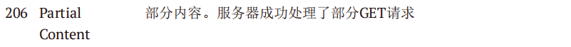

### Comparable和Comparator区别是什么？

* Comparable 位于 `java.lang`包下，Comparable可作为一个类的内部排序实现，需要在目标类中实现Comparable接口，并编写比较规则。Comparable的比较方法compareTo(A)只有1个参数
* Comparator 位于 `java.util`包下，Comparator是外部排序接口，可通过实现Compartor制定多个比较排序策略，供该类采用。可用于Collections.sort()、Arrays.sort()等方法，Comparator接口的比较方法compare(A,B)有两个参数。

### Java语言的三大特性是什么

Java语言的三大特性分别是封装、继承和多态。

* 封装是指将对象的属性私有化，提供一些可以访问属性的方法，我们通过访问这些方法得到对象的属性
* 继承是指某新类继承已经存在的类，该新类拥有被继承的类的所有属性和方法，并且新类可以根据自己的情况拓展属性或方法。其中新类称为子类，原存在的类被称为父类
  * 子类拥有父类对象所有的属性和方法（包括私有属性和私有方法），但是父类中的私有属性和方法子类是无法访问，只是拥有
  * 子类可以拥有自己属性和方法，即子类可以对父类进行扩展
  * 子类可以用自己的方式实现父类的方法（重写）
* 多态是指同一个引用变量在不同时刻指向不同的对象

### 重载与重写的区别

* 重载是发生在同一个类中，具有相同的方法名，但是有不同的参数，参数的个数不一样、参数的位置不一样，这就叫重载
* 重写是发生在当子类继承父类时，对父类中的一些方法根据自己的需求进行重写操作

### 接口和抽象类的区别是什么

* 接口只有定义，不能有方法的实现，但java 1.8中可以定义default方法体，而抽象类可以有定义与实现，方法可在抽象类中实现
* 实现接口的关键字为implements，继承抽象类的关键字为extends。一个类可以实现多个接口，但一个类只能继承一个抽象类。所以，使用接口可以间接地实现多重继承
* 接口强调特定功能的实现，而抽象类强调所属关系
* 接口方法默认修饰符是 public，抽象方法可以有 public、protected 和 default 这些修饰符（抽象方法就是为了被重写所以不能使用 private`关键字修饰！）
  
### Java中的内部类说一下

内部类有四种，分别是静态内部类、局部内部类、匿名内部和成员内部类

* 静态内部类：常见的main函数就是静态内部类，调用静态内部类通过“外部类.静态内部类”
* 局部内部类：定义在方法中的类叫做局部内部类。
* 匿名内部类：是指继承一个父类或者实现一个接口的方式直接定义并使用的类，匿名内部类没有class关键字，因为匿名内部类直接使用new生成一个对象
* 成员内部类：成员内部类是最普通的内部类，它的定义为位于另一个类的内部

### 说一下final关键字的作用

* 当final修饰类的时候，表明这个类不能被继承。final 类中的所有成员方法都会被隐式地指定为 final 方法
* 当final修饰方法的时候，表明这个方法不能被重写。
* 当final修饰属性的时候，如果是基本数据类型的变量，则其数值一旦在初始化之后便不能 更改；如果是引用类型的变量，则在对其初始化之后便不能再让其指向另一个对象

### 说一下String，StringBuilder和StringBuffer的区别

String 真正不可变有下面几点原因：
* 保存字符串的数组被 final 修饰且为私有的，并且String 类没有提供/暴露修改这个字符串的方法
* String 类被 final 修饰导致其不能被继承，进而避免了子类破坏 String 不可变

StringBuilder 与 StringBuffer 都继承自 AbstractStringBuilder 类，在AbstractStringBuilder中也是使用字符数组保存字符串char[]value但是没有用 final`关键字修饰，所以这两种对象都是可变的。StringBuffer 对方法加了同步锁或者对调用的方法加了同步锁，所以是线程安全。StringBuilder 并没有对方法进行加同步锁，所以是非线程安全的

* 操作少量的数据: 适用 String
* 单线程操作字符串缓冲区下操作大量数据: 适用 StringBuilder
* 多线程操作字符串缓冲区下操作大量数据: 适用 StringBuffer

### 说一下Java中的==与eaquels的区别

`==` :判断两个对象是不是同一个对象(基本数据类型`==`比较的是值，引用数据类型`==`比较的是内存地址)。

`eaquels`：
* 类没有重写 `equals()` 方法。则通过 `equals()` 比较该类的两个对象时，等价于通过`==`比较这两个对象
* 类重写了 `equals()` 方法。一般，我们都重写 `equals()` 方法来比较两个对象的内容是否相等；若它们的内容相等，则返回 `true` (即，认为这两个对象相等)

### Java访问修饰符有哪些？都有什么区别？

* public：public表明该数据成员、成员函数是对所有用户开放的，所有用户都可以直接进行调用
* protected：protected对于子女、朋友来说，就是public的，可以自由使用，没有任何限制，而对于其他的外部class，protected就变成private
* private：private表示私有，私有的意思就是除了class自己之外，任何人都不可以直接使用，私有财产神圣不可侵犯嘛，即便是子女，朋友，都不可以使用

### Java中的异常体系说一下

Java中的异常主要分为Error和Exception

Error 指Java程序运行错误，如果程序在启动时出现Error，则启动失败；如果程序运行过程中出现Error，则系统将退出程序。**出现Error是系统的内部错误或资源耗尽**，Error不能在程序运行过程中被动态处理，一旦出现Error，**系统能做的只有记录错误的原因和安全终止**

Exception 指 Java程序运行异常，在运行中的程序发生了程序员不期望发生的事情，**可以被Java异常处理机制处理**。Exception也是程序开发中异常处理的核心，可分为**RuntimeException（运行时异常）** 和**CheckedException（检查异常）**，如下图所示

* RuntimeException（运行时异常）：指在Java虚拟机正常运行期间抛出的异常， RuntimeException可以被捕获并处理，如果出现此情况，我们需要抛出异常或者捕获并处理异常。常见的有NullPointerException、ClassCastException、 ArrayIndexOutOfBoundsException等
* CheckedException（检查异常）：指在编译阶段Java编译器检查 CheckedException异常，并强制程序捕获和处理此类异常，要求程序在可能出现异常的地方通过try catch语句块捕获异常并处理异常。常见的有由于I/O错误导致的IOException、SQLException、ClassNotFoundException等。该类异常通常由于打开错误的文件、SQL语法错误、类不存等引起

### 追问1：异常的处理方式？

异常处理方式有抛出异常和使用try catch语句块捕获异常两种方式。

* 抛出异常：遇到异常时不进行具体的处理，直接将异常抛给调用者，让调用者自己根据情况处理。抛出异常的三种形式：throws、throw和系统自动抛出异常。其中throws作用在方法上，用于定义方法可能抛出的异常；throw作用在方法内，表示明确抛出一个异常
* 使用try catch捕获并处理异常：使用费try catch 捕获异常能够有针对性的处理每种可能出现的异常，并在捕获到异常后根据不同的情况做不同的处理。其使用过程比较简单：用try catch语句块将可能出现异常的代码包起来即可

### Java中的深拷贝和浅拷贝说一下

深拷贝和浅拷贝都是对象拷贝

* **浅拷贝：** 浅拷贝会在堆上创建一个新的对象（区别于引用拷贝的一点），不过，如果原对象内部的属性是引用类型的话，浅拷贝会直接复制内部对象的引用地址，也就是说拷贝对象和原对象共用同一个内部对象。
* **深拷贝 ：** 深拷贝会完全复制整个对象，包括这个对象所包含的内部对象。
* **引用拷贝：** 简单来说，引用拷贝就是两个不同的引用指向同一个对象。

### 追问1：浅拷贝与深拷贝的特点是什么

浅拷贝特点
* 对于基本数据类型的成员对象，因为基础数据类型是值传递的，所以是直接将属性值赋值给新的对象。基础类型的拷贝，其中一个对象修改该值，不会影响另外一个。
* 对于引用类型，比如数组或者类对象，因为引用类型是引用传递，所以浅拷贝只是把内存地址赋值给了成员变量，它们指向了同一内存空间。改变其中一个，会对另外一个也产生影响

深拷贝特点
* 对于基本数据类型的成员对象，因为基础数据类型是值传递的，所以是直接将属性值赋值给新的对象。基础类型的拷贝，其中一个对象修改该值，不会影响另外一个（和浅拷贝一样）
* 对于引用类型，比如数组或者类对象，深拷贝会新建一个对象空间，然后拷贝里面的内容，所以它们指向了不同的内存空间。改变其中一个，不会对另外一个也产生影响
* 深拷贝相比于浅拷贝速度较慢并且花销较大

### Java中的集合框架有哪些

Java 集合框架主要包括两种类型的容器，一种是集合（Collection），存储一个元素集合，另一种是图（Map），存储键/值对映射

Collection 接口又有 3 种子类型，List、Set 和 Queue

### ArrayList和LinkedList的底层实现和区别

ArrayList底层使用的是 Object数组；LinkedList底层使用的是 双向链表 数据结构

ArrayList:增删慢、查询快，线程不安全，对元素必须连续存储
LinkedList:增删快，查询慢，线程不安全

### 追问1：说说ArrayList的扩容机制

通过阅读ArrayList的源码我们可以发现当以无参数构造方法创建 ArrayList 时，实际上初始化赋值的是一个空数组。当真正对数组进行添加元素操作时，才真正分配容量。即向数组中添加第一个元素时，数组容量扩为 10。当插入的元素个数大于当前容量时，就需要进行扩容了， ArrayList 每次扩容之后容量都会变为原来的 1.5 倍左右

### HashMap的底层实现？扩容？是否线程安全

在jdk1.7之前HashMap是基于数组和链表实现的，而且采用头插法

而jdk1.8 之后在解决哈希冲突时有了较大的变化，当链表长度大于阈值（默认为 8）（将链表转换成红黑树前会判断，如果当前数组的长度小于 64，那么会选择先进行数组扩容，而不是转换为红黑树）时，将链表转化为红黑树，以减少搜索时间。采用尾插法

HashMap默认的初始化大小为 16。当HashMap中的元素个数之和大于负载因子*当前容量的时候就要进行扩充，容量变为原来的 2 倍。（这里注意不是数组中的个数，而且数组中和链/树中的所有元素个数之和！）

HashMap是线程不安全的，其主要体现:

* 在jdk1.7中，在多线程环境下，扩容时会造成环形链或数据丢失
* 在jdk1.8中，在多线程环境下，会发生数据覆盖的情况

### 追问1：HashMap扩容的时候为什么是2的n次幂

数组下标的计算方法是(n - 1) & hash，取余(%)操作中如果除数是2的幂次则等价 于与其除数减一的与(&)操作（也就是说 hash%length==hash&(length-1)的前提是 length 是2的 n 次方；）。” 并且 采用二进制位操作 &，相对于%能够提高运算效率， 这就解释了 HashMap 的长度为什么是2的幂次方

### 追问2：HashMap的put方法说一下

* 根据key通过哈希算法与与运算得出数组下标
* 如果数组下标元素为空，则将key和value封装为Entry对象（JDK1.7是Entry对象，JDK1.8 是Node对象）并放入该位置
* 如果数组下标位置元素不为空，则要分情况
  * 如果是在JDK1.7，则首先会判断是否需要扩容，如果要扩容就进行扩容，如果不需要扩容就生成Entry对象，并使用头插法添加到当前链表中
  * 如果是在JDK1.8中，则会先判断当前位置上的TreeNode类型，看是红黑树还是链表Node
    * 如果是红黑树TreeNode，则将key和value封装为一个红黑树节点并添加到红黑树中去，在这个过程中会判断红黑树中是否存在当前key，如果存在则更新value
    * 如果此位置上的Node对象是链表节点，则将key和value封装为一个Node并通过尾插法插入到链表的最后位置去，因为是尾插法，所以需要遍历链表，在遍历过程中会判断是否存在当前key，如果存在则更新其value，当遍历完链表后，将新的Node插入到链表中，插入到链表后，会看当前链表的节点个数，如果大于8，则会将链表转为红黑树
    * 将key和value封装为Node插入到链表或红黑树后，在判断是否需要扩容

### HashMap源码中在计算hash值的时候为什么要右移16位

尽量打乱hashcode真正参与运算的低16位，让元素在HashMap中更加均匀的分布。

### Java中线程安全的集合有哪些

* Vector：就比Arraylist多了个同步化机制（线程安全）
* Hashtable：就比Hashmap多了个线程安全
* ConcurrentHashMap:是一种高效但是线程安全的集合
* Stack：栈，也是线程安全的，继承于Vector

### 追问1：说一下ConcurrentHashMap的底层实现，它为什么是线程安全的

在jdk1.7是 分段的数组+链表 ，jdk1.8的时候跟HashMap1.8的时候一样都是基于数组+链表/红黑树

ConcurrentHashMap是线程安全的
* 在jdk1.7的时候是使用分段锁segment，每一把锁只锁容器其中一部分数据，多线程访问容器里不同数据段的数据，就不会存在锁竞争，提高并发访问率
* 在jdk1.8的时候摒弃了 Segment的概念，而是直接用 Node 数组+链表+红黑树的数据结构来实现，并发控制使用 synchronized 和 CAS 来操作。synchronized只锁定当前链表或红黑二叉树的首节点

### HashMap和Hashtable的区别

* 线程是否安全： HashMap 是非线程安全的，HashTable 是线程安全的,因为HashTable 内部的方法基本都经过synchronized修饰
* 对 Null key 和 Null value 的支持： HashMap可以存储 null 的 key 和 value，但null 作为键只能有一个，null 作为值可以有多个；HashTable 不允许有 null 键和 null 值，否则会抛出 NullPointerException
* 初始容量大小和每次扩充容量大小的不同 ：
  * 创建时如果不指定容量初始值，Hashtable默认的初始大小为 11，之后每次扩充，容量变为原来的 2n+1。HashMap 默认的初始化大小为 16。之后每次扩充，容量变为原来的 2倍
  *  创建时如果给定了容量初始值，那么 Hashtable 会直接使用你给定的大小，而 HashMap会将其扩充为 2 的幂次方大小（HashMap 中的tableSizeFor()方法保证，下面给出了源代码）。也就是说 HashMap 总是使用 2 的幂作为哈希表的大小。
* 底层数据结构： JDK1.8 以后的 HashMap在解决哈希冲突时有了较大的变化，当链表长度大于阈值（默认为 8）（将链表转换成红黑树前会判断，如果当前数组的长度小于64，那么会选择先进行数组扩容，而不是转换为红黑树）时，将链表转化为红黑树，以减少搜索时间。Hashtable 没有这样的机制
* 效率： 因为线程安全的问题，HashMap 要比 HashTable效率高一点。另外，HashTable基本被淘汰，不要在代码中使用它

### HashMap和TreeMap的区别

相比于`HashMap`来说 `TreeMap` 主要多了对集合中的元素根据键排序的能力以及对集合内元素的搜索的能力

### 说说什么是线程安全？如何实现线程安全？

当多个线程同时访问一个对象时，如果不用考虑这些线程在运行时环境下的调度和交替执行，也不需要进行额外的同步，或者在调用方进行任何其他的协调操作，调用这个对象的行为都可以获得正确的结果，那就称这个对象是线程安全的。(当多个线程同时访问一个对象时，无论CPU如何进行调度，最终都能获得正确的结果，则称这个对象是线程安全的)

实现线程安全的方式有三大种方法，分别是互斥同步、非阻塞同步和无同步方案

互斥同步：同步是指多个线程并发访问共享数据时，保证共享数据在同一各时刻只被一条（或一些，当使用信号量的时候）线程使用。而互斥是实现同步的一种手段，临界区、互斥量和信号量都是常见的互斥实现方式。**Java中实现互斥同步的手段主要有synchronized关键字或ReentrantLock等。**

非阻塞同步类似是一种乐观并发的策略，比如**CAS**。

无同步方案，比如**使用ThreadLocal**

### 追问1：synchronized和ReentranLock的区别是什么?

#### 两者都是可重入锁

**“可重入锁”** 指的是自己可以再次获取自己的内部锁。比如一个线程获得了某个对象的锁，此时这个对象锁还没有释放，当其再次想要获取这个对象的锁的时候还是可以获取的，如果是不可重入锁的话，就会造成死锁。同一个线程每次获取锁，锁的计数器都自增 1，所以要等到锁的计数器下降为 0 时才能释放锁

* `synchronized` 是依赖于 JVM 实现的,`ReentrantLock` 是 JDK 层面实现的（也就是 API 层面，需要 lock() 和 unlock() 方法配合 try/finally 语句块来完成），所以我们可以通过查看它的源代码，来看它是如何实现的

* **等待可中断 :** `ReentrantLock`提供了一种能够中断等待锁的线程的机制，通过 `lock.lockInterruptibly()` 来实现这个机制。也就是说正在等待的线程可以选择放弃等待，改为处理其他事情
* **可实现公平锁 :** `ReentrantLock`可以指定是公平锁还是非公平锁。而`synchronized`只能是非公平锁。所谓的公平锁就是先等待的线程先获得锁。`ReentrantLock`默认情况是非公平的，可以通过 `ReentrantLock`类的`ReentrantLock(boolean fair)`构造方法来制定是否是公平的
* **可实现选择性通知（锁可以绑定多个条件）:** `synchronized`关键字与`wait()`和`notify()/notifyAll()`方法相结合可以实现等待/通知机制。`ReentrantLock`类当然也可以实现，但是需要借助于`Condition`接口与`newCondition()`方法
* **`synchronized`隐式获取锁和释放锁，`ReentrantLock`显示获取和释放锁**，在使用时避免程序异常无法释放锁，需要在`finally`控制块中进行解锁操作

> `notify()/notifyAll()`方法进行通知时，被通知的线程是由 JVM 选择的，用`ReentrantLock`类结合`Condition`实例可以实现“选择性通知”。如果执行`notifyAll()`方法的话就会通知所有处于等待状态的线程这样会造成很大的效率问题，而`Condition`实例的`signalAll()`方法 只会唤醒注册在该`Condition`实例中的所有等待线程

### 追问2：syn和volatile的区别

`synchronized` 关键字和 `volatile` 关键字是两个互补的存在，而不是对立的存在

* `volatile` 关键字是线程同步的轻量级实现，所以 `volatile` 性能肯定比`synchronized`关键字要好 。但是 `volatile` 关键字只能用于变量而 `synchronized` 关键字可以修饰方法以及代码块
* `volatile` 关键字能保证数据的可见性，但不能保证数据的原子性。`synchronized` 关键字两者都能保证
* `volatile`关键字主要用于解决变量在多个线程之间的可见性，而 `synchronized` 关键字解决的是多个线程之间访问资源的同步性。

### 追问3：synchronize锁的作用范围

* **修饰实例方法:** 作用于当前对象实例加锁，进入同步代码前要获得 **当前对象实例的锁**
* **修饰静态方法:** 也就是给当前类加锁，会作用于类的所有对象实例 ，进入同步代码前要获得 **当前 class 的锁**
* **修饰代码块 ：** 指定加锁对象，对给定对象/类加锁。

### 追问4：synchronized锁升级的过程说一下？

**为什么要引入偏向锁？**

因为经过HotSpot的作者大量的研究发现，大多数时候是不存在锁竞争的，常常是一个线程多次获得同一个锁，因此如果每次都要竞争锁会增大很多没有必要付出的代价，为了降低获取锁的代价，才引入的偏向锁。

**如果一个线程获得了偏向锁，在此线程之后的执行过程中，如果再次进入或者退出同一段同步块代码，并不再需要去进行加锁或者解锁操作，这样可以省略很多开销。假如有两个线程来竞争该锁话，那么偏向锁就失效了，进而升级成轻量级锁了。**

**为什么要引入轻量级锁？**

轻量级锁考虑的是竞争锁对象的线程不多，而且线程持有锁的时间也不长的情景。因为阻塞线程需要CPU从用户态转到内核态，代价较大，如果刚刚阻塞不久这个锁就被释放了，那这个代价就有点得不偿失了，因此这个时候就干脆不阻塞这个线程，让它自旋这等待锁释放。所谓自旋，就是指当有另外一个线程来竞争锁时，这个线程会在原地循环等待，就相当于在执行一个啥也没有的for循环。

**轻量级锁什么时候升级为重量级锁？**

但是如果自旋的时间太长也不行，因为自旋是要消耗CPU的，因此自旋的次数是有限制的，比如10次或者100次，如果自旋次数到了线程1还没有释放锁，或者线程1还在执行，线程2 还在自旋等待，这时又有一个线程3过来竞争这个锁对象，那么这个时候轻量级锁就会 膨胀为重量级锁。重量级锁把除了拥有锁的线程都阻塞，防止CPU空转。

**重量级锁**

重量级锁是依赖对象内部的monitor锁来实现的，而monitor又依赖操作系统的MutexLock(互斥锁)来实现的，所以重量级锁也被成为互斥锁。

### Java中线程的状态有哪些？线程间的通信方式有哪些？

Java中线程生命周期分为新建（New）、运行（Runnable）、阻塞（Blocked）、无限期等待（Waiting）、限期等待（Time Waiting）和结束（Terminated）这6种状态。

Java中线程间通信方式有：

* **互斥量(Mutex)：** 采用互斥对象机制，只有拥有互斥对象的线程才有访问公共资源的权限。因为互斥对象只有一个，所以可以保证公共资源不会被多个线程同时访问。比如 Java 中的synchronized 关键词和各种 Lock 都是这种机制。
* **信号量(Semphares) ：** 它允许同一时刻多个线程访问同一资源，但是需要控制同一时刻访问此资源的最大线程数量
* **事件(Event) :** Wait/Notify：通过通知操作的方式来保持多线程同步

### 追问1：sleep后进入什么状态，wait后进入什么状态？

sleep后进入Time waiting超时等待状态，wait后进入等待waiting状态。

### 追问2：sleep和wait的区别？

* 两者最主要的区别在于：`sleep()` 方法没有释放锁，而 `wait()` 方法释放了锁 。
* `wait()` 通常被用于线程间交互/通信，`sleep()` 通常被用于暂停执行。
* `wait()` 方法被调用后，线程不会自动苏醒，需要别的线程调用同一个对象上的 `notify()` 或者 `notifyAll()` 方法。`sleep()` 方法执行完成后，线程会自动苏醒。

### 追问3：wait为什么是Object类下面的方法？

因为synchronized中的这把锁可以是任意对象，所以任意对象都可以调用wait()和notify()；所以wait和notify属于Object。

### 追问4:start方法和run方法有什么区别？

调用 start()方法，会启动一个线程并使线程进入了就绪状态，当分配到时间片后就可以开始运行了。 start() 会执行线程的相应准备工作，然后自动执行 run() 方法的内容，这是真正的多线程工作。 但是，直接执行 run() 方法，会把 run() 方法当成一个 main 线程下的普通方法去执行，并不会在某个线程中执行它，所以这并不是多线程工作。

### 在浏览器输入 url 网址 → 显示主页的过程

总体来说分为以下几个过程:
* DNS解析
* 建立TCP连接
* 发送HTTP请求
* 服务器处理请求并返回HTTP报文
* 浏览器解析渲染页面
* 连接结束

### 追问：DNS解析过程

首先会在本地的hosts文件中查找是否有这个网址的映射关系，如果有则直接调用这个IP的映射进行访问。首先在本地域名服务器中查询IP地址，如果没有找到的情况下，本地域名服务器会向根域名服务器发送一个请求，如果根域名服务器也不存在该域名时，本地域名会向com顶级域名服务器发送一个请求，依次类推下去。直到最后本地域名服务器得到google的IP地址并把它缓存到本地，供下次查询使用。从上述过程中，可以看出网址的解析是一个**从右向左**的过程: com -> google.com -> www.google.com。但是你是否发现少了点什么，根域名服务器的解析过程呢？事实上，真正的网址是www.google.com.，并不是我多打了一个.，这个.对应的就是根域名服务器，默认情况下所有的网址的最后一位都是.，既然是默认情况下，为了方便用户，通常都会省略，浏览器在请求DNS的时候会自动加上，所有网址真正的解析过程为: . -> .com -> google.com. -> www.google.com.

### Ping的工作原理

ping 命令执行的时候，源主机先会构建一个 ICMP 回送请求消息数据包。在规定的时候间内，源主机如果没有接到 ICMP 的应答包，则说明目标主机不可达；如果接收到了 ICMP 回送响应消息，则说明目标主机可达。此时，源主机会检查，用当前时刻减去该数据包最初从源主机上发出的时刻，就是 ICMP 数据包的时间延迟。

### Cookie的作用是什么?和Session有什么区别？

**区别**
* session 在服务器端，cookie 在客户端，既然它是存储在客户端的，换句话说通过某些手法我就可以篡改本地存储的信息来欺骗服务端的某些策略。
* cookie不是很安全，考虑到安全应当使用session，但也可以对cookie进行加密
* session会在一定时间内保存在服务器上。当访问增多，会比较占用你服务器的性能考虑到减轻服务器性能方面，应当使用cookie
* 单个Cookie保存的数据不能超过4K，很多浏览器都限制一个站点最多保存20个Cookie
* Session 的运行依赖Session ID，而 Session ID 是存在 Cookie 中的，也就是说，如果浏览器禁用了 Cookie，Session 也会失效 **（但是可以通过其它方式实现，比如在 url 中传递 Session ID）**
* 用户验证这种场合一般会用 Session。因此，维持一个会话的核心就是客户端的唯一标识，即Session ID。

### OSI与TCP/IP各层的结构与功能,都有哪些协议?

### 追问1：HTTP属于那一层？TCP/UDP属于哪一层？IP属于哪一层？

IP： 网络层
TCP/UDP： 传输层
HTTP、RTSP、FTP： 应用层协议

### HTTP是什么？ HTTP 常见的状态码，有哪些？GET 和 POST 的区别？

HTTP是超文本传输协议(HTTP 是在计算机世界的协议。它使计算机能够理解的语言确立了一种计算机之间交流通信的规范（两个以上的参与者），以及相关的各种控制和错 误处理方式（行为约定和规范）

### HTTP常见状态码

**GET和POST的区别：**
*  get是获取数据的，而post是提交数据的
*  GET 用于获取信息，是无副作用的，是幂等的，且可缓存， 而POST 用于修改服务器上的数据，有副作用，非幂等，不可缓存

### 追问1：HTTP1.1相对于HTTP1.0的优化是什么？

* **长连接 : 在 HTTP/1.0 中，默认使用的是短连接**，也就是说每次请求都要重新建立一次连接。HTTP 是基于 TCP/IP 协议的,每一次建立或者断开连接都需要三次握手四次挥手的开销，如果每次请求都要这样的话，开销会比较大。因此最好能维持一个长连接，可以用个长连接来发多个请求。**HTTP 1.1 起，默认使用长连接** ,默认开启 Connection： keep-alive。 **HTTP/1.1 的持续连接有非流水线方式和流水线方式** 。流水线方式是客户在收到 HTTP 的响应报文之前就能接着发送新的请求报文。与之相对应的非流水线方式是客户在收到前一个响应后才能发送下一个请求。
* **错误状态响应码 :** HTTP/1.1中新加入了大量的状态码，光是错误响应状态码就新增了24种。比如说，`100 (Continue)` ——在请求大资源前的预热请求，`206 (Partial Content)` ——范围请求的标识码，`409 (Conflict)` ——请求与当前资源的规定冲突，`410 (Gone)` ——资源已被永久转移，而且没有任何已知的转发地址。
* **缓存处理 :** 在 HTTP1.0 中主要使用 header 里的 If-Modified-Since,Expires 来做为缓存判断的标准，HTTP1.1 则引入了更多的缓存控制策略例如 Entity tag，If-Unmodified-Since, If-Match, If-None-Match 等更多可供选择的缓存头来控制缓存策略
* **带宽优化及网络连接的使用 :** HTTP1.0 中，存在一些浪费带宽的现象，例如客户端只是需要某个对象的一部分，而服务器却将整个对象送过来了，并且不支持断点续传功能，HTTP1.1 则在请求头引入了 range 头域，它允许只请求资源的某个部分，即返回码是 206（Partial Content），这样就方便了开发者自由的选择以便于充分利用带宽和连接。 
* **Host头处理 :** HTTP/1.1在请求头中加入了Host字段

Host 是 HTTP 1.1 协议中新增的一个请求头，主要用来实现虚拟主机技术
虚拟主机（virtual hosting）即共享主机（shared web hosting）,可以利用虚拟技术把一台完整的服务器分成若干个主机，因此可以在单一服务器上运行多个网站或服务。
举一个简单的例子：有一台 ip 地址为 61.135.169.125 的服务器，在这台服务器桑部署着谷歌、百度、淘宝的网站。为什么我们访问 https://www.google.com 时，看到的是 Google 的首页而不是百度或者淘宝的首页？原因就是 Host 请求头决定着访问哪个虚拟主机。

### 追问2：HTTP与HTTPS的区别？

* **端口号 ：** HTTP 默认是 80，HTTPS 默认是 443。
* **URL 前缀 ：** HTTP 的 URL 前缀是 http://，HTTPS 的 URL 前缀是 https://。
* **安全性和资源消耗 ：** HTTP 协议运行在 TCP 之上，所有传输的内容都是明文，客户端和服务器端都无法验证对方的身份。HTTPS 是运行在 SSL/TLS 之上的 HTTP 协议，SSL/TLS 运行在 TCP 之上。所有传输的内容都经过加密，加密采用对称加密，但对称加密的密钥用服务器方的证书进行了非对称加密。所以说，HTTP 安全性没有 HTTPS 高，但是 HTTPS 比 HTTP 耗费更多服务器资源

### 追问3：HTTPS 解决了 HTTP 的哪些问题？

HTTP 由于是明⽂传输，所以安全上存在以下三个⻛险：

* 窃听风险，如通信链路上可以获取通信内容，号容易没
* 篡改风险，如强制植入垃圾广告，视觉污染，用户眼容易瞎
* 冒充风险，冒充淘宝网站，用户钱容易没

### HTTP1.1和HTTP2.0的区别

* **多路复用：**  HTTP2.0使用了多路复用的技术，做到同一个连接并发处理多个请求，而且并发请求的数量比HTTP1.1大了好几个数量级。
* **头部数据压缩：** 在HTTP1.1中，状态行和头部却没有经过任何压缩，直接以纯文本传输。随着Web功能越来越复杂，每个页面产生的请求数也越来越多，导致消耗在头部的流量越来越多。HTTP2.0使用HPACK算法对header的数据进行压缩，这样数据体积小了，在网络上传输就会更快
* **服务器推送：** 网页使用了许多资源：HTML、样式表、脚本、图片等等。在HTTP1.1中这些资源每一个都必须明确地请求。这是一个很慢的过程。HTTP2.0引入了server push，它允许服务端推送资源给浏览器，在浏览器明确地请求之前，免得客户端再次创建连接发送请求到服务器端获取。这样客户端可以直接从本地加载这些资源，不用再通过网络。

### TCP和UDP的区别是什么？

### TCP是如何保证可靠传输的

1. 应用数据被分割成 TCP 认为最适合发送的数据块。

2. TCP 给发送的每一个包进行编号，接收方对数据包进行排序，把有序数据传送给应用层。

3. **校验和：** TCP 将保持它首部和数据的检验和。这是一个端到端的检验和，目的是检测数据在传输过程中的任何变化。如果收到段的检验和有差错，TCP 将丢弃这个报文段和不确认收到此报文段

4. TCP 的接收端会丢弃重复的数据

5. **流量控制：** TCP 连接的每一方都有固定大小的缓冲空间，TCP 的接收端只允许发送端发送接收端缓冲区能接纳的数据。当接收方来不及处理发送方的数据，能提示发送方降低发送的速率，防止包丢失。TCP 使用的流量控制协议是可变大小的滑动窗口协议。 （TCP 利用滑动窗口实现流量控制）

6. **拥塞控制：** 当网络拥塞时，减少数据的发送

7. **ARQ 协议：**  也是为了实现可靠传输的，它的基本原理就是每发完一个分组就停止发送，等待对方确认。在收到确认后再发下一个分组

8. **超时重传：**  当 TCP 发出一个段后，它启动一个定时器，等待目的端确认收到这个报文段。如果不能及时收到一个确认，将重发这个报文段

### TCP的三次握手和四次挥手

>最开始的时候客户端和服务器都是处于CLOSED状态。主动打开连接的为客户端，被动打开连接的是服务器。

* TCP服务器进程先创建传输控制块TCB，时刻准备接受客户进程的连接请求，此时**服务器就进入了LISTEN（监听**）状态；
* TCP客户进程也是先创建传输控制块TCB，然后向服务器发出连接请求报文，这是报文首部中的同部位SYN=1，同时选择一个初始序列号 seq=x ，此时，**TCP客户端进程进入了 SYN-SENT（同步已发送状态）** 状态。**TCP规定，SYN报文段（SYN=1的报文段）不能携带数据，但需要消耗掉一个序号**
* TCP服务器收到请求报文后，如果同意连接，则发出确认报文。确认报文中应该 ACK=1，SYN=1，确认号是ack=x+1，同时也要为自己初始化一个序列号 seq=y，此时，**TCP服务器进程进入了SYN-RCVD（同步收到**状态。**这个报文也不能携带数据，但是同样要消耗一个序号。**
* TCP客户进程收到确认后，还要向服务器给出确认。确认报文的ACK=1，ack=y+1，自己的序列号seq=x+1，**此时，TCP连接建立，客户端进入ESTABLISHED（已建立连接）状态。TCP规定，ACK报文段可以携带数据，但是如果不携带数据则不消耗序号。**
* **当服务器收到客户端的确认后也进入ESTABLISHED状态，此后双方就可以开始通信了。**

> 数据传输完毕后，双方都可释放连接。最开始的时候，客户端和服务器都是处于ESTABLISHED状态，然后客户端主动关闭，服务器被动关闭。

1. 客户端进程发出连接释放报文，并且停止发送数据。释放数据报文首部，FIN=1，其序列号为seq=u（等于前面已经传送过来的数据的最后一个字节的序号加1），此时，**客户端进入FIN-WAIT-1（终止等待1**状态。 **TCP规定，FIN报文段即使不携带数据，也要消耗一个序号。**
   
2. 服务器收到连接释放报文，发出确认报文，ACK=1，ack=u+1，并且带上自己的序列号seq=v，**此时，服务端就进入了CLOSE-WAIT（关闭等待)** 状态。TCP服务器通知高层的应用进程，客户端向服务器的方向就释放了，这时候处于半关闭状态，即客户端已经没有数据要发送了，但是服务器若发送数据，客户端依然要接受。这个状态还要持续一段时间，也就是整个CLOSE-WAIT状态持续的时间。

3. 客户端收到服务器的确认请求后，此时，客户端就进入**FIN-WAIT-2（终止等待2)** 状态，等待服务器发送连接释放报文（**在这之前还需要接受服务器发送的最后的数据**）。

4. 服务器将最后的数据发送完毕后，就向客户端发送连接释放报文，FIN=1，ack=u+1，由于在半关闭状态，服务器很可能又发送了一些数据，假定此时的序列号为seq=w，此时，服务器就进入了**LAST-ACK（最后确认）** 状态，等待客户端的确认。

5. 客户端收到服务器的连接释放报文后，必须发出确认，ACK=1，ack=w+1，而自己的序列号是seq=u+1，此时，**客户端就进入了TIME-WAIT（时间等待）** 状态。**注意此时TCP连接还没有释放，必须经过2∗ MSL（最长报文段寿命）的时间后，当客户端撤销相应的TCB后，才进入CLOSED状态。**

6. 服务器只要收到了客户端发出的确认，**立即进入CLOSED状态** 。同样，撤销TCB后，就结束了这次的TCP连接。可以看到，服务器结束TCP连接的时间要比客户端早一些。

### 追问1：为什么是三次？不是两次、四次？

* 因为三次才能保证双方具有接收和发送的能力

不使用两次和四次的原因：

* 两次：无法防止历史连接的建立，会造成双方资源的浪费，也无法可靠的同步双方序列号
* 四次：三次握手就已经理论上最少可靠连接建立，所以不需要使用更多的通信次数。

### 追问2：为什么 TIME_WAIT 等待的时间是 2MSL？

* **第一，保证客户端发送的最后一个ACK报文能够到达服务器**，因为这个ACK报文可能丢失，站在服务器的角度看来，我已经发送了FIN+ACK报文请求断开了，客户端还没有给我回应，应该是我发送的请求断开报文它没有收到，于是服务器又会重新发送一次，而客户端就能在这个2MSL时间段内收到这个重传的报文，接着给出回应报文，并且会重启2MSL计时器。
* **第二，防止类似与“三次握手”中提到了的“已经失效的连接请求报文段”出现在本连接中**。客户端发送完最后一个确认报文后，在这个2MSL时间中，就可以使本连接持续的时间内所产生的所有报文段都从网络中消失。这样新的连接中不会出现旧连接的请求报文

### 追问4：TIME_WAIT 过多有什么危害？

过多的 TIME-WAIT 状态主要的危害有两种：
* 第一是内存资源占用；
* 第二是对端口资源的占用，一个 TCP 连接至少消耗一个本地端口

### 拥塞控制有哪些控制算法

* **慢开始：** 慢开始算法的思路是当主机开始发送数据时，如果立即把大量数据字节注入到网络，那么可能会引起网络阻塞，因为现在还不知道网络的符合情况。经验表明，较好的方法是先探测一下，即由小到大逐渐增大发送窗口，也就是由小到大逐渐增大拥塞窗口数值。cwnd 初始值为 1，每经过一个传播轮次，cwnd 加倍
* **拥塞避免：** 拥塞避免算法的思路是让拥塞窗口 cwnd 缓慢增大，即每经过一个往返时间 RTT 就把发送放的 cwnd 加 1.
* **快重传与快恢复：** 在 TCP/IP 中，快速重传和恢复（fast retransmit and recovery，FRR）是一种拥塞控制算法，它能快速恢复丢失的数据包。没有 FRR，如果数据包丢失了，TCP 将会使用定时器来要求传输暂停。在暂停的这段时间内，没有新的或复制的数据包被发送。有了 FRR，如果接收机接收到一个不按顺序的数据段，它会立即给发送机发送一个重复确认。如果发送机接收到三个重复确认，它会假定确认件指出的数据段丢失了，并立即重传这些丢失的数据段。有了 FRR，就不会因为重传时要求的暂停被耽误。 　**当有单独的数据包丢失时，快速重传和恢复（FRR）能最有效地工作。当有多个数据信息包在某一段很短的时间内丢失时，它则不能很有效地工作**

### TCP 半连接队列和全连接队列

在 TCP 三次握手的时候，Linux 内核会维护两个队列，分别是：
* 半连接队列，也称 SYN 队列；
* 全连接队列，也称 accepet 队列

服务端收到客户端发起的 SYN 请求后，内核会把该连接存储到半连接队列，并向客户端响应 SYN+ACK，接着客户端会返回 ACK，服务端收到第三次握手的 ACK 后，内核会把连 接从半连接队列移除，然后创建新的完全的连接，并将其添加到 accept 队列，等待进 程调用accept 函数时把连接取出来。

### 什么是线程什么是进程，有什么区别？

进程就是运行中的程序。

* 线程是进程划分成的更小的运行单位,一个进程在其执行的过程中可以产生多个线程。
* 各进程是独立的，而各线程则不一定，因为同一进程中的线程极有可能会相互影响。
* 线程执行开销小，但不利于资源的管理和保护；而进程正相反。

### 并发和并行有什么区别？

* 并发： 同一时间段，多个任务都在执行 (单位时间内不一定同时执行)；
* 并行： 单位时间内，多个任务同时执行。

### 使用线程的优缺点

**优点：** 
* 一个进程中可以同时存在多个线程
* 各个线程之间可以并发执行
* 各个线程之间可以共享地址空间和文件等资源

**缺点：**
* 当进程中的一个线程崩溃时，会导致其所属进程的所有线程崩溃

### 什么是线程的上下文切换

CPU 会停止处理当前运行的程序，并保存当前程序运行的具体位置以便之后继续运行。
从这个角度来看，上下文切换有点像我们同时阅读几本书，在来回切换书本的同时我们需要记住每本书当前读到的页码。

### 线程上下文切换的是什么

这还得看线程是不是属于同一个进程：
* 当两个线程不是属于同一个进程，则切换的过程就跟进程上下文切换同样
* 当两个线程是属于同一个进程，因为虚拟内存是共享的，所以在切换时，虚拟内存这些资源就保持不动，只需要切换线程的私有数据、寄存器等不共享的数据

### 进程有哪几种状态?

* **创建状态(new) ：** 进程正在被创建，尚未到就绪状态。
* **就绪状态(ready) ：** 进程已处于准备运行状态，即进程获得了除了处理器之外的一切所需资源，一旦得到处理器资源(处理器分配的时间片)即可运行。
* **运行状态(running) ：** 进程正在处理器上上运行(单核 CPU 下任意时刻只有一个进程处于运行状态)。
* **阻塞状态(waiting) ：** 又称为等待状态，进程正在等待某一事件而暂停运行如等待某资源为可用或等待 IO 操作完成。即使处理器空闲，该进程也不能运行。
* **结束状态(terminated) ：** 进程正在从系统中消失。可能是进程正常结束或其他原因中断退出运行。

### 进程间的通信方式

**1.管道/匿名管道(pipe):** 用于具有亲缘关系的父子进程间或者兄弟进程之间的通信。

**2.有名管道(Names Pipes) :** 匿名管道由于没有名字，只能用于亲缘关系的进程间通信。为了克服这个缺点，提出了有名管道。有名管道严格遵循**先进先出(first in first out)**。有名管道以磁盘文件的方式存在，可以实现本机任意两个进程通信。

**3.信号(Signal) ：** 信号是一种比较复杂的通信方式，用于通知接收进程某个事件已经发生

**4.消息队列(Message Queuing) ：** 消息队列是消息的链表,具有特定的格式,存放在内存中并由消息队列标识符标识。管道和消息队列的通信数据都是先进先出的原则。与管道（无名管道：只存在于内存中的文件；命名管道：存在于实际的磁盘介质或者文件系统）不同的是**消息队列存放在内核**中，只有在内核重启(即，操作系统重启)或者显式地删除一个消息队列时，该消息队列才会被真正的删除。消息队列可以实现消息的随机查询,消息不一定要以先进先出的次序读取,也可以按消息的类型读取.比 FIFO 更有优势。**消息队列克服了信号承载信息量少，管道只能承载无格式字 节流以及缓冲区大小受限等缺点。**

**5.信号量(Semaphores) ：** 信号量是一个计数器，用于多进程对共享数据的访问，信号量的意图在于进程间同步。这种通信方式主要用于解决与同步相关的问题并避免竞争条件

**6.共享内存(Shared memory) ：** 使得多个进程可以访问同一块内存空间，不同进程可以及时看到对方进程中对共享内存中数据的更新。这种方式需要依靠某种同步操作，如互斥锁和信号量等。**可以说这是最有用的进程间通信方式**

**7.套接字(Sockets) :** 此方法主要用于在客户端和服务器之间通过网络进行通信。套接字是支持 TCP/IP 的网络通信的基本操作单元，可以看做是不同主机之间的进程进行双向通信的端点，简单的说就是通信的两方的一种约定，用套接字中的相关函数来完成通信过程

### 进程的调度算法

* **先到先服务(FCFS)调度算法 :** 从就绪队列中选择一个最先进入该队列的进程为之分配资源，使它立即执行并一直执行到完成或发生某事件而被阻塞放弃占用 CPU 时再重新调度
  * FCFS调度算法的特点是算法简单，但效率低；对长作业比较有利，但对短作业不利
* **短作业优先(SJF)的调度算法 :** 从就绪队列中选出一个估计运行时间最短的进程为之分配资源，使它立即执行并一直执行到完成或发生某事件而被阻塞放弃占用 CPU 时再重新调度
  * 该算法对长作业不利，SJF调度算法中长作业的周转时间会增加。更严重的是，如果有一长作业进入系统的后备队列，由于调度程序总是优先调度那些 (即使是后进来的）短作业，将导致长作业长期不被调度("饥饿现象")
  * 该算法完全未考虑作业的紧迫程度，因而不能保证紧迫性作业会被及时处理
  * **SJF调度算法的平均等待时间、平均周转时间最少。**
* **最短剩余时间优先:** ​	最短剩余时间是针对最短进程优先增加了抢占机制的版本。在这种情况下，进程调度总是选择预期剩余时间最短的进程。当一个进程加入到就绪队列时，他可能比当前运行的进程具有更短的剩余时间，因此只要新进程就绪，调度程序就能可能抢占当前正在运行的进程。像最短进程优先一样，调度程序正在执行选择函数是必须有关于处理时间的估计，**并且存在长进程饥饿的危险**。
* **时间片轮转调度算法 :**  时间片轮转调度是一种最古老，最简单，最公平且使用最广的算法，又称 RR(Round robin)调度。每个进程被分配一个时间段，称作它的时间片，即该进程允许运行的时间。**时间片轮转调度算法主要适用于分时系统。** 在这种算法中，系统将所有就绪进程按到达时间的先后次序排成一个队列，进程调度程序总是选择就绪队列中第一个进程执行，即先来先服务的原则，但仅能运行一个时间片，如100ms。在使用完一个时间片后，即使进程并未完成其运行，它也必须释放出（被剥夺）处理机给下一个就绪的进程，而被剥夺的进程返回到就绪队列的末尾重新排队，等候再次运行。
* **多级反馈队列算法:** 不必事先知道各种进程所需要执行的时间，他是当前被公认的一种较好的进程调度算法。
  * 应设置多个就绪队列，并为各个队列赋予不同的优先级，第1级队列的优先级最高，第2级队列次之，其余队列的优先级逐次降低
  * 赋予各个队列中进程执行时间片的大小也各不相同，在优先级越高的队列中，每个进程的运行时间片就越小。例如，第2级队列的时间片要比第1级队列的时间片长一倍， ……第i+1级队列的时间片要比第i级队列的时间片长一倍。
  * 当一个新进程进入内存后，首先将它放入第1级队列的末尾，按FCFS原则排队等待调度。当轮到该进程执行时，如它能在该时间片内完成，便可准备撤离系统；如果它在一个时间片结束时尚未完成，调度程序便将该进程转入第2级队列的末尾，再同样地按FCFS 原则等待调度执行；如果它在第2级队列中运行一个时间片后仍未完成，再以同样的方法放入第3级队列……如此下去，当一个长进程从第1级队列依次降到第 n 级队列后，在第 n 级队列中便釆用时间片轮转的方式运行。
  * 仅当第1级队列为空时，调度程序才调度第2级队列中的进程运行；仅当第1 ~ (i-1)级队列均为空时，才会调度第i级队列中的进程运行。如果处理机正在执行第i级队列中的某进程时，又有新进程进入优先级较高的队列（第 1 ~ (i-1)中的任何一个队列），则此时新进程将抢占正在运行进程的处理机，即由调度程序把正在运行的进程放回到第i级队列的末尾，把处理机分配给新到的更高优先级的进程。
* **优先级调度 ：** 为每个流程分配优先级，首先执行具有最高优先级的进程，依此类推。具有相同优先级的进程以 FCFS 方式执行。可以根据内存要求，时间要求或任何其他资源要求来确定优先级。

###  死锁的四个条件

如果系统中以下四个条件同时成立，那么就能引起死锁：
* **互斥：** 资源必须处于非共享模式，即一次只有一个进程可以使用。如果另一进程申请该资源，那么必须等待直到该资源被释放为止
* **占有并等待：** 一个进程至少应该占有一个资源，并等待另一资源，而该资源被其他进程所占有
* **非抢占：** 资源不能被抢占。只能在持有资源的进程完成任务后，该资源才会被释放
* **循环等待：** 有一组等待进程 `{P0, P1,..., Pn}`， `P0` 等待的资源被 `P1` 占有，`P1` 等待的资源被 `P2` 占有，......，`Pn-1` 等待的资源被 `Pn` 占有，`Pn` 等待的资源被 `P0` 占有

注意，只有四个条件同时成立时，死锁才会出现。

### 追问1：如何预防死锁

* **破坏占有并等待** ：一次性申请所有的资源。
* **破坏非抢占 ：** 占用部分资源的线程进一步申请其他资源时，如果申请不到，可以主动释放它占有的资源。
* **破坏循环等待条件 ：** 靠按序申请资源来预防。按某一顺序申请资源，释放资源则反序释放。破坏循环等待条件。

### 追问2：如何避免死锁问题的发生？

避免死锁就是在资源分配时，借助于算法（比如银行家算法）对资源分配进行计算评估，使其进入安全状态。

>**安全状态** 指的是系统能够按照某种线程推进顺序（P1、P2、P3.....Pn）来为每个线程分配所需资源，直到满足每个线程对资源的最大需求，使每个线程都可顺利完成。称<P1、P2、P3.....Pn>序列为安全序列。

### 页面置换算法

* **OPT 页面置换算法（最佳页面置换算法） ：** 最佳(Optimal, OPT)置换算法所选择的被淘汰页面将是**以后永不使用的，或者是在最长时间内不再被访问的页面**,这样可以保证获得最低的缺页率。**但由于人们目前无法预知进程在内存下的若千页面中哪个是未来最长时间内不再被访问的，因而该算法无法实现。一般作为衡量其他置换算法的方法**。
* **FIFO（First In First Out） 页面置换算法（先进先出页面置换算法） :** 总是淘汰最先进入内存的页面，**即选择在内存中驻留时间最久的页面进行淘汰。**
* **LRU （Least Recently Used）页面置换算法（最近最久未使用页面置换算法） ：** LRU算法赋予每个页面一个访问字段，用来记录一个页面自上次被访问以来所经历的时间 T，当须淘汰一个页面时，选择现有页面中其 T 值最大的，**即最近最久未使用的页面予以淘汰。**
* **LFU （Least Frequently Used）页面置换算法（最少使用页面置换算法） :** 该置换算法选择在之前时期使用最少的页面作为淘汰页。每页设置访问计数器，每当页面被访问时，该页面的访问计数器加1。当主存中的页面计数器的值都一样时，可以采用 **FIFO** 也可以采用 **LRU**
